# Keratoconus-and-your-correlations
On this job, I'll analyze if exist correlation amoung kind of alergies, kind of eyes diseases and other features. The data was acquired by a research made from internet using Google Forms. Also, I generate a Random Forest Classifier to try predict carriers of keratoconus.


```python
##Importando as Bibliotecas ##

import pandas as pd
import numpy as np
import matplotlib.pyplot as plt
import seaborn as sns

##Importando o dataset da pesquisa##
df = pd.read_csv('C:\\Users\\filipe.luz\\Desktop\\TCC -MBA\\CeratoconeCorrelacao.csv', sep=',')

###Analisando o dataset###
df.head()
df.info()

```

    <class 'pandas.core.frame.DataFrame'>
    RangeIndex: 610 entries, 0 to 609
    Data columns (total 19 columns):
    Carimbo de data/hora                                                                                     610 non-null object
    Você faz parte do grupo do Facebook Ceratocone e Tratamentos?                                            610 non-null object
    Qual a sua idade?                                                                                        610 non-null int64
    Qual seu sexo?                                                                                           610 non-null object
    Você possui alergia a poeria?                                                                            610 non-null object
    Você possui alergia a algum medicamento?                                                                 610 non-null object
    Você possui alergia a algum alimento?                                                                    610 non-null object
    Você costuma coçar os olhos frequentemente?                                                              610 non-null object
    Você faz uso de colírio lubrificante constantemente?                                                     610 non-null object
    Você é ou já foi fumante ?                                                                               610 non-null object
    Você já utiliza/utilizou óculos?                                                                         610 non-null object
    Por quantos anos utiliza/utilizou óculos? (Inserir apenas número, caso use o campo outros)               610 non-null object
    Você já usou lentes de contato?                                                                          610 non-null object
    Por quantos anos utiliza/utilizou lentes de contato? (Inserir apenas número, caso use o campo outros)    610 non-null object
    Você possui Miopia ?                                                                                     607 non-null object
    Você possui astigmatismo?                                                                                610 non-null object
    Já realizou alguma cirurgia corretiva de grau?                                                           610 non-null object
    Você é portador de ceratocone?                                                                           610 non-null object
    Possui algum parente de primeiro grau portador do ceratocone?                                            610 non-null object
    dtypes: int64(1), object(18)
    memory usage: 90.6+ KB
    


```python
df.describe()
```


<div>
<style scoped>
    .dataframe tbody tr th:only-of-type {
        vertical-align: middle;
    }

    .dataframe tbody tr th {
        vertical-align: top;
    }

    .dataframe thead th {
        text-align: right;
    }
</style>
<table border="1" class="dataframe">
  <thead>
    <tr style="text-align: right;">
      <th></th>
      <th>Integra_Grp_cerato</th>
      <th>Idade</th>
      <th>Sexo</th>
      <th>Alrg_Poeira</th>
      <th>Alrg_Medicamento</th>
      <th>Alrg_Alimento</th>
      <th>Coça_os_Olhos</th>
      <th>Usa_Colirio</th>
      <th>Exp_fumaca_cigarro</th>
      <th>Exp_Oculos</th>
      <th>Tmp_Uso_Oculos</th>
      <th>Exp_Lentes</th>
      <th>Tmp_Uso_Lentes</th>
      <th>Miope</th>
      <th>Astigmatismo</th>
      <th>Fez_Cirurgia</th>
      <th>Portador_Ceratocone</th>
      <th>Parente_Portador</th>
    </tr>
  </thead>
  <tbody>
    <tr>
      <th>count</th>
      <td>610.000000</td>
      <td>6.100000e+02</td>
      <td>610.000000</td>
      <td>610.000000</td>
      <td>610.000000</td>
      <td>610.000000</td>
      <td>610.000000</td>
      <td>610.000000</td>
      <td>610.000000</td>
      <td>610.000000</td>
      <td>610.000000</td>
      <td>610.000000</td>
      <td>610.000000</td>
      <td>610.000000</td>
      <td>610.000000</td>
      <td>610.000000</td>
      <td>610.000000</td>
      <td>610.000000</td>
    </tr>
    <tr>
      <th>mean</th>
      <td>0.708197</td>
      <td>1.721028e+04</td>
      <td>0.263934</td>
      <td>0.714754</td>
      <td>0.198361</td>
      <td>0.186885</td>
      <td>0.688525</td>
      <td>0.483607</td>
      <td>0.193443</td>
      <td>0.847541</td>
      <td>9.445902</td>
      <td>0.606557</td>
      <td>3.801639</td>
      <td>0.609836</td>
      <td>0.816393</td>
      <td>0.181967</td>
      <td>0.742623</td>
      <td>0.237705</td>
    </tr>
    <tr>
      <th>std</th>
      <td>0.454965</td>
      <td>4.242099e+05</td>
      <td>0.441126</td>
      <td>0.451902</td>
      <td>0.399092</td>
      <td>0.390139</td>
      <td>0.463477</td>
      <td>0.500141</td>
      <td>0.395321</td>
      <td>0.359760</td>
      <td>11.278874</td>
      <td>0.488915</td>
      <td>6.851102</td>
      <td>0.488187</td>
      <td>0.387481</td>
      <td>0.386134</td>
      <td>0.437548</td>
      <td>0.426027</td>
    </tr>
    <tr>
      <th>min</th>
      <td>0.000000</td>
      <td>9.000000e+00</td>
      <td>0.000000</td>
      <td>0.000000</td>
      <td>0.000000</td>
      <td>0.000000</td>
      <td>0.000000</td>
      <td>0.000000</td>
      <td>0.000000</td>
      <td>0.000000</td>
      <td>0.000000</td>
      <td>0.000000</td>
      <td>0.000000</td>
      <td>0.000000</td>
      <td>0.000000</td>
      <td>0.000000</td>
      <td>0.000000</td>
      <td>0.000000</td>
    </tr>
    <tr>
      <th>25%</th>
      <td>0.000000</td>
      <td>2.600000e+01</td>
      <td>0.000000</td>
      <td>0.000000</td>
      <td>0.000000</td>
      <td>0.000000</td>
      <td>0.000000</td>
      <td>0.000000</td>
      <td>0.000000</td>
      <td>1.000000</td>
      <td>1.000000</td>
      <td>0.000000</td>
      <td>0.000000</td>
      <td>0.000000</td>
      <td>1.000000</td>
      <td>0.000000</td>
      <td>0.000000</td>
      <td>0.000000</td>
    </tr>
    <tr>
      <th>50%</th>
      <td>1.000000</td>
      <td>3.200000e+01</td>
      <td>0.000000</td>
      <td>1.000000</td>
      <td>0.000000</td>
      <td>0.000000</td>
      <td>1.000000</td>
      <td>0.000000</td>
      <td>0.000000</td>
      <td>1.000000</td>
      <td>5.000000</td>
      <td>1.000000</td>
      <td>1.000000</td>
      <td>1.000000</td>
      <td>1.000000</td>
      <td>0.000000</td>
      <td>1.000000</td>
      <td>0.000000</td>
    </tr>
    <tr>
      <th>75%</th>
      <td>1.000000</td>
      <td>4.000000e+01</td>
      <td>1.000000</td>
      <td>1.000000</td>
      <td>0.000000</td>
      <td>0.000000</td>
      <td>1.000000</td>
      <td>1.000000</td>
      <td>0.000000</td>
      <td>1.000000</td>
      <td>14.750000</td>
      <td>1.000000</td>
      <td>4.000000</td>
      <td>1.000000</td>
      <td>1.000000</td>
      <td>0.000000</td>
      <td>1.000000</td>
      <td>0.000000</td>
    </tr>
    <tr>
      <th>max</th>
      <td>1.000000</td>
      <td>1.047725e+07</td>
      <td>1.000000</td>
      <td>1.000000</td>
      <td>1.000000</td>
      <td>1.000000</td>
      <td>1.000000</td>
      <td>1.000000</td>
      <td>1.000000</td>
      <td>1.000000</td>
      <td>118.000000</td>
      <td>1.000000</td>
      <td>44.000000</td>
      <td>1.000000</td>
      <td>1.000000</td>
      <td>1.000000</td>
      <td>1.000000</td>
      <td>1.000000</td>
    </tr>
  </tbody>
</table>
</div>


```python
## Ajustando nome das colunas do dataset ##
col_name = ['Data/hora','Integra_Grp_cerato','Idade','Sexo','Alrg_Poeira','Alrg_Medicamento','Alrg_Alimento','Coça_os_Olhos','Usa_Colirio','Exp_fumaca_cigarro','Exp_Oculos','Tmp_Uso_Oculos','Exp_Lentes','Tmp_Uso_Lentes','Miope','Astigmatismo','Fez_Cirurgia','Portador_Ceratocone','Parente_Portador']

for i in range(0,len(df.columns)):
      df.rename(columns = {df.columns[i] : col_name[i]}, inplace = True)


```


```python
## Verificando existência de registros NaN ##
df.isnull().sum()

#Ajustando Coluna com registro NaN#
df = df.fillna('Não')

## Verificando existência de registros NaN, após ajuste de valores ##
df.isnull().sum()
```


    Data/hora              0
    Integra_Grp_cerato     0
    Idade                  0
    Sexo                   0
    Alrg_Poeira            0
    Alrg_Medicamento       0
    Alrg_Alimento          0
    Coça_os_Olhos          0
    Usa_Colirio            0
    Exp_fumaca_cigarro     0
    Exp_Oculos             0
    Tmp_Uso_Oculos         0
    Exp_Lentes             0
    Tmp_Uso_Lentes         0
    Miope                  0
    Astigmatismo           0
    Fez_Cirurgia           0
    Portador_Ceratocone    0
    Parente_Portador       0
    dtype: int64


```python
#Convertendo respostas SIM = 1 NÃO = 0#
col_ZeroUm = ['Integra_Grp_cerato','Alrg_Poeira','Alrg_Medicamento','Alrg_Alimento','Coça_os_Olhos','Usa_Colirio','Exp_fumaca_cigarro','Exp_Oculos','Exp_Lentes','Miope','Astigmatismo','Fez_Cirurgia','Portador_Ceratocone','Parente_Portador']

#Converte valores e transforma colunas Object em Integer
for i in col_ZeroUm:
    df[i] = np.where(df[i].astype(str) == 'Sim', 1,0)
    df[i].astype('int64')

sexo = ['Sexo']
for i in sexo:
    df[i] = np.where(df[i].astype(str) == 'Masculino', 1,0)
    df[i].astype('int64')
```


```python
print("Tratamento de campos que permitiram texto aberto : Tmp_Uso_Oculos")
```

    Tratamento de campos que permitiram texto aberto : Tmp_Uso_Oculos
    


```python
### Tratando campos que contem texto, foram retirados os textos e mantidos os números ###
df['Tmp_Uso_Oculos'] = df['Tmp_Uso_Oculos'].astype(str).map(lambda x: x.lstrip(', . ! /pra longe/ +- í ã vários óéhjusoaAbBcCdDeEfFgGhHiIjJkKlLmMnNoOpPqQrRsStTuUvVxXzZ').rstrip('aAbBcCdDeEfFgGhHiIjJkKlLmMnNoOpPqQrRsStTuUvVxXzZ tem anos  anos e hj tenho . í ã !'))

### Caso específico que não foi tratado pela funçao a cima, aonde se tem texto entre números, buscando index da resposta (Index = 62)###
df['Tmp_Uso_Oculos'] = np.where(df['Tmp_Uso_Oculos'] == '7 anos e hj tenho 34',27,df['Tmp_Uso_Oculos'])

### Tratando resposta (index = 74), para colocar valor numérico correto, segundo informação posta no campo ###
df.loc[74,'Tmp_Uso_Oculos'] = df.loc[74,'Tmp_Uso_Oculos'].replace('8','18')


```


```python
###Tratando registros vazios que continham apenas texto sem informação que pudesse gerar dado numérico ##
df['Tmp_Uso_Oculos'] = df['Tmp_Uso_Oculos'].replace("", 0)

'''
###Loop que verifica se os registros foram ajustados
for idx, i in enumerate(df['Tmp_Uso_Oculos']):
    print(idx,i)
'''

df.isnull().sum()

###Trocando o datatype da coluna###
df['Tmp_Uso_Oculos'] = df['Tmp_Uso_Oculos'].astype('int64')

```


```python
'''#Loop para verificar registros linha a linha
for idx, i in enumerate(df['Tmp_Uso_Lentes']):
    print(idx,i)
'''

### Tratando campos que contem texto, foram retirados os textos e mantidos os números ###
df['Tmp_Uso_Lentes'] = df['Tmp_Uso_Lentes'].astype(str).map(lambda x: x.lstrip(', anos já í ã me vários óéhjusoaAbBcCdDeEfFgGhHiIjJkKlLmMnNoOpPqQrRsStTuUvVxXzZ').rstrip('aAbBcCdDeEfFgGhHiIjJkKlLmMnNoOpPqQrRsStTuUvVxXzZ tem anos já anos e hj tenho mê anos já'))

### Tratando resposta (index = 62), para colocar valor numérico correto, segundo informação posta no campo ###
df.loc[62,'Tmp_Uso_Lentes'] = df.loc[62,'Tmp_Uso_Lentes'].replace('1 ano a gelatinosa 1 ano a escleral 1','3')

### Tratando resposta (index = 354), para colocar valor numérico correto, segundo informação posta no campo ###
df.loc[354,'Tmp_Uso_Lentes'] = df.loc[354,'Tmp_Uso_Lentes'].replace('(ambos os olhos) em fase de adaptação ( sem sucesso ) foi uns 3 meses mais ou menos. Lente escleral em OD fase de adaptação ( sem sucesso) 2','0')


###Tratando registros vazios que continham apenas texto sem informação que pudesse gerar dado numérico ##
df['Tmp_Uso_Lentes'] = df['Tmp_Uso_Lentes'].replace("", 0)

df['Tmp_Uso_Lentes'] = df['Tmp_Uso_Lentes'].astype('int64')

'''
#Loop utilizado para validar os ajustes feitos
for idx, i in enumerate(df['Tmp_Uso_Lentes']):
    print(idx,i)
'''
```


    "\n#Loop utilizado para validar os ajustes feitos\nfor idx, i in enumerate(df['Tmp_Uso_Lentes']):\n    print(idx,i)\n"


```python
#Analisando data set após ajustes#
df.head()
df.info()
```

    <class 'pandas.core.frame.DataFrame'>
    RangeIndex: 610 entries, 0 to 609
    Data columns (total 19 columns):
    Data/hora              610 non-null object
    Integra_Grp_cerato     610 non-null int32
    Idade                  610 non-null int64
    Sexo                   610 non-null int32
    Alrg_Poeira            610 non-null int32
    Alrg_Medicamento       610 non-null int32
    Alrg_Alimento          610 non-null int32
    Coça_os_Olhos          610 non-null int32
    Usa_Colirio            610 non-null int32
    Exp_fumaca_cigarro     610 non-null int32
    Exp_Oculos             610 non-null int32
    Tmp_Uso_Oculos         610 non-null int64
    Exp_Lentes             610 non-null int32
    Tmp_Uso_Lentes         610 non-null int64
    Miope                  610 non-null int32
    Astigmatismo           610 non-null int32
    Fez_Cirurgia           610 non-null int32
    Portador_Ceratocone    610 non-null int32
    Parente_Portador       610 non-null int32
    dtypes: int32(15), int64(3), object(1)
    memory usage: 54.9+ KB
    


```python
df.describe()
```


<div>
<style scoped>
    .dataframe tbody tr th:only-of-type {
        vertical-align: middle;
    }

    .dataframe tbody tr th {
        vertical-align: top;
    }

    .dataframe thead th {
        text-align: right;
    }
</style>
<table border="1" class="dataframe">
  <thead>
    <tr style="text-align: right;">
      <th></th>
      <th>Integra_Grp_cerato</th>
      <th>Idade</th>
      <th>Sexo</th>
      <th>Alrg_Poeira</th>
      <th>Alrg_Medicamento</th>
      <th>Alrg_Alimento</th>
      <th>Coça_os_Olhos</th>
      <th>Usa_Colirio</th>
      <th>Exp_fumaca_cigarro</th>
      <th>Exp_Oculos</th>
      <th>Tmp_Uso_Oculos</th>
      <th>Exp_Lentes</th>
      <th>Tmp_Uso_Lentes</th>
      <th>Miope</th>
      <th>Astigmatismo</th>
      <th>Fez_Cirurgia</th>
      <th>Portador_Ceratocone</th>
      <th>Parente_Portador</th>
    </tr>
  </thead>
  <tbody>
    <tr>
      <th>count</th>
      <td>610.000000</td>
      <td>6.100000e+02</td>
      <td>610.000000</td>
      <td>610.000000</td>
      <td>610.000000</td>
      <td>610.000000</td>
      <td>610.000000</td>
      <td>610.000000</td>
      <td>610.000000</td>
      <td>610.000000</td>
      <td>610.000000</td>
      <td>610.000000</td>
      <td>610.000000</td>
      <td>610.000000</td>
      <td>610.000000</td>
      <td>610.000000</td>
      <td>610.000000</td>
      <td>610.000000</td>
    </tr>
    <tr>
      <th>mean</th>
      <td>0.708197</td>
      <td>1.721028e+04</td>
      <td>0.263934</td>
      <td>0.714754</td>
      <td>0.198361</td>
      <td>0.186885</td>
      <td>0.688525</td>
      <td>0.483607</td>
      <td>0.193443</td>
      <td>0.847541</td>
      <td>9.445902</td>
      <td>0.606557</td>
      <td>3.801639</td>
      <td>0.609836</td>
      <td>0.816393</td>
      <td>0.181967</td>
      <td>0.742623</td>
      <td>0.237705</td>
    </tr>
    <tr>
      <th>std</th>
      <td>0.454965</td>
      <td>4.242099e+05</td>
      <td>0.441126</td>
      <td>0.451902</td>
      <td>0.399092</td>
      <td>0.390139</td>
      <td>0.463477</td>
      <td>0.500141</td>
      <td>0.395321</td>
      <td>0.359760</td>
      <td>11.278874</td>
      <td>0.488915</td>
      <td>6.851102</td>
      <td>0.488187</td>
      <td>0.387481</td>
      <td>0.386134</td>
      <td>0.437548</td>
      <td>0.426027</td>
    </tr>
    <tr>
      <th>min</th>
      <td>0.000000</td>
      <td>9.000000e+00</td>
      <td>0.000000</td>
      <td>0.000000</td>
      <td>0.000000</td>
      <td>0.000000</td>
      <td>0.000000</td>
      <td>0.000000</td>
      <td>0.000000</td>
      <td>0.000000</td>
      <td>0.000000</td>
      <td>0.000000</td>
      <td>0.000000</td>
      <td>0.000000</td>
      <td>0.000000</td>
      <td>0.000000</td>
      <td>0.000000</td>
      <td>0.000000</td>
    </tr>
    <tr>
      <th>25%</th>
      <td>0.000000</td>
      <td>2.600000e+01</td>
      <td>0.000000</td>
      <td>0.000000</td>
      <td>0.000000</td>
      <td>0.000000</td>
      <td>0.000000</td>
      <td>0.000000</td>
      <td>0.000000</td>
      <td>1.000000</td>
      <td>1.000000</td>
      <td>0.000000</td>
      <td>0.000000</td>
      <td>0.000000</td>
      <td>1.000000</td>
      <td>0.000000</td>
      <td>0.000000</td>
      <td>0.000000</td>
    </tr>
    <tr>
      <th>50%</th>
      <td>1.000000</td>
      <td>3.200000e+01</td>
      <td>0.000000</td>
      <td>1.000000</td>
      <td>0.000000</td>
      <td>0.000000</td>
      <td>1.000000</td>
      <td>0.000000</td>
      <td>0.000000</td>
      <td>1.000000</td>
      <td>5.000000</td>
      <td>1.000000</td>
      <td>1.000000</td>
      <td>1.000000</td>
      <td>1.000000</td>
      <td>0.000000</td>
      <td>1.000000</td>
      <td>0.000000</td>
    </tr>
    <tr>
      <th>75%</th>
      <td>1.000000</td>
      <td>4.000000e+01</td>
      <td>1.000000</td>
      <td>1.000000</td>
      <td>0.000000</td>
      <td>0.000000</td>
      <td>1.000000</td>
      <td>1.000000</td>
      <td>0.000000</td>
      <td>1.000000</td>
      <td>14.750000</td>
      <td>1.000000</td>
      <td>4.000000</td>
      <td>1.000000</td>
      <td>1.000000</td>
      <td>0.000000</td>
      <td>1.000000</td>
      <td>0.000000</td>
    </tr>
    <tr>
      <th>max</th>
      <td>1.000000</td>
      <td>1.047725e+07</td>
      <td>1.000000</td>
      <td>1.000000</td>
      <td>1.000000</td>
      <td>1.000000</td>
      <td>1.000000</td>
      <td>1.000000</td>
      <td>1.000000</td>
      <td>1.000000</td>
      <td>118.000000</td>
      <td>1.000000</td>
      <td>44.000000</td>
      <td>1.000000</td>
      <td>1.000000</td>
      <td>1.000000</td>
      <td>1.000000</td>
      <td>1.000000</td>
    </tr>
  </tbody>
</table>
</div>


```python
### Início do processo EDA - Exploratory Data Analise ###
def distribuicao (data):
    '''
    Esta função exibirá a quantidade de registros únicos para cada coluna
    existente no dataset
    
    dataframe -> Histogram
    '''
    # Calculando valores unicos para cada label: num_unique_labels
    num_unique_labels = data.apply(pd.Series.nunique)

    # plotando valores
    num_unique_labels.plot( kind='bar')
    
    # Nomeando os eixos
    plt.xlabel('Campos')
    plt.ylabel('Número de Registros únicos')
    plt.title('Distribuição de dados únicos do DataSet')
    
    # Exibindo gráfico
    plt.show()

distribuicao(df.drop('Data/hora', axis=1))


```


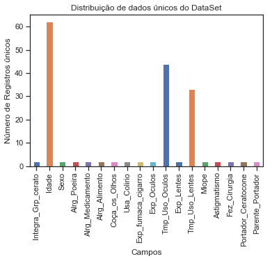


```python
sns.pairplot(df.drop(['Integra_Grp_cerato','Idade','Usa_Colirio','Coça_os_Olhos','Exp_fumaca_cigarro','Exp_Oculos','Exp_Lentes','Miope','Fez_Cirurgia','Parente_Portador','Exp_Oculos','Exp_Lentes'],axis=1), hue="Portador_Ceratocone")

#'Integra_Grp_cerato','Alrg_Poeira','Alrg_Medicamento','Alrg_Alimento','Coça_os_Olhos','Usa_Colirio','Exp_fumaca_cigarro','Exp_Oculos','Exp_Lentes','Miope','Astigmatismo','Fez_Cirurgia','Portador_Ceratocone','Parente_Portador'
```

    D:\Continuum\anaconda3\lib\site-packages\statsmodels\nonparametric\kde.py:488: RuntimeWarning: invalid value encountered in true_divide
      binned = fast_linbin(X, a, b, gridsize) / (delta * nobs)
    D:\Continuum\anaconda3\lib\site-packages\statsmodels\nonparametric\kdetools.py:34: RuntimeWarning: invalid value encountered in double_scalars
      FAC1 = 2*(np.pi*bw/RANGE)**2
    


    <seaborn.axisgrid.PairGrid at 0x18d9414ac50>


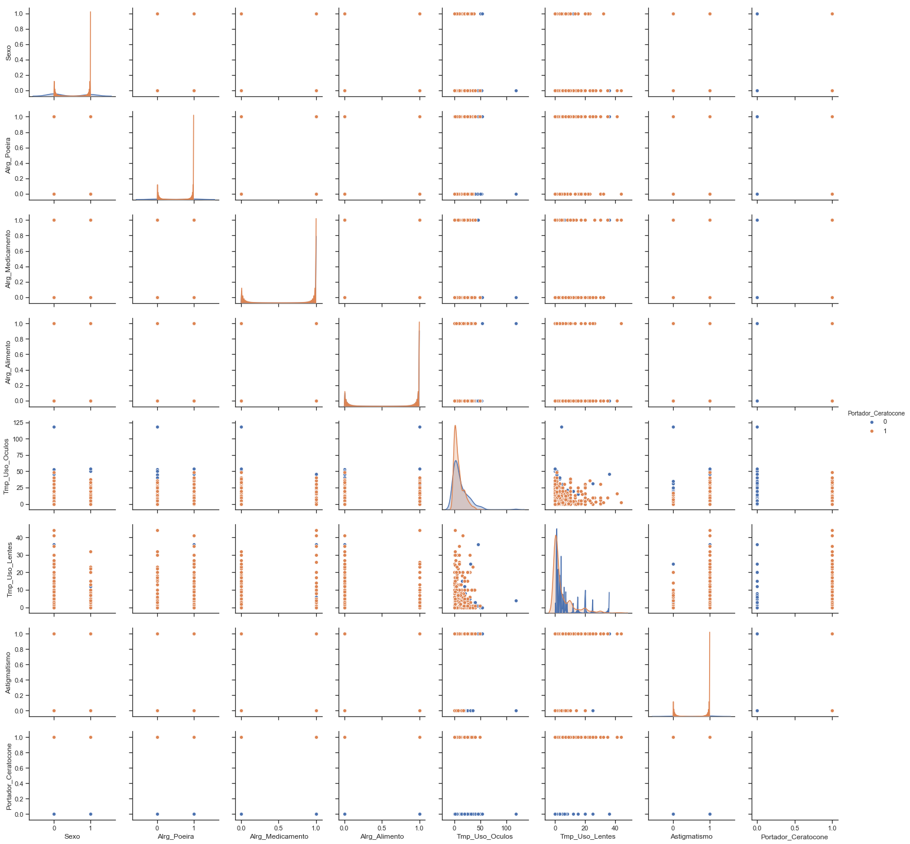


```python
sns.pairplot(df.drop(['Integra_Grp_cerato','Sexo','Idade','Alrg_Poeira','Alrg_Medicamento','Alrg_Alimento','Tmp_Uso_Oculos','Tmp_Uso_Lentes'],axis=1), hue="Portador_Ceratocone")

```

    D:\Continuum\anaconda3\lib\site-packages\statsmodels\nonparametric\kde.py:488: RuntimeWarning: invalid value encountered in true_divide
      binned = fast_linbin(X, a, b, gridsize) / (delta * nobs)
    D:\Continuum\anaconda3\lib\site-packages\statsmodels\nonparametric\kdetools.py:34: RuntimeWarning: invalid value encountered in double_scalars
      FAC1 = 2*(np.pi*bw/RANGE)**2
    


    <seaborn.axisgrid.PairGrid at 0x18d9414acc0>


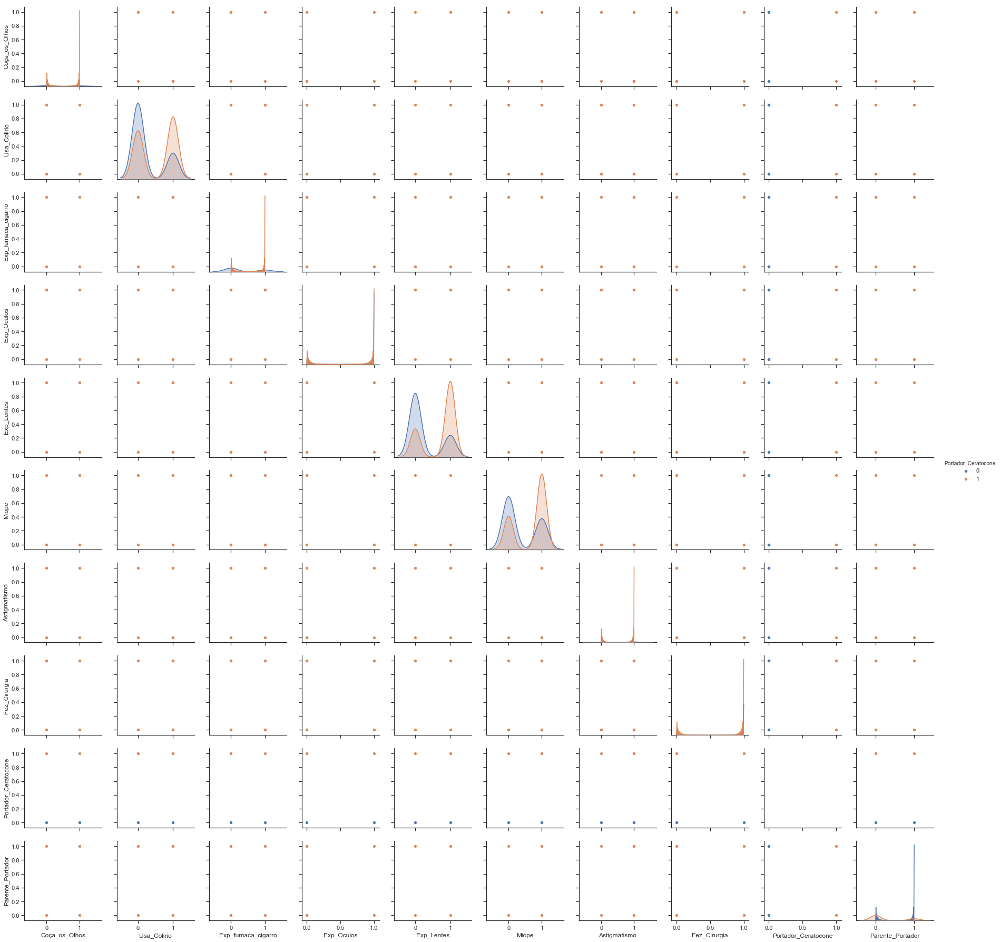


```python
# Analisando coluna a Portadores de Ceratocone, e sua distribuição
from scipy import stats
y = df['Portador_Ceratocone']

sns.distplot(y, fit=stats.norm)

# Obtendo os parametros atribuidos e utilizados pela função
(mu, sigma) = stats.norm.fit(y)
print( '\n mu = {:.2f} and sigma = {:.2f}\n'.format(mu, sigma))

#Plotando gráfico de distribuição
plt.legend(['Normal dist. ($\mu=$ {:.2f} and $\sigma=$ {:.2f} )'.format(mu, sigma)],
            loc='best')
plt.ylabel('Frequency')
plt.title('Portador Ceratocone distribution')

#Gerando também QQ-plot
fig = plt.figure()
res = stats.probplot(df['Portador_Ceratocone'], plot=plt)
plt.show()
```

    
     mu = 0.74 and sigma = 0.44
    
    


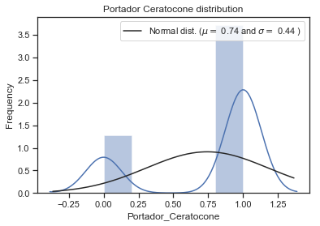


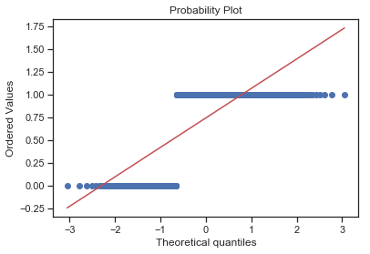


```python
'''É possível analisar que o conjunto de dados está desbalanceado, a diferença é de 25% de uma classe para a outra.
Este fato pode enviesar o modelo de classificação gerando assim falsos positivos, o que é aceitável uma vez que
é preferível que se investigue uma falsa suspeita do que o inverso podendo gerar problemas futuros a pessoa '''
```


    'É possível analisar que o conjunto de dados está desbalanceado, a diferença é de 25% de uma classe para a outra.\nEste fato pode enviesar o modelo de classificação gerando assim falsos positivos, o que é aceitável uma vez que\né preferível que se investigue uma falsa suspeita do que o inverso podendo gerar problemas futuros a pessoa '


```python
  
def heat_corr (data):
    '''Analisando a correlação entre as features
       do dataset
    '''    
    sns.heatmap(data.corr(),square=True,cmap='RdYlGn')
    plt.title('Correlação entre as features')
    plt.show()
 

#Chamando função para analisar a correlação entre as features originais do dataset
heat_corr(df) 

#Imprimindo valor da correlação
df[['Portador_Ceratocone','Alrg_Poeira','Alrg_Medicamento','Alrg_Alimento','Tmp_Uso_Lentes','Exp_Lentes','Miope','Astigmatismo','Coça_os_Olhos','Parente_Portador','Sexo']].corr()

```


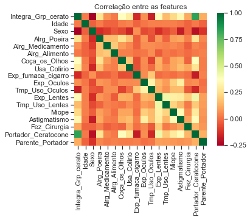


<div>
<style scoped>
    .dataframe tbody tr th:only-of-type {
        vertical-align: middle;
    }

    .dataframe tbody tr th {
        vertical-align: top;
    }

    .dataframe thead th {
        text-align: right;
    }
</style>
<table border="1" class="dataframe">
  <thead>
    <tr style="text-align: right;">
      <th></th>
      <th>Portador_Ceratocone</th>
      <th>Alrg_Poeira</th>
      <th>Alrg_Medicamento</th>
      <th>Alrg_Alimento</th>
      <th>Tmp_Uso_Lentes</th>
      <th>Exp_Lentes</th>
      <th>Miope</th>
      <th>Astigmatismo</th>
      <th>Coça_os_Olhos</th>
      <th>Parente_Portador</th>
      <th>Sexo</th>
    </tr>
  </thead>
  <tbody>
    <tr>
      <th>Portador_Ceratocone</th>
      <td>1.000000</td>
      <td>0.267541</td>
      <td>0.048358</td>
      <td>0.022518</td>
      <td>0.194380</td>
      <td>0.423931</td>
      <td>0.290150</td>
      <td>0.360034</td>
      <td>0.381360</td>
      <td>0.126140</td>
      <td>-0.208960</td>
    </tr>
    <tr>
      <th>Alrg_Poeira</th>
      <td>0.267541</td>
      <td>1.000000</td>
      <td>0.159466</td>
      <td>0.163156</td>
      <td>-0.021488</td>
      <td>0.078341</td>
      <td>0.097590</td>
      <td>0.113022</td>
      <td>0.257174</td>
      <td>0.045721</td>
      <td>-0.140652</td>
    </tr>
    <tr>
      <th>Alrg_Medicamento</th>
      <td>0.048358</td>
      <td>0.159466</td>
      <td>1.000000</td>
      <td>0.193909</td>
      <td>0.037836</td>
      <td>0.047182</td>
      <td>0.052336</td>
      <td>0.034153</td>
      <td>0.086008</td>
      <td>0.021611</td>
      <td>-0.102002</td>
    </tr>
    <tr>
      <th>Alrg_Alimento</th>
      <td>0.022518</td>
      <td>0.163156</td>
      <td>0.193909</td>
      <td>1.000000</td>
      <td>0.024950</td>
      <td>-0.035704</td>
      <td>0.004127</td>
      <td>0.020976</td>
      <td>0.031858</td>
      <td>0.038545</td>
      <td>-0.048550</td>
    </tr>
    <tr>
      <th>Tmp_Uso_Lentes</th>
      <td>0.194380</td>
      <td>-0.021488</td>
      <td>0.037836</td>
      <td>0.024950</td>
      <td>1.000000</td>
      <td>0.429134</td>
      <td>0.216896</td>
      <td>0.147699</td>
      <td>0.010504</td>
      <td>0.093255</td>
      <td>-0.075014</td>
    </tr>
    <tr>
      <th>Exp_Lentes</th>
      <td>0.423931</td>
      <td>0.078341</td>
      <td>0.047182</td>
      <td>-0.035704</td>
      <td>0.429134</td>
      <td>1.000000</td>
      <td>0.312063</td>
      <td>0.302798</td>
      <td>0.132217</td>
      <td>0.094988</td>
      <td>-0.134423</td>
    </tr>
    <tr>
      <th>Miope</th>
      <td>0.290150</td>
      <td>0.097590</td>
      <td>0.052336</td>
      <td>0.004127</td>
      <td>0.216896</td>
      <td>0.312063</td>
      <td>1.000000</td>
      <td>0.349840</td>
      <td>0.107906</td>
      <td>0.075586</td>
      <td>-0.031900</td>
    </tr>
    <tr>
      <th>Astigmatismo</th>
      <td>0.360034</td>
      <td>0.113022</td>
      <td>0.034153</td>
      <td>0.020976</td>
      <td>0.147699</td>
      <td>0.302798</td>
      <td>0.349840</td>
      <td>1.000000</td>
      <td>0.129056</td>
      <td>0.065879</td>
      <td>-0.177140</td>
    </tr>
    <tr>
      <th>Coça_os_Olhos</th>
      <td>0.381360</td>
      <td>0.257174</td>
      <td>0.086008</td>
      <td>0.031858</td>
      <td>0.010504</td>
      <td>0.132217</td>
      <td>0.107906</td>
      <td>0.129056</td>
      <td>1.000000</td>
      <td>0.026311</td>
      <td>-0.079129</td>
    </tr>
    <tr>
      <th>Parente_Portador</th>
      <td>0.126140</td>
      <td>0.045721</td>
      <td>0.021611</td>
      <td>0.038545</td>
      <td>0.093255</td>
      <td>0.094988</td>
      <td>0.075586</td>
      <td>0.065879</td>
      <td>0.026311</td>
      <td>1.000000</td>
      <td>-0.124687</td>
    </tr>
    <tr>
      <th>Sexo</th>
      <td>-0.208960</td>
      <td>-0.140652</td>
      <td>-0.102002</td>
      <td>-0.048550</td>
      <td>-0.075014</td>
      <td>-0.134423</td>
      <td>-0.031900</td>
      <td>-0.177140</td>
      <td>-0.079129</td>
      <td>-0.124687</td>
      <td>1.000000</td>
    </tr>
  </tbody>
</table>
</div>


```python
''' A análise anterior nos apresenta informações importantes que consolidam a suspeita da correlação entre portadores de 
 ceratocone com algum tipo de alergia. No caso desta pesquisa é possível perceber uma correlação positiva se analisarmos
 alergia a poeira. Também é possível identificar correlação forte com o Astigmatismo, 
 coçar os olhos com frequência e a exposição a lentes de contato'''
```


    ' A análise anterior nos apresenta informações importantes que consolidam a suspeita da correlação entre portadores de \n ceratocone com algum tipo de alergia. No caso desta pesquisa é possível perceber uma correlação positiva se analisarmos\n alergia a poeira. Também é possível identificar correlação forte com o Astigmatismo, \n coçar os olhos com frequência e a exposição a lentes de contato'


```python
'''Será gerada a analise descritiva dos dados obtidos na pesquisa, para um melhor entendimento da amostragem adiquirida'''

#Agrupando os dados por idade de quem é portador da doença

portadores = pd.DataFrame(df.groupby(['Idade'], as_index=False)['Portador_Ceratocone','Astigmatismo','Miope','Alrg_Poeira','Coça_os_Olhos','Tmp_Uso_Lentes','Sexo','Exp_Lentes'].sum())

#criando coluna nova
portadores['grupo_idade'] = '0'    


#Verificando condição para preencher nova coluna grupo de idade
for i in range(0,len(portadores)):
    if portadores.Idade[i] <= 10:    
        portadores.loc[i,['grupo_idade']]='0-10'
        
    elif portadores.Idade[i]>= 11 and portadores.Idade[i] <= 20:
        portadores.loc[i,['grupo_idade']]='11 - 20'
    
    elif portadores.Idade[i] >= 21 and portadores.Idade[i] <= 30:
        portadores.loc[i,['grupo_idade']]= '21 - 30'

    elif portadores.Idade[i] >= 31 and portadores.Idade[i] <= 40:
        portadores.loc[i,['grupo_idade']]=  '31 - 40'   

    else:
        portadores.loc[i,['grupo_idade']]='Maior ou Igual a 50' 

        
#Realizando agrupamento pelo novo grupo de idade criado
portadores_idade = pd.DataFrame(portadores.groupby(['grupo_idade'], as_index=False)['Portador_Ceratocone'].sum())


## Doenças e fatores conhecidos ##

#Realizando agrupamento por portadores com astigmatismo
port_astigm = pd.DataFrame(df.groupby(['Astigmatismo'], as_index=False)['Portador_Ceratocone'].sum())

#Realizando agrupamento por portadores com astigmatismo
port_miopia = pd.DataFrame(df.groupby(['Miope'], as_index=False)['Portador_Ceratocone'].sum())

#Realizando agrupamento por portadores que costumam coças frequentemente os olhos
port_cocaOlho = pd.DataFrame(df.groupby(['Coça_os_Olhos'], as_index=False)['Portador_Ceratocone'].sum())

### Alergias ##

#Realizando agrupamento por portadores com alergia a poeira
port_alerg = pd.DataFrame(df.groupby(['Alrg_Poeira'], as_index=False)['Portador_Ceratocone'].sum())

#Realizando agrupamento por portadores com alergia a alimentos
port_aler_alimento = pd.DataFrame(df.groupby(['Alrg_Alimento'], as_index=False)['Portador_Ceratocone'].sum())

#Realizando agrupamento por portadores com alergia a medicamentos
port_aler_medic = pd.DataFrame(df.groupby(['Alrg_Medicamento'], as_index=False)['Portador_Ceratocone'].sum())

#Realizando agrupamento por portadores pelo sexo
sexo = pd.DataFrame(df.groupby(['Sexo'], as_index=False)['Portador_Ceratocone'].sum())


```


```python
# Gerando Gráfico de pizza
def pie_chart(data,col1,col2,title):    

    labels = {'Não':0,'Sim':1}
    sizes = data[col2]
    colors = ['lightcoral', 'lightskyblue','green', 'purple','skyblue']

    plt.pie(sizes, labels=labels, colors=colors,
                autopct='%1.1f%%', shadow=True, startangle=140, labeldistance =1.2)
    plt.title( title )
    
    plt.axis('equal')
    plt.show()

def pie_chart_1(data,col1,col2,title):    

    labels = {'Não':0,'Sim':1}
    sizes = data[col2]
    colors = ['gold', 'yellowgreen']

    plt.pie(sizes, labels=labels, colors=colors,
                autopct='%1.1f%%', shadow=True, startangle=140, labeldistance =1.2)
    plt.title( title )
    
    plt.axis('equal')
    plt.show()

#Tratamento dos campos 0,1 para Não e Sim, para apresentar no gráfico descritivo
    
def sim_nao (data,col):
    '''data -->dataframe
       col --> string
       return (dataframe)       
    '''
    data[col] = np.where(np.logical_or(data[col] == 1, data[col].astype('str')=="Sim"), "Sim","Não")
    return(data)

#Tratamento dos campos 0,1 para Feminino e Masculino, para apresentar no gráfico descritivo
def h_m (data,col):
    '''data -->dataframe
       col --> string
       return (dataframe)       
    '''
    data[col] = np.where(np.logical_or(data[col] == 1, data[col].astype('str')=="Sim"), "Masculino","Feminino")
    return(data)
```


```python
''' Geração de Gráficos para análise descritiva'''
print('Quantidade total de registros analisados: ' + str(df.shape[0]))
print('Quantidade total de portadores analisados: ' + str(df[df['Portador_Ceratocone']==1].shape[0]))
print('Quantidade total de não portadores analisados: ' + str(df[df['Portador_Ceratocone']==0].shape[0]))

#Criando gráfico portadores com astigmatismo
pie_chart(port_astigm,'Astigmatismo','Portador_Ceratocone','Portadores do Ceratocone com Astigmatismo')
sim_nao(port_astigm,'Astigmatismo') 
print(port_astigm )

#Criando gráfico portadores com miopia
pie_chart(port_miopia,'Miope','Portador_Ceratocone','Portadores do Ceratocone com Miopia')
sim_nao(port_miopia,'Miope') 
print(port_miopia)

#Criando gráfico portadores que coçam os olhos frequentemente
pie_chart(port_cocaOlho,'Coça_os_Olhos','Portador_Ceratocone','Portadores do Ceratocone\n Que coçam os Olhos com Frequência ')
sim_nao(port_cocaOlho,'Coça_os_Olhos') 
print(port_cocaOlho)
```

    Quantidade total de registros analisados: 610
    Quantidade total de portadores analisados: 453
    Quantidade total de não portadores analisados: 157
    


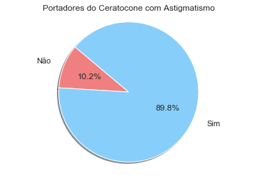


      Astigmatismo  Portador_Ceratocone
    0          Não                   46
    1          Sim                  407
    


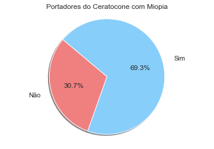


      Miope  Portador_Ceratocone
    0   Não                  139
    1   Sim                  314
    


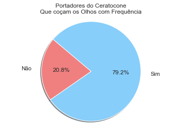


      Coça_os_Olhos  Portador_Ceratocone
    0           Não                   94
    1           Sim                  359
    


```python
print('Quantidade total de registros analisados: ' + str(df.shape[0]))
print('Quantidade total de portadores analisados: ' + str(df[df['Portador_Ceratocone']==1].shape[0]))
print('Quantidade total de não portadores analisados: ' + str(df[df['Portador_Ceratocone']==0].shape[0]))

#Criando gráfico portadores com alergia a poeira
pie_chart_1(port_alerg,'Alrg_Poeira','Portador_Ceratocone','Portadores do Ceratocone com\n Alergia a Poeira')
sim_nao(port_alerg,'Alrg_Poeira') 
print(port_alerg)

#Criando gráfico portadores com alergia a Alimentos
pie_chart_1(port_aler_alimento,'Alrg_Alimento','Portador_Ceratocone','Portadores do Ceratocone com\n Alergia a algum alimento\n')
sim_nao(port_aler_alimento,'Alrg_Alimento') 
print(port_aler_alimento)

#Criando gráfico portadores com alergia a medicamentos
pie_chart_1(port_aler_medic,'Alrg_Medicamento','Portador_Ceratocone','Portadores do Ceratocone com\n Alergia a algum medicamento\n')
sim_nao(port_aler_medic,'Alrg_Medicamento') 
print(port_aler_medic)

```

    Quantidade total de registros analisados: 610
    Quantidade total de portadores analisados: 453
    Quantidade total de não portadores analisados: 157
    


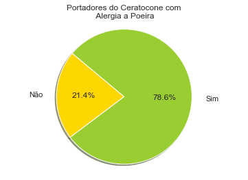


      Alrg_Poeira  Portador_Ceratocone
    0         Não                   97
    1         Sim                  356
    


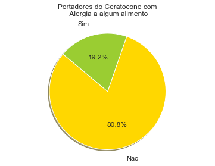


      Alrg_Alimento  Portador_Ceratocone
    0           Não                  366
    1           Sim                   87
    


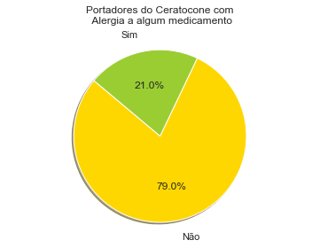


      Alrg_Medicamento  Portador_Ceratocone
    0              Não                  358
    1              Sim                   95
    


```python
print('Quantidade total de registros analisados: ' + str(df.shape[0]))
print('Quantidade total de portadores analisados: ' + str(df[df['Portador_Ceratocone']==1].shape[0]))
print('Quantidade total de não portadores analisados: ' + str(df[df['Portador_Ceratocone']==0].shape[0]))

#Criando gráfico portadores pelo sexo
pie_chart(sexo,'Sexo','Portador_Ceratocone','Portadores do Ceratocone por sexo\n')
h_m(sexo,'Sexo') 
print(sexo)

```

    Quantidade total de registros analisados: 610
    Quantidade total de portadores analisados: 453
    Quantidade total de não portadores analisados: 157
    


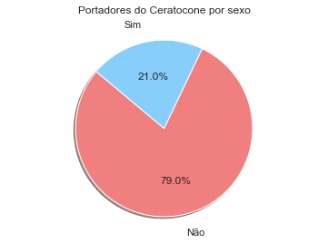


            Sexo  Portador_Ceratocone
    0   Feminino                  358
    1  Masculino                   95
    


```python
#Criando gráfico portadores por grupo de idade    

bar = portadores_idade.plot('grupo_idade','Portador_Ceratocone', kind='bar')
plt.xlabel('Idade')
plt.ylabel('Quantidade de portadores')
plt.title('Análise da idade dos portadores de Ceratocone')

plt.legend()
plt.show()

print(portadores_idade[['grupo_idade','Portador_Ceratocone']])
```


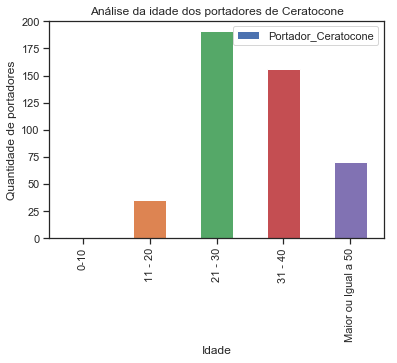


               grupo_idade  Portador_Ceratocone
    0                 0-10                    1
    1              11 - 20                   35
    2              21 - 30                  191
    3              31 - 40                  156
    4  Maior ou Igual a 50                   70
    


```python
'''Foi realizado um agrupamento das idades para melhor compreensão da faixa etária mais atingida pela doença'''
```


    'Foi realizado um agrupamento das idades para melhor compreensão da faixa etária mais atingida pela doença'


```python
'''Após o agrupamento das idades, foi gerada uma nova visualização quanto a 
correlação das features com o fato de ser portador da doença. O quão sensível são essas variáveis
em relação ao fato de se portar a doença'''

print("Análise da correlação após agrupar portadores por idade")
heat_corr(portadores.drop(['Idade','Sexo'],axis=1))
#Imprimindo valor da correlação
portadores[['Portador_Ceratocone','Alrg_Poeira','Miope','Astigmatismo','Coça_os_Olhos','Tmp_Uso_Lentes','Exp_Lentes']].corr()

```

    Análise da correlação após agrupar portadores por idade
    


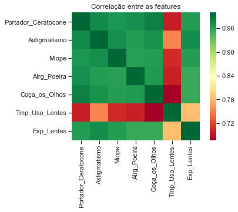


<div>
<style scoped>
    .dataframe tbody tr th:only-of-type {
        vertical-align: middle;
    }

    .dataframe tbody tr th {
        vertical-align: top;
    }

    .dataframe thead th {
        text-align: right;
    }
</style>
<table border="1" class="dataframe">
  <thead>
    <tr style="text-align: right;">
      <th></th>
      <th>Portador_Ceratocone</th>
      <th>Alrg_Poeira</th>
      <th>Miope</th>
      <th>Astigmatismo</th>
      <th>Coça_os_Olhos</th>
      <th>Tmp_Uso_Lentes</th>
      <th>Exp_Lentes</th>
    </tr>
  </thead>
  <tbody>
    <tr>
      <th>Portador_Ceratocone</th>
      <td>1.000000</td>
      <td>0.973057</td>
      <td>0.967732</td>
      <td>0.976569</td>
      <td>0.982404</td>
      <td>0.698504</td>
      <td>0.963768</td>
    </tr>
    <tr>
      <th>Alrg_Poeira</th>
      <td>0.973057</td>
      <td>1.000000</td>
      <td>0.961738</td>
      <td>0.962856</td>
      <td>0.965516</td>
      <td>0.699052</td>
      <td>0.954197</td>
    </tr>
    <tr>
      <th>Miope</th>
      <td>0.967732</td>
      <td>0.961738</td>
      <td>1.000000</td>
      <td>0.973159</td>
      <td>0.962257</td>
      <td>0.705681</td>
      <td>0.962278</td>
    </tr>
    <tr>
      <th>Astigmatismo</th>
      <td>0.976569</td>
      <td>0.962856</td>
      <td>0.973159</td>
      <td>1.000000</td>
      <td>0.970472</td>
      <td>0.753092</td>
      <td>0.974637</td>
    </tr>
    <tr>
      <th>Coça_os_Olhos</th>
      <td>0.982404</td>
      <td>0.965516</td>
      <td>0.962257</td>
      <td>0.970472</td>
      <td>1.000000</td>
      <td>0.677451</td>
      <td>0.953777</td>
    </tr>
    <tr>
      <th>Tmp_Uso_Lentes</th>
      <td>0.698504</td>
      <td>0.699052</td>
      <td>0.705681</td>
      <td>0.753092</td>
      <td>0.677451</td>
      <td>1.000000</td>
      <td>0.785786</td>
    </tr>
    <tr>
      <th>Exp_Lentes</th>
      <td>0.963768</td>
      <td>0.954197</td>
      <td>0.962278</td>
      <td>0.974637</td>
      <td>0.953777</td>
      <td>0.785786</td>
      <td>1.000000</td>
    </tr>
  </tbody>
</table>
</div>


```python
print('Pair Plot apresentando dados por Grupo de Idade')
sns.pairplot(portadores.drop('Idade',axis=1), hue="grupo_idade")

```

    Pair Plot apresentando dados por Grupo de Idade
    

    D:\Continuum\anaconda3\lib\site-packages\numpy\core\_methods.py:135: RuntimeWarning: Degrees of freedom <= 0 for slice
      keepdims=keepdims)
    D:\Continuum\anaconda3\lib\site-packages\numpy\core\_methods.py:127: RuntimeWarning: invalid value encountered in double_scalars
      ret = ret.dtype.type(ret / rcount)
    


    <seaborn.axisgrid.PairGrid at 0x18d8a7ef9b0>


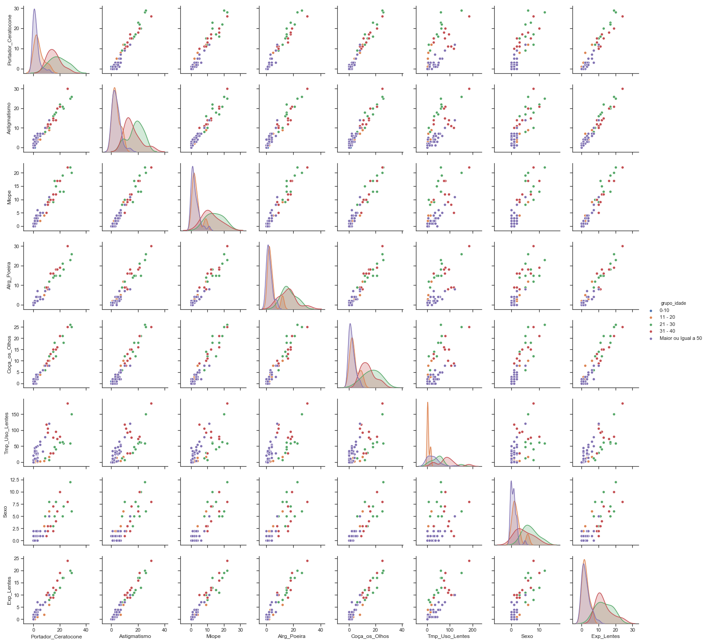


```python
print("Inicio das atividades de Machine Learning\n Objetivo: Classificar possíveis portadores da doença")
```

    Inicio das atividades de Machine Learning
     Objetivo: Classificar possíveis portadores da doença
    


```python
from sklearn.ensemble import RandomForestClassifier
from sklearn.model_selection import train_test_split
from sklearn.metrics import  classification_report,confusion_matrix, roc_curve


def compute_log_loss(predicted, actual, eps=1e-14):
    '''
    Computa a medida de avaliação sobre perda (log loss)
    Utilizada para avaliação do modelo
    '''
    
    predicted = np.clip( predicted , eps , 1- eps)  
    loss = -1 * np.mean(  actual * np.log(predicted) + (1 - actual) * np.log(1 - predicted))

    return loss


def ac_desemp (cm):
    ac = 0
    ac = (cm[0,0] + cm[1,1]) / (cm[0,0] + cm[1,1] + cm[1,0] + cm[0,1])
    
    print("Acuracia do modelo é : " + str(ac))


```


```python
#Separando coluna previsora das demais colunas de informação

X = (df.drop(['Portador_Ceratocone','Data/hora','Integra_Grp_cerato'], axis=1))
y = (df.Portador_Ceratocone)

'''Apesar do dataset estar coeso e sem features descritivas, a aplicação do metodo de encoding
gerou uma melhora percentual aceitável, por este motivo resolvi manter esse passo no processo'''

#One Hot Encoding fuel rail column
from sklearn.preprocessing import LabelEncoder, OneHotEncoder
labelEncoder= LabelEncoder()
for i in range(0,len(X.columns)):
    X.iloc[:,i] = labelEncoder.fit_transform(X.iloc[:,i].astype('int'))


hotEncoder = OneHotEncoder()
for i in range(0,len(X.columns)):
    X.iloc[:,i] = labelEncoder.fit_transform(X.iloc[:,i])

```


```python
#Realiando o split do modelo

X_train, X_test, y_train, y_test = train_test_split(X, y , test_size=0.45, random_state = 0)


classifier = RandomForestClassifier(n_estimators=35, criterion='entropy', random_state=0)

classifier.fit(X_train, y_train)

RandomForestClassifier(bootstrap=True, class_weight=None, criterion='entropy',
            max_depth=None, max_features='auto', max_leaf_nodes=None,
            min_impurity_decrease=0.0, min_impurity_split=None,
            min_samples_leaf=1, min_samples_split=2,
            min_weight_fraction_leaf=0.0, n_estimators=35, n_jobs=1,
            oob_score=False, random_state=None, verbose=0,
            warm_start=False)

### Criando a o modelo te treinamento ###
y_pred_train = classifier.predict_proba(X_train)

### Gerando teste do modelo ###
y_pred = classifier.predict_proba(X_test)

# Compute predicted probabilities: y_pred_prob
y_pred_prob = (y_pred[:,1])

# Generate ROC curve values: fpr, tpr, thresholds
fpr, tpr,threshold = roc_curve(y_test,y_pred_prob.round())

# Plot ROC curve
plt.plot([0, 1], [0, 1], 'k--')
plt.plot(fpr,tpr)
plt.xlabel('False Positive Rate')
plt.ylabel('True Positive Rate')
plt.title('ROC Curve')
plt.show()


# Making the Confusion Matrix
cm = confusion_matrix(y_test, y_pred[:,1].round())
ac_desemp(cm)
# Compute metrics
print(classification_report(y_test, y_pred[:,1].round()))

print("Log Loss Result: \n" + str( compute_log_loss(np.array(pd.Series(y_pred[:,1])),y_test)))
print('\nConfusion Matrix:')
print(cm)
```


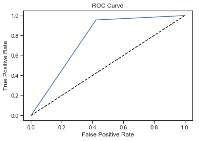


    Acuracia do modelo é : 0.8581818181818182
                 precision    recall  f1-score   support
    
              0       0.82      0.58      0.68        71
              1       0.87      0.96      0.91       204
    
    avg / total       0.85      0.86      0.85       275
    
    Log Loss Result: 
    0.31886010774652945
    
    Confusion Matrix:
    [[ 41  30]
     [  9 195]]
    


```python
feature_imp = pd.Series(classifier.feature_importances_,index=X.columns).sort_values(ascending=False)
feature_imp
```


    Idade                 0.201700
    Tmp_Uso_Oculos        0.143502
    Coça_os_Olhos         0.108980
    Exp_Lentes            0.094710
    Tmp_Uso_Lentes        0.081091
    Astigmatismo          0.064758
    Miope                 0.054727
    Sexo                  0.045002
    Usa_Colirio           0.039450
    Exp_fumaca_cigarro    0.034514
    Alrg_Poeira           0.034301
    Fez_Cirurgia          0.032778
    Parente_Portador      0.025736
    Alrg_Medicamento      0.023319
    Exp_Oculos            0.015430
    dtype: float64


```python
# Creating a bar plot
sns.barplot(x=feature_imp, y=feature_imp.index)
# Add labels to your graph
plt.xlabel('Pontuação de Importancia das Features')
plt.ylabel('Features')
plt.title("Visualizando Features Importantes")
plt.show()
```


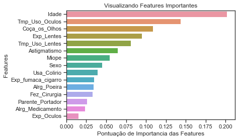


```python
def chart_stat(df):    

    # Analisando a predição do modelo, e sua distribuição
    from scipy import stats
    y_teste = df

    sns.distplot(y_teste, fit=stats.norm)

    # Obtendo os parametros atribuidos e utilizados pela função
    (mu, sigma) = stats.norm.fit(y_teste)
    print( '\n mu = {:.2f} and sigma = {:.2f}\n'.format(mu, sigma))

    #Plotando gráfico de distribuição
    plt.legend(['Normal dist. ($\mu=$ {:.2f} and $\sigma=$ {:.2f} )'.format(mu, sigma)],
                loc='best')
    plt.ylabel('Frequency')
    plt.title('Portador Ceratocone distribution')

    #Gerando também QQ-plot
    fig = plt.figure()
    res = stats.probplot(y_teste, plot=plt)
    plt.show()
```


```python
###Analisando distribuição do modelo de treinamento, dados de Portadores###
chart_stat(y_pred_train[:,1])
```

    
     mu = 0.75 and sigma = 0.35
    
    


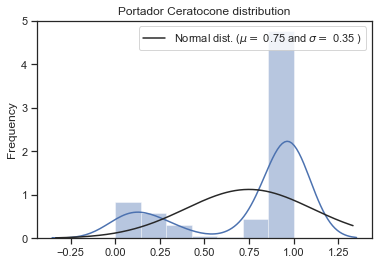


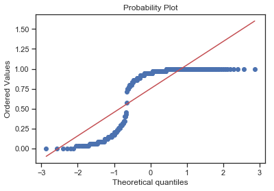


```python
###Analisando distribuição do modelo de treinamento, dados de Não Portadores###
chart_stat(y_pred_train[:,0])
```

    
     mu = 0.25 and sigma = 0.35
    
    


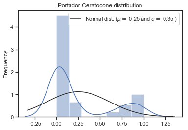


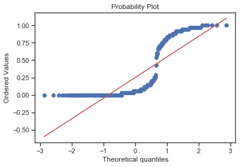


```python
###Analisando distribuição do modelo de Teste, dados de Portadores###
chart_stat(y_pred[:,1])
```

    
     mu = 0.77 and sigma = 0.28
    
    


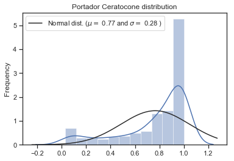


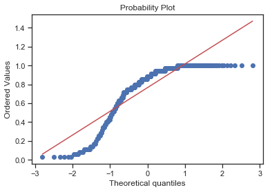


```python
###Analisando distribuição do modelo de Teste, dados de Não Portadores###
chart_stat(y_pred[:,0])
```

    
     mu = 0.23 and sigma = 0.28
    
    


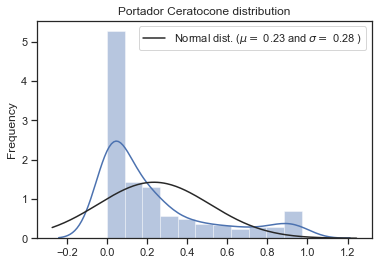


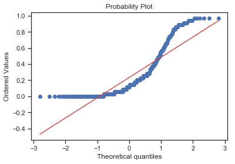


```python
''' Realizando Teste de classificação, me utilizei como 
cobaia uma vez que sou portador da doença e não respondi o questionário'''


filipe = [[30,1,1,1,0,1,0,1,1,8,1,10,1,1,1,0]]

drik = [[26,0,0,0,0,0,0,0,1,2,0,0,0,1,0,0]]

y_pred_eu = classifier.predict_proba(filipe)
y_predict_eu = classifier.predict(filipe)

print('Resultado da analise de um portador da doença\n que não respondeu o questionário:')
print(y_pred_eu, y_predict_eu)


y_pred_drik = classifier.predict_proba(drik)
y_predict_drik = classifier.predict(drik)

print('Resultado da analise de um não portador da doença\n que não respondeu o questionário:')
print(y_pred_drik, y_predict_drik)

```

    Resultado da analise de um portador da doença
     que não respondeu o questionário:
    [[0.2 0.8]] [1]
    Resultado da analise de um não portador da doença
     que não respondeu o questionário:
    [[0.77142857 0.22857143]] [0]
    
