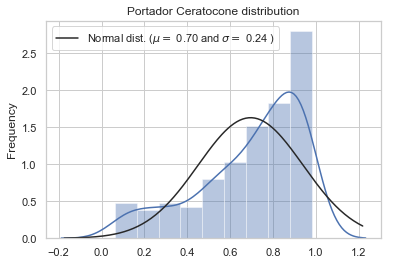
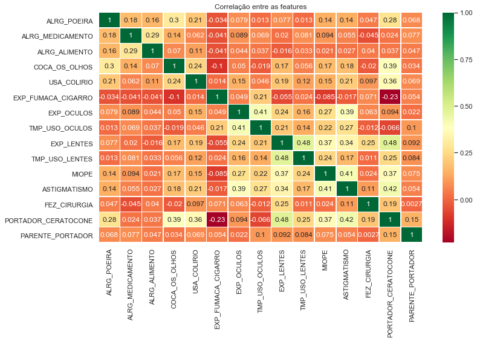
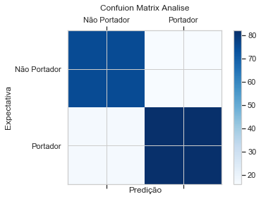
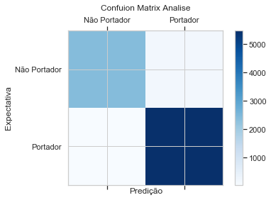

## Describe:

#### The work below aims in identify the probability of some people having Keratoconus or not, using data obtained by an research using google forms. Also, I tried analize the correlations with keratoconus and people with some alergies, trying to comprove the hypothesis that people with some alergies will be propense to have keratoconus dissease.

## Data:
The data set is avaliable to download at my github page.

## License:
If you wish to use this work for something is just make the right citation. Thank you and enjoy!


## Code Section:

# Análise da correlação de alergias e astigmatismo com a insidência do Ceratocone

### Este trabalho de cunho acadêmico, irá analisar dados obtidos por intermédio de uma pesquisa realizada via internet. Os resultados obtidos não poderão ser considerados como única fonte de identificação da portabilidade da doença, sendo necessária a análise médica por intermédio de exames específicos para detecção da doença.

### O objetivo será analisar a influência de alguns tipos de alergias e doenças básicas relacionadas a problemas de visão, bem como analisar fatores externos como tempo de exposição a óculos e lentes e faixa etária do portador, visando a classificação, com análise probabilistica quanto portabilidade ou não do ceratocone.


```python
##Importando as Bibliotecas ##
import pandas as pd
import numpy as np
from scipy import stats
import matplotlib.pyplot as plt
import seaborn as sns
import os


##Importando o dataset da pesquisa##
df = pd.read_csv("C:\\Users\\filip\\OneDrive\\Área de Trabalho\\Lipe_1\\TCC -MBA\\CeratoconeCorrelacao.csv", engine='python',encoding='utf-8', sep=',')

###Analisando o dataset###
df.head()
```


<div>
<style scoped>
    .dataframe tbody tr th:only-of-type {
        vertical-align: middle;
    }

    .dataframe tbody tr th {
        vertical-align: top;
    }

    .dataframe thead th {
        text-align: right;
    }
</style>
<table border="1" class="dataframe">
  <thead>
    <tr style="text-align: right;">
      <th></th>
      <th>Carimbo de data/hora</th>
      <th>Você faz parte do grupo do Facebook Ceratocone e Tratamentos?</th>
      <th>Qual a sua idade?</th>
      <th>Qual seu sexo?</th>
      <th>Você possui alergia a poeria?</th>
      <th>Você possui alergia a algum medicamento?</th>
      <th>Você possui alergia a algum alimento?</th>
      <th>Você costuma coçar os olhos frequentemente?</th>
      <th>Você faz uso de colírio lubrificante constantemente?</th>
      <th>Você é ou já foi fumante ?</th>
      <th>Você já utiliza/utilizou óculos?</th>
      <th>Por quantos anos utiliza/utilizou óculos? (Inserir apenas número, caso use o campo outros)</th>
      <th>Você já usou lentes de contato?</th>
      <th>Por quantos anos utiliza/utilizou lentes de contato? (Inserir apenas número, caso use o campo outros)</th>
      <th>Você possui Miopia ?</th>
      <th>Você possui astigmatismo?</th>
      <th>Já realizou alguma cirurgia corretiva de grau?</th>
      <th>Você é portador de ceratocone?</th>
      <th>Possui algum parente de primeiro grau portador do ceratocone?</th>
    </tr>
  </thead>
  <tbody>
    <tr>
      <th>0</th>
      <td>27/09/2018 14:10:46</td>
      <td>Sim</td>
      <td>23</td>
      <td>Masculino</td>
      <td>Sim</td>
      <td>Sim</td>
      <td>Não</td>
      <td>Não</td>
      <td>Não</td>
      <td>Sim</td>
      <td>Não</td>
      <td>0</td>
      <td>Sim</td>
      <td>1</td>
      <td>Sim</td>
      <td>Sim</td>
      <td>Não</td>
      <td>Sim</td>
      <td>Não</td>
    </tr>
    <tr>
      <th>1</th>
      <td>27/09/2018 14:14:09</td>
      <td>Sim</td>
      <td>22</td>
      <td>Feminino</td>
      <td>Sim</td>
      <td>Não</td>
      <td>Sim</td>
      <td>Sim</td>
      <td>Sim</td>
      <td>Não</td>
      <td>Sim</td>
      <td>10</td>
      <td>Sim</td>
      <td>13</td>
      <td>Sim</td>
      <td>Sim</td>
      <td>Não</td>
      <td>Sim</td>
      <td>Sim</td>
    </tr>
    <tr>
      <th>2</th>
      <td>27/09/2018 14:15:03</td>
      <td>Sim</td>
      <td>34</td>
      <td>Feminino</td>
      <td>Sim</td>
      <td>Não</td>
      <td>Sim</td>
      <td>Sim</td>
      <td>Não</td>
      <td>Não</td>
      <td>Sim</td>
      <td>vários</td>
      <td>Sim</td>
      <td>5</td>
      <td>NaN</td>
      <td>Sim</td>
      <td>Não</td>
      <td>Sim</td>
      <td>Sim</td>
    </tr>
    <tr>
      <th>3</th>
      <td>27/09/2018 14:15:31</td>
      <td>Sim</td>
      <td>19</td>
      <td>Masculino</td>
      <td>Sim</td>
      <td>Não</td>
      <td>Não</td>
      <td>Não</td>
      <td>Sim</td>
      <td>Sim</td>
      <td>Sim</td>
      <td>2</td>
      <td>Não</td>
      <td>0</td>
      <td>Sim</td>
      <td>Sim</td>
      <td>Não</td>
      <td>Sim</td>
      <td>Não</td>
    </tr>
    <tr>
      <th>4</th>
      <td>27/09/2018 14:15:47</td>
      <td>Não</td>
      <td>34</td>
      <td>Masculino</td>
      <td>Sim</td>
      <td>Não</td>
      <td>Não</td>
      <td>Não</td>
      <td>Não</td>
      <td>Não</td>
      <td>Sim</td>
      <td>22</td>
      <td>Não</td>
      <td>0</td>
      <td>Sim</td>
      <td>Não</td>
      <td>Não</td>
      <td>Não</td>
      <td>Não</td>
    </tr>
  </tbody>
</table>
</div>


### Analisando tipo de dados e quantidades de registros


```python
df.info()
```

    <class 'pandas.core.frame.DataFrame'>
    RangeIndex: 673 entries, 0 to 672
    Data columns (total 19 columns):
    Carimbo de data/hora                                                                                     673 non-null object
    Você faz parte do grupo do Facebook Ceratocone e Tratamentos?                                            673 non-null object
    Qual a sua idade?                                                                                        673 non-null int64
    Qual seu sexo?                                                                                           673 non-null object
    Você possui alergia a poeria?                                                                            673 non-null object
    Você possui alergia a algum medicamento?                                                                 673 non-null object
    Você possui alergia a algum alimento?                                                                    673 non-null object
    Você costuma coçar os olhos frequentemente?                                                              673 non-null object
    Você faz uso de colírio lubrificante constantemente?                                                     673 non-null object
    Você é ou já foi fumante ?                                                                               673 non-null object
    Você já utiliza/utilizou óculos?                                                                         673 non-null object
    Por quantos anos utiliza/utilizou óculos? (Inserir apenas número, caso use o campo outros)               673 non-null object
    Você já usou lentes de contato?                                                                          673 non-null object
    Por quantos anos utiliza/utilizou lentes de contato? (Inserir apenas número, caso use o campo outros)    673 non-null object
    Você possui Miopia ?                                                                                     670 non-null object
    Você possui astigmatismo?                                                                                673 non-null object
    Já realizou alguma cirurgia corretiva de grau?                                                           673 non-null object
    Você é portador de ceratocone?                                                                           673 non-null object
    Possui algum parente de primeiro grau portador do ceratocone?                                            673 non-null object
    dtypes: int64(1), object(18)
    memory usage: 100.0+ KB
    


```python
df.describe()
```


<div>
<style scoped>
    .dataframe tbody tr th:only-of-type {
        vertical-align: middle;
    }

    .dataframe tbody tr th {
        vertical-align: top;
    }

    .dataframe thead th {
        text-align: right;
    }
</style>
<table border="1" class="dataframe">
  <thead>
    <tr style="text-align: right;">
      <th></th>
      <th>Qual a sua idade?</th>
    </tr>
  </thead>
  <tbody>
    <tr>
      <th>count</th>
      <td>6.730000e+02</td>
    </tr>
    <tr>
      <th>mean</th>
      <td>1.560252e+04</td>
    </tr>
    <tr>
      <th>std</th>
      <td>4.038669e+05</td>
    </tr>
    <tr>
      <th>min</th>
      <td>9.000000e+00</td>
    </tr>
    <tr>
      <th>25%</th>
      <td>2.600000e+01</td>
    </tr>
    <tr>
      <th>50%</th>
      <td>3.200000e+01</td>
    </tr>
    <tr>
      <th>75%</th>
      <td>4.000000e+01</td>
    </tr>
    <tr>
      <th>max</th>
      <td>1.047725e+07</td>
    </tr>
  </tbody>
</table>
</div>


### Ajustando nome das colunas do dataset


```python
col_name = ['Data/hora','Integra_Grp_cerato','Idade','Sexo','Alrg_Poeira','Alrg_Medicamento','Alrg_Alimento','Coca_os_Olhos','Usa_Colirio','Exp_fumaca_cigarro','Exp_Oculos','Tmp_Uso_Oculos','Exp_Lentes','Tmp_Uso_Lentes','Miope','Astigmatismo','Fez_Cirurgia','Portador_Ceratocone','Parente_Portador']

for i in range(0,len(df.columns)):
      df.rename(columns = {df.columns[i] : col_name[i].upper()}, inplace = True)

```

### Verificando existência de registros NaN values, e inferindo valores nas colunas com esse tipo de registro.


```python
## Verificando existência de registros NaN ##
df.isnull().sum()

#Ajustando Coluna com registro NaN#
df = df.fillna('Não')

## Verificando existência de registros NaN, após ajuste de valores ##
df.isnull().sum()
```


    DATA/HORA              0
    INTEGRA_GRP_CERATO     0
    IDADE                  0
    SEXO                   0
    ALRG_POEIRA            0
    ALRG_MEDICAMENTO       0
    ALRG_ALIMENTO          0
    COCA_OS_OLHOS          0
    USA_COLIRIO            0
    EXP_FUMACA_CIGARRO     0
    EXP_OCULOS             0
    TMP_USO_OCULOS         0
    EXP_LENTES             0
    TMP_USO_LENTES         0
    MIOPE                  0
    ASTIGMATISMO           0
    FEZ_CIRURGIA           0
    PORTADOR_CERATOCONE    0
    PARENTE_PORTADOR       0
    dtype: int64


### Convertendo dados de respostas Sim = 1 Não = 0 e Masculino = 1 Feminino = 0


```python
#Convertendo respostas SIM = 1 NÃO = 0#
col_ZeroUm = ['INTEGRA_GRP_CERATO','ALRG_POEIRA','ALRG_MEDICAMENTO','ALRG_ALIMENTO','COCA_OS_OLHOS','USA_COLIRIO','EXP_FUMACA_CIGARRO','EXP_OCULOS','EXP_LENTES','MIOPE','ASTIGMATISMO','FEZ_CIRURGIA','PORTADOR_CERATOCONE','PARENTE_PORTADOR']

for i in df[col_ZeroUm]:
    df[i] = df[i].apply(lambda row: '1' if row == 'Sim' else '0' ).astype('int64')

#Convertendo coluna sexo para Masculino = 1 Feminino = 0    
df['SEXO'] = df['SEXO'].apply(lambda row: '1' if row == 'Masculino' else '0' ).astype('int64')
```

### Analisando novamente o dataset, após ajustes realizados.


```python
df.info()
```

    <class 'pandas.core.frame.DataFrame'>
    RangeIndex: 673 entries, 0 to 672
    Data columns (total 19 columns):
    DATA/HORA              673 non-null object
    INTEGRA_GRP_CERATO     673 non-null int64
    IDADE                  673 non-null int64
    SEXO                   673 non-null int64
    ALRG_POEIRA            673 non-null int64
    ALRG_MEDICAMENTO       673 non-null int64
    ALRG_ALIMENTO          673 non-null int64
    COCA_OS_OLHOS          673 non-null int64
    USA_COLIRIO            673 non-null int64
    EXP_FUMACA_CIGARRO     673 non-null int64
    EXP_OCULOS             673 non-null int64
    TMP_USO_OCULOS         673 non-null object
    EXP_LENTES             673 non-null int64
    TMP_USO_LENTES         673 non-null object
    MIOPE                  673 non-null int64
    ASTIGMATISMO           673 non-null int64
    FEZ_CIRURGIA           673 non-null int64
    PORTADOR_CERATOCONE    673 non-null int64
    PARENTE_PORTADOR       673 non-null int64
    dtypes: int64(16), object(3)
    memory usage: 100.0+ KB
    

### Análise estatísitca do data set, verificando distribuição dos dados nas features utilizadas


```python
df.describe()
```


<div>
<style scoped>
    .dataframe tbody tr th:only-of-type {
        vertical-align: middle;
    }

    .dataframe tbody tr th {
        vertical-align: top;
    }

    .dataframe thead th {
        text-align: right;
    }
</style>
<table border="1" class="dataframe">
  <thead>
    <tr style="text-align: right;">
      <th></th>
      <th>INTEGRA_GRP_CERATO</th>
      <th>IDADE</th>
      <th>SEXO</th>
      <th>ALRG_POEIRA</th>
      <th>ALRG_MEDICAMENTO</th>
      <th>ALRG_ALIMENTO</th>
      <th>COCA_OS_OLHOS</th>
      <th>USA_COLIRIO</th>
      <th>EXP_FUMACA_CIGARRO</th>
      <th>EXP_OCULOS</th>
      <th>EXP_LENTES</th>
      <th>MIOPE</th>
      <th>ASTIGMATISMO</th>
      <th>FEZ_CIRURGIA</th>
      <th>PORTADOR_CERATOCONE</th>
      <th>PARENTE_PORTADOR</th>
    </tr>
  </thead>
  <tbody>
    <tr>
      <th>count</th>
      <td>673.000000</td>
      <td>6.730000e+02</td>
      <td>673.000000</td>
      <td>673.000000</td>
      <td>673.000000</td>
      <td>673.000000</td>
      <td>673.000000</td>
      <td>673.000000</td>
      <td>673.000000</td>
      <td>673.000000</td>
      <td>673.000000</td>
      <td>673.000000</td>
      <td>673.000000</td>
      <td>673.000000</td>
      <td>673.000000</td>
      <td>673.000000</td>
    </tr>
    <tr>
      <th>mean</th>
      <td>0.650817</td>
      <td>1.560252e+04</td>
      <td>0.276374</td>
      <td>0.699851</td>
      <td>0.200594</td>
      <td>0.187221</td>
      <td>0.668648</td>
      <td>0.459138</td>
      <td>0.194651</td>
      <td>0.829123</td>
      <td>0.570579</td>
      <td>0.585438</td>
      <td>0.793462</td>
      <td>0.173848</td>
      <td>0.686478</td>
      <td>0.230312</td>
    </tr>
    <tr>
      <th>std</th>
      <td>0.477066</td>
      <td>4.038669e+05</td>
      <td>0.447537</td>
      <td>0.458663</td>
      <td>0.400743</td>
      <td>0.390379</td>
      <td>0.471049</td>
      <td>0.498698</td>
      <td>0.396226</td>
      <td>0.376681</td>
      <td>0.495362</td>
      <td>0.493013</td>
      <td>0.405122</td>
      <td>0.379261</td>
      <td>0.464269</td>
      <td>0.421346</td>
    </tr>
    <tr>
      <th>min</th>
      <td>0.000000</td>
      <td>9.000000e+00</td>
      <td>0.000000</td>
      <td>0.000000</td>
      <td>0.000000</td>
      <td>0.000000</td>
      <td>0.000000</td>
      <td>0.000000</td>
      <td>0.000000</td>
      <td>0.000000</td>
      <td>0.000000</td>
      <td>0.000000</td>
      <td>0.000000</td>
      <td>0.000000</td>
      <td>0.000000</td>
      <td>0.000000</td>
    </tr>
    <tr>
      <th>25%</th>
      <td>0.000000</td>
      <td>2.600000e+01</td>
      <td>0.000000</td>
      <td>0.000000</td>
      <td>0.000000</td>
      <td>0.000000</td>
      <td>0.000000</td>
      <td>0.000000</td>
      <td>0.000000</td>
      <td>1.000000</td>
      <td>0.000000</td>
      <td>0.000000</td>
      <td>1.000000</td>
      <td>0.000000</td>
      <td>0.000000</td>
      <td>0.000000</td>
    </tr>
    <tr>
      <th>50%</th>
      <td>1.000000</td>
      <td>3.200000e+01</td>
      <td>0.000000</td>
      <td>1.000000</td>
      <td>0.000000</td>
      <td>0.000000</td>
      <td>1.000000</td>
      <td>0.000000</td>
      <td>0.000000</td>
      <td>1.000000</td>
      <td>1.000000</td>
      <td>1.000000</td>
      <td>1.000000</td>
      <td>0.000000</td>
      <td>1.000000</td>
      <td>0.000000</td>
    </tr>
    <tr>
      <th>75%</th>
      <td>1.000000</td>
      <td>4.000000e+01</td>
      <td>1.000000</td>
      <td>1.000000</td>
      <td>0.000000</td>
      <td>0.000000</td>
      <td>1.000000</td>
      <td>1.000000</td>
      <td>0.000000</td>
      <td>1.000000</td>
      <td>1.000000</td>
      <td>1.000000</td>
      <td>1.000000</td>
      <td>0.000000</td>
      <td>1.000000</td>
      <td>0.000000</td>
    </tr>
    <tr>
      <th>max</th>
      <td>1.000000</td>
      <td>1.047725e+07</td>
      <td>1.000000</td>
      <td>1.000000</td>
      <td>1.000000</td>
      <td>1.000000</td>
      <td>1.000000</td>
      <td>1.000000</td>
      <td>1.000000</td>
      <td>1.000000</td>
      <td>1.000000</td>
      <td>1.000000</td>
      <td>1.000000</td>
      <td>1.000000</td>
      <td>1.000000</td>
      <td>1.000000</td>
    </tr>
  </tbody>
</table>
</div>


### Realizando o tratamento de campos que permitiram texto aberto. Campo: Tmp_Uso_Oculos


```python
### Tratando campos que contem texto, foram retirados os textos e mantidos os números ###
df['TMP_USO_OCULOS'] = df['TMP_USO_OCULOS'].astype(str).map(lambda x: x.lstrip(', . ! /pra longe/ +- í ã vários óéhjusoaAbBcCdDeEfFgGhHiIjJkKlLmMnNoOpPqQrRsStTuUvVxXzZ').rstrip('aAbBcCdDeEfFgGhHiIjJkKlLmMnNoOpPqQrRsStTuUvVxXzZ tem anos  anos e hj tenho . í ã !'))

### Caso específico que não foi tratado pela funçao a cima, aonde se tem texto entre números, buscando index da resposta (Index = 62)###
df['TMP_USO_OCULOS'] = np.where(df['TMP_USO_OCULOS'] == '7 anos e hj tenho 34',27,df['TMP_USO_OCULOS'])


### Tratando resposta (index = 74), para colocar valor numérico correto, segundo informação posta no campo ###
if df.loc[74,'TMP_USO_OCULOS'] == '8':
    df.loc[74,'TMP_USO_OCULOS'] = df.loc[74,'TMP_USO_OCULOS'].replace('8','18')
else: 
    df.loc[74,'TMP_USO_OCULOS']
```

### Tratando registros vazios que continham apenas texto sem informação que pudessem gerar dados numéricos


```python
df['TMP_USO_OCULOS'] = df['TMP_USO_OCULOS'].replace("", 0).astype('int64')
```

### Tratando campos que contem texto, excluirei os caracteres descritos na função a baixo. Serão excluídos da esquerda e da direita todos os caracteres (Strings)


```python
df['TMP_USO_LENTES'] = df['TMP_USO_LENTES'].astype(str).map(lambda x: x.lstrip(', . anos já í ã me vários óéhjusoaAbBcCdDeEfFgGhHiIjJkKlLmMnNoOpPqQrRsStTuUvVxXzZ').rstrip('aAbBcCdDeEfFgGhHiIjJkKlLmMnNoOpPqQrRsStTuUvVxXzZ tem anos já anos e hj tenho mê anos já .'))
```

### Alguns casos específicos serão tratados individualmente, para garantir a substituição do texto descrito por valores calculados, expostos de forma literária pelo proprio respondente.


```python
### Tratando resposta (index = 62), para colocar valor numérico correto, segundo informação posta no campo ###
df.loc[62,'TMP_USO_LENTES'] = df.loc[62,'TMP_USO_LENTES'].replace('1 ano a gelatinosa 1 ano a escleral 1','3')

### Tratando resposta (index = 354), para colocar valor numérico correto, segundo informação posta no campo ###
df.loc[354,'TMP_USO_LENTES'] = df.loc[354,'TMP_USO_LENTES'].replace('(ambos os olhos) em fase de adaptação ( sem sucesso ) foi uns 3 meses mais ou menos. Lente escleral em OD fase de adaptação ( sem sucesso) 2','0')
```

### Após tratamento, será aplicado valor 0 aos campos que continham texto sem informações úteis para atribuição de valores numéricos.


```python
###Tratando registros vazios que continham apenas texto sem informação que pudesse gerar dado numérico ##
df['TMP_USO_LENTES'] = df['TMP_USO_LENTES'].replace("", 0).astype('int64')
```

### Analisando data set após ajustes


```python
df.head()
```


<div>
<style scoped>
    .dataframe tbody tr th:only-of-type {
        vertical-align: middle;
    }

    .dataframe tbody tr th {
        vertical-align: top;
    }

    .dataframe thead th {
        text-align: right;
    }
</style>
<table border="1" class="dataframe">
  <thead>
    <tr style="text-align: right;">
      <th></th>
      <th>DATA/HORA</th>
      <th>INTEGRA_GRP_CERATO</th>
      <th>IDADE</th>
      <th>SEXO</th>
      <th>ALRG_POEIRA</th>
      <th>ALRG_MEDICAMENTO</th>
      <th>ALRG_ALIMENTO</th>
      <th>COCA_OS_OLHOS</th>
      <th>USA_COLIRIO</th>
      <th>EXP_FUMACA_CIGARRO</th>
      <th>EXP_OCULOS</th>
      <th>TMP_USO_OCULOS</th>
      <th>EXP_LENTES</th>
      <th>TMP_USO_LENTES</th>
      <th>MIOPE</th>
      <th>ASTIGMATISMO</th>
      <th>FEZ_CIRURGIA</th>
      <th>PORTADOR_CERATOCONE</th>
      <th>PARENTE_PORTADOR</th>
    </tr>
  </thead>
  <tbody>
    <tr>
      <th>0</th>
      <td>27/09/2018 14:10:46</td>
      <td>1</td>
      <td>23</td>
      <td>1</td>
      <td>1</td>
      <td>1</td>
      <td>0</td>
      <td>0</td>
      <td>0</td>
      <td>1</td>
      <td>0</td>
      <td>0</td>
      <td>1</td>
      <td>1</td>
      <td>1</td>
      <td>1</td>
      <td>0</td>
      <td>1</td>
      <td>0</td>
    </tr>
    <tr>
      <th>1</th>
      <td>27/09/2018 14:14:09</td>
      <td>1</td>
      <td>22</td>
      <td>0</td>
      <td>1</td>
      <td>0</td>
      <td>1</td>
      <td>1</td>
      <td>1</td>
      <td>0</td>
      <td>1</td>
      <td>10</td>
      <td>1</td>
      <td>13</td>
      <td>1</td>
      <td>1</td>
      <td>0</td>
      <td>1</td>
      <td>1</td>
    </tr>
    <tr>
      <th>2</th>
      <td>27/09/2018 14:15:03</td>
      <td>1</td>
      <td>34</td>
      <td>0</td>
      <td>1</td>
      <td>0</td>
      <td>1</td>
      <td>1</td>
      <td>0</td>
      <td>0</td>
      <td>1</td>
      <td>0</td>
      <td>1</td>
      <td>5</td>
      <td>0</td>
      <td>1</td>
      <td>0</td>
      <td>1</td>
      <td>1</td>
    </tr>
    <tr>
      <th>3</th>
      <td>27/09/2018 14:15:31</td>
      <td>1</td>
      <td>19</td>
      <td>1</td>
      <td>1</td>
      <td>0</td>
      <td>0</td>
      <td>0</td>
      <td>1</td>
      <td>1</td>
      <td>1</td>
      <td>2</td>
      <td>0</td>
      <td>0</td>
      <td>1</td>
      <td>1</td>
      <td>0</td>
      <td>1</td>
      <td>0</td>
    </tr>
    <tr>
      <th>4</th>
      <td>27/09/2018 14:15:47</td>
      <td>0</td>
      <td>34</td>
      <td>1</td>
      <td>1</td>
      <td>0</td>
      <td>0</td>
      <td>0</td>
      <td>0</td>
      <td>0</td>
      <td>1</td>
      <td>22</td>
      <td>0</td>
      <td>0</td>
      <td>1</td>
      <td>0</td>
      <td>0</td>
      <td>0</td>
      <td>0</td>
    </tr>
  </tbody>
</table>
</div>


```python
df.info()
```

    <class 'pandas.core.frame.DataFrame'>
    RangeIndex: 673 entries, 0 to 672
    Data columns (total 19 columns):
    DATA/HORA              673 non-null object
    INTEGRA_GRP_CERATO     673 non-null int64
    IDADE                  673 non-null int64
    SEXO                   673 non-null int64
    ALRG_POEIRA            673 non-null int64
    ALRG_MEDICAMENTO       673 non-null int64
    ALRG_ALIMENTO          673 non-null int64
    COCA_OS_OLHOS          673 non-null int64
    USA_COLIRIO            673 non-null int64
    EXP_FUMACA_CIGARRO     673 non-null int64
    EXP_OCULOS             673 non-null int64
    TMP_USO_OCULOS         673 non-null int64
    EXP_LENTES             673 non-null int64
    TMP_USO_LENTES         673 non-null int64
    MIOPE                  673 non-null int64
    ASTIGMATISMO           673 non-null int64
    FEZ_CIRURGIA           673 non-null int64
    PORTADOR_CERATOCONE    673 non-null int64
    PARENTE_PORTADOR       673 non-null int64
    dtypes: int64(18), object(1)
    memory usage: 100.0+ KB
    


```python
df.describe()
```


<div>
<style scoped>
    .dataframe tbody tr th:only-of-type {
        vertical-align: middle;
    }

    .dataframe tbody tr th {
        vertical-align: top;
    }

    .dataframe thead th {
        text-align: right;
    }
</style>
<table border="1" class="dataframe">
  <thead>
    <tr style="text-align: right;">
      <th></th>
      <th>INTEGRA_GRP_CERATO</th>
      <th>IDADE</th>
      <th>SEXO</th>
      <th>ALRG_POEIRA</th>
      <th>ALRG_MEDICAMENTO</th>
      <th>ALRG_ALIMENTO</th>
      <th>COCA_OS_OLHOS</th>
      <th>USA_COLIRIO</th>
      <th>EXP_FUMACA_CIGARRO</th>
      <th>EXP_OCULOS</th>
      <th>TMP_USO_OCULOS</th>
      <th>EXP_LENTES</th>
      <th>TMP_USO_LENTES</th>
      <th>MIOPE</th>
      <th>ASTIGMATISMO</th>
      <th>FEZ_CIRURGIA</th>
      <th>PORTADOR_CERATOCONE</th>
      <th>PARENTE_PORTADOR</th>
    </tr>
  </thead>
  <tbody>
    <tr>
      <th>count</th>
      <td>673.000000</td>
      <td>6.730000e+02</td>
      <td>673.000000</td>
      <td>673.000000</td>
      <td>673.000000</td>
      <td>673.000000</td>
      <td>673.000000</td>
      <td>673.000000</td>
      <td>673.000000</td>
      <td>673.000000</td>
      <td>673.000000</td>
      <td>673.000000</td>
      <td>673.000000</td>
      <td>673.000000</td>
      <td>673.000000</td>
      <td>673.000000</td>
      <td>673.000000</td>
      <td>673.000000</td>
    </tr>
    <tr>
      <th>mean</th>
      <td>0.650817</td>
      <td>1.560252e+04</td>
      <td>0.276374</td>
      <td>0.699851</td>
      <td>0.200594</td>
      <td>0.187221</td>
      <td>0.668648</td>
      <td>0.459138</td>
      <td>0.194651</td>
      <td>0.829123</td>
      <td>9.093611</td>
      <td>0.570579</td>
      <td>3.542348</td>
      <td>0.585438</td>
      <td>0.793462</td>
      <td>0.173848</td>
      <td>0.686478</td>
      <td>0.230312</td>
    </tr>
    <tr>
      <th>std</th>
      <td>0.477066</td>
      <td>4.038669e+05</td>
      <td>0.447537</td>
      <td>0.458663</td>
      <td>0.400743</td>
      <td>0.390379</td>
      <td>0.471049</td>
      <td>0.498698</td>
      <td>0.396226</td>
      <td>0.376681</td>
      <td>10.406836</td>
      <td>0.495362</td>
      <td>6.640541</td>
      <td>0.493013</td>
      <td>0.405122</td>
      <td>0.379261</td>
      <td>0.464269</td>
      <td>0.421346</td>
    </tr>
    <tr>
      <th>min</th>
      <td>0.000000</td>
      <td>9.000000e+00</td>
      <td>0.000000</td>
      <td>0.000000</td>
      <td>0.000000</td>
      <td>0.000000</td>
      <td>0.000000</td>
      <td>0.000000</td>
      <td>0.000000</td>
      <td>0.000000</td>
      <td>0.000000</td>
      <td>0.000000</td>
      <td>0.000000</td>
      <td>0.000000</td>
      <td>0.000000</td>
      <td>0.000000</td>
      <td>0.000000</td>
      <td>0.000000</td>
    </tr>
    <tr>
      <th>25%</th>
      <td>0.000000</td>
      <td>2.600000e+01</td>
      <td>0.000000</td>
      <td>0.000000</td>
      <td>0.000000</td>
      <td>0.000000</td>
      <td>0.000000</td>
      <td>0.000000</td>
      <td>0.000000</td>
      <td>1.000000</td>
      <td>1.000000</td>
      <td>0.000000</td>
      <td>0.000000</td>
      <td>0.000000</td>
      <td>1.000000</td>
      <td>0.000000</td>
      <td>0.000000</td>
      <td>0.000000</td>
    </tr>
    <tr>
      <th>50%</th>
      <td>1.000000</td>
      <td>3.200000e+01</td>
      <td>0.000000</td>
      <td>1.000000</td>
      <td>0.000000</td>
      <td>0.000000</td>
      <td>1.000000</td>
      <td>0.000000</td>
      <td>0.000000</td>
      <td>1.000000</td>
      <td>5.000000</td>
      <td>1.000000</td>
      <td>0.000000</td>
      <td>1.000000</td>
      <td>1.000000</td>
      <td>0.000000</td>
      <td>1.000000</td>
      <td>0.000000</td>
    </tr>
    <tr>
      <th>75%</th>
      <td>1.000000</td>
      <td>4.000000e+01</td>
      <td>1.000000</td>
      <td>1.000000</td>
      <td>0.000000</td>
      <td>0.000000</td>
      <td>1.000000</td>
      <td>1.000000</td>
      <td>0.000000</td>
      <td>1.000000</td>
      <td>13.000000</td>
      <td>1.000000</td>
      <td>4.000000</td>
      <td>1.000000</td>
      <td>1.000000</td>
      <td>0.000000</td>
      <td>1.000000</td>
      <td>0.000000</td>
    </tr>
    <tr>
      <th>max</th>
      <td>1.000000</td>
      <td>1.047725e+07</td>
      <td>1.000000</td>
      <td>1.000000</td>
      <td>1.000000</td>
      <td>1.000000</td>
      <td>1.000000</td>
      <td>1.000000</td>
      <td>1.000000</td>
      <td>1.000000</td>
      <td>59.000000</td>
      <td>1.000000</td>
      <td>44.000000</td>
      <td>1.000000</td>
      <td>1.000000</td>
      <td>1.000000</td>
      <td>1.000000</td>
      <td>1.000000</td>
    </tr>
  </tbody>
</table>
</div>


## Início do processo EDA - Exploratory Data Analise

### O processo de EDA é extremamente importante para garantir a qualidade dos dados utilizados, para modelar o data set para futuras análises assim como para conseguir inferir algumas hipóteses bem como identificar o melhor modelo a ser aplicado no problema.


### Criação de função para verificação da distribuição de dados únicos nas colunas do dataset, via visualização gráfica


```python
def distribuicao (data):
    '''
    Esta função exibirá a quantidade de registros únicos para cada coluna
    existente no dataset
    
    dataframe -> Histogram
    '''
    # Calculando valores unicos para cada label: num_unique_labels
    num_unique_labels = data.apply(pd.Series.nunique)

    # plotando valores
    num_unique_labels.plot( kind='bar')
    
    # Nomeando os eixos
    plt.xlabel('Campos')
    plt.ylabel('Número de Registros únicos')
    plt.title('Distribuição de dados únicos do DataSet')
    
    # Exibindo gráfico
    plt.show()
333
distribuicao(df.drop('DATA/HORA', axis=1))
```


### O processo de detecção de outliers visa identificar registros que não sejam condizentes com o padrão de distribuição da classe a qual o dado faz parte, identificando muitas vezes valores iverídicos, erros de preenchimento e até mesmo pontos que representem comportamentos estranhos reais como casos de excepcionalidade.
### Valores excepcionais podem inferir no resultado impreciso gerado por modelos de classificação / regressão que utilizem como base medida Euclidiana.

#### Realizando a detecção de Outliers na coluna TMP_USO_OCULOS.


```python
#Detectando Outliers
sns.boxplot(x=df['TMP_USO_OCULOS'])
plt.show()
```


### Analisando outliers que estejam a mais de 3 pontos além da média, utilizando função Z-Score para obter esses registros.


```python
#Analisando Z-SCORE
z = np.abs(stats.zscore(df['TMP_USO_OCULOS'].values))
threshold = 3
p = np.where(z > threshold)
print(p)
```

    (array([111, 322, 461, 502, 538, 567, 586, 665], dtype=int64),)
    

### Cirando um looping para analisar os registros dos ID's com Z-score maior que o threshold definido


```python
for i in p:
    print(df[['IDADE','TMP_USO_OCULOS']].iloc[i])
```

         IDADE  TMP_USO_OCULOS
    111     62              50
    322     55              45
    461     53              49
    502     58              53
    538     66              50
    567     61              54
    586     57              46
    665     70              59
    


```python
#Detectando Outliers
sns.boxplot(x=df['TMP_USO_LENTES'])
plt.show()
```


```python
#Analisando Z-SCORE

z = np.abs(stats.zscore(df['TMP_USO_LENTES'].values))
threshold = 3
p = np.where(z > threshold)
print(p)
```

    (array([ 18,  33,  80,  94, 104, 140, 247, 248, 258, 262, 292, 293, 299,
           337, 355, 543, 586, 588], dtype=int64),)
    


```python
#Verificando dados dos possíveis outliers
for i in p:
    print(df[['IDADE','TMP_USO_LENTES']].iloc[i])
```

         IDADE  TMP_USO_LENTES
    18      38              25
    33      62              30
    80      30              30
    94      58              30
    104     52              30
    140     47              30
    247     44              26
    248     39              24
    258     60              44
    262     69              35
    292     48              30
    293     40              25
    299     40              25
    337     47              32
    355     61              41
    543     40              27
    586     57              36
    588     49              25
    


```python
### O índice 80 é um erro que produziu um outlier, a pessoa possui 30 anos e colocou que utiliza lentes a 30 anos, algo improvável ###

# Ajuste do valor. Será atribuído a média ou mediana, para isso iremos analisar a distribuição do dado.

#Detectando Outliers
sns.boxplot(x=df['TMP_USO_LENTES'])
plt.show()

#Plotando no gráfico para analisar distribuição dos dados
sns.distplot(df['TMP_USO_LENTES'])

#Analisando média e mediana
print("Média: " + str(np.mean(df['TMP_USO_LENTES'])))
print("Mediana: " + str(np.median(df['TMP_USO_LENTES'])))

# justando campo irregular aonde pessoa com 30 anos usa lentes a 30 anos
df.loc[80,'TMP_USO_LENTES'] = np.mean(df['TMP_USO_LENTES'])
```


    C:\Users\filip\AppData\Local\Continuum\anaconda3\lib\site-packages\scipy\stats\stats.py:1713: FutureWarning: Using a non-tuple sequence for multidimensional indexing is deprecated; use `arr[tuple(seq)]` instead of `arr[seq]`. In the future this will be interpreted as an array index, `arr[np.array(seq)]`, which will result either in an error or a different result.
      return np.add.reduce(sorted[indexer] * weights, axis=axis) / sumval
    

    Média: 3.5423476968796432
    Mediana: 0.0
    


```python
### verifica-se que a alteração foi mínima ###

#Plotando no gráfico para analisar distribuição dos dados
sns.distplot(df['TMP_USO_LENTES'])

#Analisando média e mediana
print("Média: " + str(np.mean(df['TMP_USO_LENTES'])))
print("Mediana: " + str(np.median(df['TMP_USO_LENTES'])))
```

    Média: 3.50303469197159
    Mediana: 0.0
    


```python
#Criando Pair Plot de algumas colunas para facilitar a visualização e análise dos dados entre si.
sns.pairplot(df.drop(['INTEGRA_GRP_CERATO','IDADE','USA_COLIRIO','COCA_OS_OLHOS','EXP_FUMACA_CIGARRO','EXP_OCULOS','EXP_LENTES','MIOPE','FEZ_CIRURGIA','PARENTE_PORTADOR'],axis=1), hue="PORTADOR_CERATOCONE")
```

    C:\Users\filip\AppData\Local\Continuum\anaconda3\lib\site-packages\statsmodels\nonparametric\kde.py:488: RuntimeWarning: invalid value encountered in true_divide
      binned = fast_linbin(X, a, b, gridsize) / (delta * nobs)
    C:\Users\filip\AppData\Local\Continuum\anaconda3\lib\site-packages\statsmodels\nonparametric\kdetools.py:34: RuntimeWarning: invalid value encountered in double_scalars
      FAC1 = 2*(np.pi*bw/RANGE)**2
    C:\Users\filip\AppData\Local\Continuum\anaconda3\lib\site-packages\numpy\core\fromnumeric.py:83: RuntimeWarning: invalid value encountered in reduce
      return ufunc.reduce(obj, axis, dtype, out, **passkwargs)
    


    <seaborn.axisgrid.PairGrid at 0x1f49c4f0908>


```python
# Chamando exibição do PairPlot do restante das colunas
sns.pairplot(df.drop(['INTEGRA_GRP_CERATO','SEXO','IDADE','ALRG_POEIRA','ALRG_MEDICAMENTO','ALRG_ALIMENTO','TMP_USO_OCULOS','TMP_USO_LENTES'],axis=1), hue="PORTADOR_CERATOCONE")
```


    <seaborn.axisgrid.PairGrid at 0x1f49dd32b70>


```python
# Analisando coluna a Portadores de Ceratocone, e sua distribuição
from scipy import stats
y = df['PORTADOR_CERATOCONE']

sns.distplot(y, fit=stats.norm)

# Obtendo os parametros atribuidos e utilizados pela função
(mu, sigma) = stats.norm.fit(y)
print( '\n mu = {:.2f} and sigma = {:.2f}\n'.format(mu, sigma))

#Plotando gráfico de distribuição
plt.legend(['Normal dist. ($\mu=$ {:.2f} and $\sigma=$ {:.2f} )'.format(mu, sigma)],
            loc='best')
plt.ylabel('Frequency')
plt.title('Portador Ceratocone distribution')

#Gerando também QQ-plot
fig = plt.figure()
res = stats.probplot(df['PORTADOR_CERATOCONE'], plot=plt)
plt.show()
```

    
     mu = 0.69 and sigma = 0.46
    
    


```python
# Analisando coluna a Portadores de Ceratocone, e sua distribuição
from scipy import stats
y = df['ALRG_POEIRA']

sns.distplot(y, fit=stats.norm)

# Obtendo os parametros atribuidos e utilizados pela função
(mu, sigma) = stats.norm.fit(y)
print( '\n mu = {:.2f} and sigma = {:.2f}\n'.format(mu, sigma))

#Plotando gráfico de distribuição
plt.legend(['Normal dist. ($\mu=$ {:.2f} and $\sigma=$ {:.2f} )'.format(mu, sigma)],
            loc='best')
plt.ylabel('Frequency')
plt.title('Alergia a poeira distribution')

#Gerando também QQ-plot
fig = plt.figure()
res = stats.probplot(df['ALRG_POEIRA'], plot=plt)
plt.show()
```

    
     mu = 0.70 and sigma = 0.46
    
    


```python
# Analisando coluna a Portadores de Ceratocone, e sua distribuição
from scipy import stats
y = df['ASTIGMATISMO']

sns.distplot(y, fit=stats.norm)

# Obtendo os parametros atribuidos e utilizados pela função
(mu, sigma) = stats.norm.fit(y)
print( '\n mu = {:.2f} and sigma = {:.2f}\n'.format(mu, sigma))

#Plotando gráfico de distribuição
plt.legend(['Normal dist. ($\mu=$ {:.2f} and $\sigma=$ {:.2f} )'.format(mu, sigma)],
            loc='best')
plt.ylabel('Frequency')
plt.title('Astigmatismo distribution')

#Gerando também QQ-plot
fig = plt.figure()
res = stats.probplot(df['ASTIGMATISMO'], plot=plt)
plt.show()
```

    
     mu = 0.79 and sigma = 0.40
    
    


### É possível analisar que o conjunto de dados está desbalanceado, a diferença é de 25% de uma classe para a outra. Este fato pode enviesar o modelo de classificação gerando assim falsos positivos, o que é aceitável uma vez que é preferível que se investigue uma falsa suspeita do que o inverso podendo gerar problemas futuros a pessoa


```python
def heat_corr (data):
    '''Analisando a correlação entre as features
       do dataset
    '''    
    f, ax = plt.subplots(figsize=(12, 7))
    sns.heatmap(data.corr(), annot=True, linewidths=.5, ax=ax,cmap='RdYlGn')
    
    plt.title('Correlação entre as features')
    plt.show()
 

#Chamando função para analisar a correlação entre as features originais do dataset
heat_corr(df[['PORTADOR_CERATOCONE','ALRG_POEIRA','IDADE','ALRG_MEDICAMENTO','ALRG_ALIMENTO','TMP_USO_LENTES','EXP_LENTES','MIOPE','ASTIGMATISMO','COCA_OS_OLHOS','PARENTE_PORTADOR','SEXO']]) 

#Imprimindo valor da correlação
df[['PORTADOR_CERATOCONE','ALRG_POEIRA','IDADE','ALRG_MEDICAMENTO','ALRG_ALIMENTO','TMP_USO_LENTES','EXP_LENTES','MIOPE','ASTIGMATISMO','COCA_OS_OLHOS','PARENTE_PORTADOR','SEXO']].corr()
```


<div>
<style scoped>
    .dataframe tbody tr th:only-of-type {
        vertical-align: middle;
    }

    .dataframe tbody tr th {
        vertical-align: top;
    }

    .dataframe thead th {
        text-align: right;
    }
</style>
<table border="1" class="dataframe">
  <thead>
    <tr style="text-align: right;">
      <th></th>
      <th>PORTADOR_CERATOCONE</th>
      <th>ALRG_POEIRA</th>
      <th>IDADE</th>
      <th>ALRG_MEDICAMENTO</th>
      <th>ALRG_ALIMENTO</th>
      <th>TMP_USO_LENTES</th>
      <th>EXP_LENTES</th>
      <th>MIOPE</th>
      <th>ASTIGMATISMO</th>
      <th>COCA_OS_OLHOS</th>
      <th>PARENTE_PORTADOR</th>
      <th>SEXO</th>
    </tr>
  </thead>
  <tbody>
    <tr>
      <th>PORTADOR_CERATOCONE</th>
      <td>1.000000</td>
      <td>0.277213</td>
      <td>0.026060</td>
      <td>0.042594</td>
      <td>0.028768</td>
      <td>0.217447</td>
      <td>0.455474</td>
      <td>0.308992</td>
      <td>0.391005</td>
      <td>0.381627</td>
      <td>0.141461</td>
      <td>-0.219765</td>
    </tr>
    <tr>
      <th>ALRG_POEIRA</th>
      <td>0.277213</td>
      <td>1.000000</td>
      <td>0.025257</td>
      <td>0.174227</td>
      <td>0.156401</td>
      <td>-0.003426</td>
      <td>0.099928</td>
      <td>0.113575</td>
      <td>0.122365</td>
      <td>0.282854</td>
      <td>0.050228</td>
      <td>-0.160739</td>
    </tr>
    <tr>
      <th>IDADE</th>
      <td>0.026060</td>
      <td>0.025257</td>
      <td>1.000000</td>
      <td>-0.019322</td>
      <td>-0.018513</td>
      <td>0.038231</td>
      <td>0.033465</td>
      <td>0.032459</td>
      <td>0.019682</td>
      <td>0.027148</td>
      <td>-0.021100</td>
      <td>-0.023844</td>
    </tr>
    <tr>
      <th>ALRG_MEDICAMENTO</th>
      <td>0.042594</td>
      <td>0.174227</td>
      <td>-0.019322</td>
      <td>1.000000</td>
      <td>0.216164</td>
      <td>0.028913</td>
      <td>0.037269</td>
      <td>0.067530</td>
      <td>0.063086</td>
      <td>0.100372</td>
      <td>0.043253</td>
      <td>-0.118739</td>
    </tr>
    <tr>
      <th>ALRG_ALIMENTO</th>
      <td>0.028768</td>
      <td>0.156401</td>
      <td>-0.018513</td>
      <td>0.216164</td>
      <td>1.000000</td>
      <td>0.024759</td>
      <td>-0.022262</td>
      <td>0.017279</td>
      <td>0.028452</td>
      <td>0.062719</td>
      <td>0.045060</td>
      <td>-0.066634</td>
    </tr>
    <tr>
      <th>TMP_USO_LENTES</th>
      <td>0.217447</td>
      <td>-0.003426</td>
      <td>0.038231</td>
      <td>0.028913</td>
      <td>0.024759</td>
      <td>1.000000</td>
      <td>0.438773</td>
      <td>0.230165</td>
      <td>0.161741</td>
      <td>0.031380</td>
      <td>0.095287</td>
      <td>-0.079340</td>
    </tr>
    <tr>
      <th>EXP_LENTES</th>
      <td>0.455474</td>
      <td>0.099928</td>
      <td>0.033465</td>
      <td>0.037269</td>
      <td>-0.022262</td>
      <td>0.438773</td>
      <td>1.000000</td>
      <td>0.342391</td>
      <td>0.313741</td>
      <td>0.148205</td>
      <td>0.096680</td>
      <td>-0.148531</td>
    </tr>
    <tr>
      <th>MIOPE</th>
      <td>0.308992</td>
      <td>0.113575</td>
      <td>0.032459</td>
      <td>0.067530</td>
      <td>0.017279</td>
      <td>0.230165</td>
      <td>0.342391</td>
      <td>1.000000</td>
      <td>0.375327</td>
      <td>0.150920</td>
      <td>0.073478</td>
      <td>-0.066713</td>
    </tr>
    <tr>
      <th>ASTIGMATISMO</th>
      <td>0.391005</td>
      <td>0.122365</td>
      <td>0.019682</td>
      <td>0.063086</td>
      <td>0.028452</td>
      <td>0.161741</td>
      <td>0.313741</td>
      <td>0.375327</td>
      <td>1.000000</td>
      <td>0.155506</td>
      <td>0.078577</td>
      <td>-0.209983</td>
    </tr>
    <tr>
      <th>COCA_OS_OLHOS</th>
      <td>0.381627</td>
      <td>0.282854</td>
      <td>0.027148</td>
      <td>0.100372</td>
      <td>0.062719</td>
      <td>0.031380</td>
      <td>0.148205</td>
      <td>0.150920</td>
      <td>0.155506</td>
      <td>1.000000</td>
      <td>0.032687</td>
      <td>-0.122602</td>
    </tr>
    <tr>
      <th>PARENTE_PORTADOR</th>
      <td>0.141461</td>
      <td>0.050228</td>
      <td>-0.021100</td>
      <td>0.043253</td>
      <td>0.045060</td>
      <td>0.095287</td>
      <td>0.096680</td>
      <td>0.073478</td>
      <td>0.078577</td>
      <td>0.032687</td>
      <td>1.000000</td>
      <td>-0.101312</td>
    </tr>
    <tr>
      <th>SEXO</th>
      <td>-0.219765</td>
      <td>-0.160739</td>
      <td>-0.023844</td>
      <td>-0.118739</td>
      <td>-0.066634</td>
      <td>-0.079340</td>
      <td>-0.148531</td>
      <td>-0.066713</td>
      <td>-0.209983</td>
      <td>-0.122602</td>
      <td>-0.101312</td>
      <td>1.000000</td>
    </tr>
  </tbody>
</table>
</div>


### A análise anterior nos apresenta informações importantes que consolidam a suspeita da correlação entre portadores de ceratocone com algum tipo de alergia. No caso desta pesquisa é possível perceber uma correlação positiva se analisarmos alergia a poeira. Também é possível identificar correlação forte com o Astigmatismo, coçar os olhos com frequência e a exposição a lentes de contato


```python
'''Será gerada a analise descritiva dos dados obtidos na pesquisa, para um melhor entendimento da amostragem adiquirida'''

#Agrupando os dados por idade de quem é portador da doença
portadores = pd.DataFrame(df.groupby(['IDADE'], as_index=False)['PORTADOR_CERATOCONE','ASTIGMATISMO','MIOPE','ALRG_POEIRA','COCA_OS_OLHOS','TMP_USO_LENTES','SEXO','EXP_LENTES'].sum())

#criando coluna nova
portadores['GRUPO_IDADE'] = '0'    


#Verificando condição para preencher nova coluna grupo de idade
for i in range(0,len(portadores)):
    if portadores.IDADE[i] <= 10:    
        portadores.loc[i,['GRUPO_IDADE']]='0-10'
        
    elif portadores.IDADE[i]>= 11 and portadores.IDADE[i] <= 20:
        portadores.loc[i,['GRUPO_IDADE']]='11 - 20'
    
    elif portadores.IDADE[i] >= 21 and portadores.IDADE[i] <= 30:
        portadores.loc[i,['GRUPO_IDADE']]= '21 - 30'

    elif portadores.IDADE[i] >= 31 and portadores.IDADE[i] <= 40:
        portadores.loc[i,['GRUPO_IDADE']]=  '31 - 40'   

    else:
        portadores.loc[i,['GRUPO_IDADE']]='Maior ou Igual a 50' 

        
#Realizando agrupamento pelo novo grupo de idade criado
portadores_idade = pd.DataFrame(portadores.groupby(['GRUPO_IDADE'], as_index=False)['PORTADOR_CERATOCONE','ALRG_POEIRA','ASTIGMATISMO'].sum())

```


```python
# PORTADORES DE CERATOCONE


## Doenças e fatores conhecidos, Fazendo Group By ##

#Realizando agrupamento por portadores com astigmatismo
port_astigm = pd.DataFrame(df.groupby(['ASTIGMATISMO'], as_index=False)['PORTADOR_CERATOCONE'].sum())

#Realizando agrupamento por portadores com astigmatismo
port_miopia = pd.DataFrame(df.groupby(['MIOPE'], as_index=False)['PORTADOR_CERATOCONE'].sum())

#Realizando agrupamento por portadores que costumam coças frequentemente os olhos
port_cocaOlho = pd.DataFrame(df.groupby(['COCA_OS_OLHOS'], as_index=False)['PORTADOR_CERATOCONE'].sum())

### Alergias ##

#Realizando agrupamento por portadores com alergia a poeira
port_alerg = pd.DataFrame(df.groupby(['ALRG_POEIRA'], as_index=False)['PORTADOR_CERATOCONE'].sum())

#Realizando agrupamento por portadores com alergia a alimentos
port_aler_alimento = pd.DataFrame(df.groupby(['ALRG_ALIMENTO'], as_index=False)['PORTADOR_CERATOCONE'].sum())

#Realizando agrupamento por portadores com alergia a medicamentos
port_aler_medic = pd.DataFrame(df.groupby(['ALRG_MEDICAMENTO'], as_index=False)['PORTADOR_CERATOCONE'].sum())

#Realizando agrupamento por portadores pelo sexo
sexo = pd.DataFrame(df.groupby(['SEXO'], as_index=False)['PORTADOR_CERATOCONE'].sum())


```


```python

# Não Portadores do Ceratocone

### Análise inversa, quantos não portadores possuem alergias, astigmatismo, miopia e outros fatores identificados como correlacionados
nao_portadores = df[ df['PORTADOR_CERATOCONE'] == 0 ]

nao_portadores = nao_portadores.rename(columns={'PORTADOR_CERATOCONE': 'NAO_PORTADOR_CERATOCONE'})

#Realizando agrupamento por não portadores com astigmatismo
port_astigm_n_cerato = pd.DataFrame(nao_portadores.groupby(['ASTIGMATISMO'], as_index=False)[['NAO_PORTADOR_CERATOCONE'] ].count())


#Realizando agrupamento por portadores com astigmatismo
port_miopia_n_cerato = pd.DataFrame(nao_portadores.groupby(['MIOPE'], as_index=False)['NAO_PORTADOR_CERATOCONE'].count())

#Realizando agrupamento por portadores que costumam coças frequentemente os olhos
port_cocaOlho_n_cerato = pd.DataFrame(nao_portadores.groupby(['COCA_OS_OLHOS'], as_index=False)['NAO_PORTADOR_CERATOCONE'].count())

### Alergias ##

#Realizando agrupamento por portadores com alergia a poeira
port_alerg_n_cerato = pd.DataFrame(nao_portadores.groupby(['ALRG_POEIRA'], as_index=False)['NAO_PORTADOR_CERATOCONE'].count())

#Realizando agrupamento por portadores com alergia a alimentos
port_aler_alimento_n_cerato = pd.DataFrame(nao_portadores.groupby(['ALRG_ALIMENTO'], as_index=False)['NAO_PORTADOR_CERATOCONE'].count())

#Realizando agrupamento por portadores com alergia a medicamentos
port_aler_medic_n_cerato = pd.DataFrame(nao_portadores.groupby(['ALRG_MEDICAMENTO'], as_index=False)['NAO_PORTADOR_CERATOCONE'].count())


```


```python
# Gerando Gráfico de pizza
def pie_chart(data,col1,col2,title): 
    labels = {'Não':0,'Sim':1}
    sizes = data[col2]
    colors = ['lightcoral', 'lightskyblue','green', 'purple','skyblue']

    plt.pie(sizes, labels=labels, colors=colors,
                autopct='%1.1f%%', shadow=True, startangle=140, labeldistance =1.2)
    plt.title( title )
    
    plt.axis('equal')
    plt.show()

def pie_chart_1(data,col1,col2,title):      
    labels = {'Não':0,'Sim':1}
    sizes = data[col2]
    colors = ['gold', 'lightgreen','green', 'purple','skyblue']

    plt.pie(sizes, labels=labels, colors=colors,
                autopct='%1.1f%%', shadow=True, startangle=140, labeldistance =1.2)
    plt.title( title )
    
    plt.axis('equal')
    plt.show()
    
#Tratamento dos campos 0,1 para Não e Sim, para apresentar no gráfico descritivo
    
def sim_nao (data,col):
    '''data -->dataframe
       col --> string
       return (dataframe)       
    '''
    data[col] = np.where(np.logical_or(data[col] == 1, data[col].astype('str')=="Sim"), "Sim","Não")
    return(data)

#Tratamento dos campos 0,1 para Feminino e Masculino, para apresentar no gráfico descritivo
def h_m (data,col):
    '''data -->dataframe
       col --> string
       return (dataframe)       
    '''
    data[col] = np.where(np.logical_or(data[col] == 1, data[col].astype('str')=="Sim"), "Masculino","Feminino")
    return(data)

```


```python
''' Geração de Gráficos para análise descritiva'''
print('Quantidade total de registros analisados: ' + str(df.shape[0]))
print('Quantidade total de portadores analisados: ' + str(df[df['PORTADOR_CERATOCONE']==1].shape[0]))
print( "Percentual de Respondentes Portadores:" + str( '{:.2f}'.format(df[df['PORTADOR_CERATOCONE']==1].shape[0] / df.shape[0]) ))
print('Quantidade total de não portadores analisados: ' + str(df[df['PORTADOR_CERATOCONE']==0].shape[0]))
print( "Percentual de Respondentes Não Portadores:" + str( '{:.2f}'.format( (df[df['PORTADOR_CERATOCONE']==1].shape[0] - df[df['PORTADOR_CERATOCONE']==0].shape[0]) / df.shape[0]) ))


#Criando gráfico portadores com astigmatismo
pie_chart(port_astigm,'ASTIGMATISMO','PORTADOR_CERATOCONE','Portadores do Ceratocone com Astigmatismo')
sim_nao(port_astigm,'ASTIGMATISMO') 
print(port_astigm )


#Criando gráfico não portadores com astigmatismo
pie_chart(port_astigm_n_cerato,'ASTIGMATISMO','NAO_PORTADOR_CERATOCONE','Não Portadores do Ceratocone com Astigmatismo')
sim_nao(port_astigm_n_cerato,'ASTIGMATISMO') 
print(port_astigm_n_cerato )


```

    Quantidade total de registros analisados: 673
    Quantidade total de portadores analisados: 462
    Percentual de Respondentes Portadores:0.69
    Quantidade total de não portadores analisados: 211
    Percentual de Respondentes Não Portadores:0.37
    


      ASTIGMATISMO  PORTADOR_CERATOCONE
    0          Não                   46
    1          Sim                  416
    


      ASTIGMATISMO  NAO_PORTADOR_CERATOCONE
    0          Não                       93
    1          Sim                      118
    


```python
# Análise da mediana dos grupos
print("Mediana de não portadores com astigmatismo: " + str(np.median(port_astigm_n_cerato['NAO_PORTADOR_CERATOCONE'])))
print("Mediana de portadores com astigmatismo: " + str(np.median(port_astigm['PORTADOR_CERATOCONE'])))
```

    Mediana de não portadores com astigmatismo: 105.5
    Mediana de portadores com astigmatismo: 231.0
    


```python

#Criando gráfico portadores com miopia
pie_chart(port_miopia,'MIOPE','PORTADOR_CERATOCONE','Portadores do Ceratocone com Miopia')
sim_nao(port_miopia,'MIOPE') 
print(port_miopia)

#Criando gráfico não portadores com miopia
pie_chart(port_miopia_n_cerato,'MIOPE','NAO_PORTADOR_CERATOCONE','Não Portadores do Ceratocone com Miopia\n')
sim_nao(port_miopia_n_cerato,'MIOPE') 
print(port_miopia_n_cerato)

```


      MIOPE  PORTADOR_CERATOCONE
    0   Não                  144
    1   Sim                  318
    


      MIOPE  NAO_PORTADOR_CERATOCONE
    0   Não                      135
    1   Sim                       76
    


```python
#Criando gráfico portadores que coçam os olhos frequentemente
pie_chart(port_cocaOlho,'COCA_OS_OLHOS','PORTADOR_CERATOCONE','Portadores do Ceratocone\n Que coçam os Olhos com Frequência ')
sim_nao(port_cocaOlho,'COCA_OS_OLHOS') 
print(port_cocaOlho)


#Criando gráfico portadores que coçam os olhos frequentemente
pie_chart(port_cocaOlho_n_cerato,'COCA_OS_OLHOS','NAO_PORTADOR_CERATOCONE','Não Portadores do Ceratocone\n Que coçam os Olhos com Frequência\n ')
sim_nao(port_cocaOlho_n_cerato,'COCA_OS_OLHOS') 
print(port_cocaOlho_n_cerato)
```


      COCA_OS_OLHOS  PORTADOR_CERATOCONE
    0           Não                   97
    1           Sim                  365
    


      COCA_OS_OLHOS  NAO_PORTADOR_CERATOCONE
    0           Não                      126
    1           Sim                       85
    


```python
print('Quantidade total de registros analisados: ' + str(df.shape[0]))
print('Quantidade total de portadores analisados: ' + str(df[df['PORTADOR_CERATOCONE']==1].shape[0]))
print( "Percentual de Respondentes Portadores:" + str( '{:.2f}'.format(df[df['PORTADOR_CERATOCONE']==1].shape[0] / df.shape[0]) ))
print('Quantidade total de não portadores analisados: ' + str(df[df['PORTADOR_CERATOCONE']==0].shape[0]))
print( "Percentual de Respondentes Não Portadores:" + str( '{:.2f}'.format( (df[df['PORTADOR_CERATOCONE']==1].shape[0] - df[df['PORTADOR_CERATOCONE']==0].shape[0]) / df.shape[0]) ))


#Criando gráfico portadores com alergia a poeira
pie_chart_1(port_alerg,'ALRG_POEIRA','PORTADOR_CERATOCONE','\nPortadores do Ceratocone com\n Alergia a Poeira')
sim_nao(port_alerg,'ALRG_POEIRA') 
print(port_alerg)

#Criando gráfico portadores com alergia a poeira
pie_chart_1(port_alerg_n_cerato,'ALRG_POEIRA','NAO_PORTADOR_CERATOCONE','\n Não Portadores do Ceratocone com\n Alergia a Poeira')
sim_nao(port_alerg_n_cerato,'ALRG_POEIRA') 
print(port_alerg_n_cerato)

```

    Quantidade total de registros analisados: 673
    Quantidade total de portadores analisados: 462
    Percentual de Respondentes Portadores:0.69
    Quantidade total de não portadores analisados: 211
    Percentual de Respondentes Não Portadores:0.37
    


      ALRG_POEIRA  PORTADOR_CERATOCONE
    0         Não                   99
    1         Sim                  363
    


      ALRG_POEIRA  NAO_PORTADOR_CERATOCONE
    0         Não                      103
    1         Sim                      108
    


```python
#Criando gráfico portadores com alergia a Alimentos
pie_chart_1(port_aler_alimento,'ALRG_ALIMENTO','PORTADOR_CERATOCONE','\nPortadores do Ceratocone com\n Alergia a algum alimento\n')
sim_nao(port_aler_alimento,'ALRG_ALIMENTO') 
print(port_aler_alimento)

#Criando gráfico portadores com alergia a Alimentos
pie_chart_1(port_aler_alimento_n_cerato,'ALRG_ALIMENTO','NAO_PORTADOR_CERATOCONE','\n Não Portadores do Ceratocone com\n Alergia a algum alimento\n')
sim_nao(port_aler_alimento_n_cerato,'ALRG_ALIMENTO') 
print(port_aler_alimento_n_cerato)

```


      ALRG_ALIMENTO  PORTADOR_CERATOCONE
    0           Não                  372
    1           Sim                   90
    


      ALRG_ALIMENTO  NAO_PORTADOR_CERATOCONE
    0           Não                      175
    1           Sim                       36
    


```python

#Criando gráfico portadores com alergia a medicamentos
pie_chart_1(port_aler_medic,'ALRG_MEDICAMENTO','PORTADOR_CERATOCONE','\nPortadores do Ceratocone com\n Alergia a algum medicamento\n')
sim_nao(port_aler_medic,'ALRG_MEDICAMENTO') 
print(port_aler_medic)

#Criando gráfico portadores com alergia a medicamentos
pie_chart_1(port_aler_medic_n_cerato,'ALRG_MEDICAMENTO','NAO_PORTADOR_CERATOCONE','\n Não Portadores do Ceratocone com\n Alergia a algum medicamento\n')
sim_nao(port_aler_medic_n_cerato,'ALRG_MEDICAMENTO') 
print(port_aler_medic_n_cerato)
```


      ALRG_MEDICAMENTO  PORTADOR_CERATOCONE
    0              Não                  364
    1              Sim                   98
    


      ALRG_MEDICAMENTO  NAO_PORTADOR_CERATOCONE
    0              Não                      174
    1              Sim                       37
    


```python
#Criando gráfico portadores pelo sexo
pie_chart(sexo,'SEXO','PORTADOR_CERATOCONE','Portadores do Ceratocone por sexo\n')
h_m(sexo,'SEXO') 
print(sexo)
```


            SEXO  PORTADOR_CERATOCONE
    0   Feminino                  365
    1  Masculino                   97
    


```python
#Criando gráfico portadores por grupo de idade    
sns.set(style="whitegrid")
sns.barplot(x='GRUPO_IDADE',y='PORTADOR_CERATOCONE',hue='PORTADOR_CERATOCONE', data=portadores_idade)
plt.xlabel('Idade')
plt.ylabel('Quantidade de portadores')
plt.title('Análise da Quantidade de portadores por grupo de idade')
plt.show()
```


```python
cmap = sns.cubehelix_palette(dark=.3, light=.8, as_cmap=True)
ax = sns.scatterplot(x="ALRG_POEIRA", y="PORTADOR_CERATOCONE",hue='PORTADOR_CERATOCONE', size='PORTADOR_CERATOCONE',palette=cmap,
                     sizes=(60, 200),legend="full",data=portadores_idade)
plt.title("Correlação entre medidas após agrupar por Idade")
plt.show()
```


```python
cmap = sns.cubehelix_palette(dark=.3, light=.8, as_cmap=True)
ax = sns.scatterplot(x="ASTIGMATISMO", y="PORTADOR_CERATOCONE",hue='PORTADOR_CERATOCONE', size='PORTADOR_CERATOCONE',palette=cmap,
                     sizes=(60, 200),legend="full",data=portadores_idade)
plt.title("Correlação entre medidas após agrupar por Idade")
plt.show()
```


```python
"""Percebe-se que após agrupamento dos dados, é possível enxergar uma correlação entre as varáveis 
mostrando que quanto mais pessoas com alergia no grupo de idade, maior o quantitativo de portadores de ceratocone"""

print( "Pearson Correlation : " +  str('{:.2f}'.format(np.corrcoef(portadores_idade['ALRG_POEIRA'], portadores_idade['PORTADOR_CERATOCONE'])[0, 1])))
```

    Pearson Correlation : 0.99
    

### Foi realizado um agrupamento das idades para melhor compreensão da faixa etária mais atingida pela doença, neste caso a análise pode ter sido extremamente influênciada a não apresentar informações do grupo 0-10 anos umas vez que nesta faixa etária existe um controle parental referente ao acesso a redes sociais


```python
'''Após o agrupamento das idades, foi gerada uma nova visualização quanto a 
correlação das features com o fato de ser portador da doença. O quão sensível são essas variáveis
em relação ao fato de se portar a doença'''

print("Análise da correlação após agrupar portadores por idade")
heat_corr(portadores.drop(['IDADE','SEXO'],axis=1))
#Imprimindo valor da correlação
portadores[['PORTADOR_CERATOCONE','ALRG_POEIRA','MIOPE','ASTIGMATISMO','COCA_OS_OLHOS','TMP_USO_LENTES','EXP_LENTES']].corr()
```

    Análise da correlação após agrupar portadores por idade
    


<div>
<style scoped>
    .dataframe tbody tr th:only-of-type {
        vertical-align: middle;
    }

    .dataframe tbody tr th {
        vertical-align: top;
    }

    .dataframe thead th {
        text-align: right;
    }
</style>
<table border="1" class="dataframe">
  <thead>
    <tr style="text-align: right;">
      <th></th>
      <th>PORTADOR_CERATOCONE</th>
      <th>ALRG_POEIRA</th>
      <th>MIOPE</th>
      <th>ASTIGMATISMO</th>
      <th>COCA_OS_OLHOS</th>
      <th>TMP_USO_LENTES</th>
      <th>EXP_LENTES</th>
    </tr>
  </thead>
  <tbody>
    <tr>
      <th>PORTADOR_CERATOCONE</th>
      <td>1.000000</td>
      <td>0.972653</td>
      <td>0.960015</td>
      <td>0.975654</td>
      <td>0.977269</td>
      <td>0.711665</td>
      <td>0.963003</td>
    </tr>
    <tr>
      <th>ALRG_POEIRA</th>
      <td>0.972653</td>
      <td>1.000000</td>
      <td>0.959420</td>
      <td>0.965717</td>
      <td>0.967678</td>
      <td>0.710157</td>
      <td>0.954144</td>
    </tr>
    <tr>
      <th>MIOPE</th>
      <td>0.960015</td>
      <td>0.959420</td>
      <td>1.000000</td>
      <td>0.972103</td>
      <td>0.961026</td>
      <td>0.721795</td>
      <td>0.963505</td>
    </tr>
    <tr>
      <th>ASTIGMATISMO</th>
      <td>0.975654</td>
      <td>0.965717</td>
      <td>0.972103</td>
      <td>1.000000</td>
      <td>0.971132</td>
      <td>0.763441</td>
      <td>0.977113</td>
    </tr>
    <tr>
      <th>COCA_OS_OLHOS</th>
      <td>0.977269</td>
      <td>0.967678</td>
      <td>0.961026</td>
      <td>0.971132</td>
      <td>1.000000</td>
      <td>0.697740</td>
      <td>0.955283</td>
    </tr>
    <tr>
      <th>TMP_USO_LENTES</th>
      <td>0.711665</td>
      <td>0.710157</td>
      <td>0.721795</td>
      <td>0.763441</td>
      <td>0.697740</td>
      <td>1.000000</td>
      <td>0.803403</td>
    </tr>
    <tr>
      <th>EXP_LENTES</th>
      <td>0.963003</td>
      <td>0.954144</td>
      <td>0.963505</td>
      <td>0.977113</td>
      <td>0.955283</td>
      <td>0.803403</td>
      <td>1.000000</td>
    </tr>
  </tbody>
</table>
</div>


```python
print('Pair Plot apresentando dados por Grupo de Idade')
sns.pairplot(portadores.drop('IDADE',axis=1), hue="GRUPO_IDADE")
```

    Pair Plot apresentando dados por Grupo de Idade
    

    C:\Users\filip\AppData\Local\Continuum\anaconda3\lib\site-packages\numpy\core\_methods.py:140: RuntimeWarning: Degrees of freedom <= 0 for slice
      keepdims=keepdims)
    C:\Users\filip\AppData\Local\Continuum\anaconda3\lib\site-packages\numpy\core\_methods.py:132: RuntimeWarning: invalid value encountered in double_scalars
      ret = ret.dtype.type(ret / rcount)
    C:\Users\filip\AppData\Local\Continuum\anaconda3\lib\site-packages\statsmodels\nonparametric\bandwidths.py:20: RuntimeWarning: invalid value encountered in minimum
      return np.minimum(np.std(X, axis=0, ddof=1), IQR)
    


    <seaborn.axisgrid.PairGrid at 0x1f4a7d32f98>


### Inicio das atividades de Machine Learning\n Objetivo: Classificar possíveis portadores da doença


```python
from sklearn.ensemble import RandomForestClassifier
from sklearn.model_selection import train_test_split
from sklearn.metrics import  classification_report,confusion_matrix, roc_curve


def compute_log_loss(predicted, actual, eps=1e-14):
    '''
    Computa a medida de avaliação sobre perda (log loss)
    Utilizada para avaliação do modelo
    '''
    
    predicted = np.clip( predicted , eps , 1- eps)  
    loss = -1 * np.mean(  actual * np.log(predicted) + (1 - actual) * np.log(1 - predicted))

    return loss


def ac_desemp (cm):
    ac = 0
    ac = (cm[0,0] + cm[1,1]) / (cm[0,0] + cm[1,1] + cm[1,0] + cm[0,1])
    
    print("Acuracia do modelo é : " + str(ac))


```


```python
#Separando coluna previsora das demais colunas de informação

X = (df.drop(['PORTADOR_CERATOCONE','IDADE','SEXO','DATA/HORA','INTEGRA_GRP_CERATO'], axis=1))
y = (df.PORTADOR_CERATOCONE)

'''Apesar do dataset estar coeso e sem features descritivas, a aplicação do metodo de encoding
gerou uma melhora percentual aceitável, por este motivo resolvi manter esse passo no processo'''

#One Hot Encoding fuel rail column
from sklearn.preprocessing import LabelEncoder, OneHotEncoder
labelEncoder= LabelEncoder()
for i in range(0,len(X.columns)):
    X.iloc[:,i] = labelEncoder.fit_transform(X.iloc[:,i].astype('int'))


hotEncoder = OneHotEncoder()
for i in range(0,len(X.columns)):
    X.iloc[:,i] = labelEncoder.fit_transform(X.iloc[:,i])
```


```python
'''Desenvolvimento do modelo de Machine Learning, aplicando técnicas the split do dataset e 
GridSearch para procurar a melhor optimização dos resultados do modelo(tunning) '''


#Realiando o split do modelo
from sklearn.model_selection import GridSearchCV
from sklearn.metrics import make_scorer, accuracy_score

X_train, X_test, y_train, y_test = train_test_split(X, y , test_size=0.45, random_state = 0)

#classifier = RandomForestClassifier(n_estimators=35, criterion='entropy', random_state=0)
'''Criando o modelo'''
classifier = RandomForestClassifier()

#Criando parametros para verificação de performance dos parametros (Técnicas de Tunning)
parameters_rf = {"n_estimators": [20,35,45], 
                 "criterion":["gini","entropy"], "max_features":['auto','sqrt','log2'],
                 "max_depth":[2,5,10],"min_samples_split":[2,5,10]}

'''Atribuindo parametros de ao modelo de classificacao'''
grid_rf = GridSearchCV(classifier,parameters_rf,scoring=make_scorer(accuracy_score))

grid_rf.fit(X_train, y_train)

classifier = grid_rf.best_estimator_

print("Best Parameter founded: " + str(classifier))
```

    C:\Users\filip\AppData\Local\Continuum\anaconda3\lib\site-packages\sklearn\model_selection\_split.py:1943: FutureWarning: You should specify a value for 'cv' instead of relying on the default value. The default value will change from 3 to 5 in version 0.22.
      warnings.warn(CV_WARNING, FutureWarning)
    

    Best Parameter founded: RandomForestClassifier(bootstrap=True, class_weight=None, criterion='gini',
                max_depth=5, max_features='log2', max_leaf_nodes=None,
                min_impurity_decrease=0.0, min_impurity_split=None,
                min_samples_leaf=1, min_samples_split=2,
                min_weight_fraction_leaf=0.0, n_estimators=45, n_jobs=None,
                oob_score=False, random_state=None, verbose=0,
                warm_start=False)
    


```python
'''Atribuindo os dados de treinamento ao melhor modelo encontrado pelo método de GridSearch'''
classifier.fit(X_train, y_train)

### Criando a o modelo te treinamento ###
y_pred_train = classifier.predict_proba(X_train)

### Gerando teste do modelo ###
y_pred = classifier.predict_proba(X_test)

# Compute predicted probabilities: y_pred_prob
y_pred_prob = (y_pred[:,1])

# Generate ROC curve values: fpr, tpr, thresholds
fpr, tpr,threshold = roc_curve(y_test,y_pred_prob.round())


"""Curva ROC e AUC para analizar o corte de falsos positivos"""
# Plot ROC curve
plt.plot([0, 1], [0, 1], 'k--')
plt.plot(fpr,tpr)
plt.xlabel('False Positive Rate')
plt.ylabel('True Positive Rate')
plt.title('ROC Curve')
plt.show()
```


```python
# Making the Confusion Matrix
cm = confusion_matrix(y_test, y_pred[:,1].round())
ac_desemp(cm)
# Compute metrics
print(classification_report(y_test, y_pred[:,1].round()))

print("Log Loss Result: \n" + str( compute_log_loss(np.array(pd.Series(y_pred[:,1])),y_test)))
print('\nConfusion Matrix:')
print(cm)
```

    Acuracia do modelo é : 0.7986798679867987
                  precision    recall  f1-score   support
    
               0       0.79      0.51      0.62        97
               1       0.80      0.94      0.86       206
    
       micro avg       0.80      0.80      0.80       303
       macro avg       0.80      0.72      0.74       303
    weighted avg       0.80      0.80      0.78       303
    
    Log Loss Result: 
    0.418504287097466
    
    Confusion Matrix:
    [[ 49  48]
     [ 13 193]]
    

### Gerando Gráfico para Melhor analisar a matriz confusa


```python
labels = ['Não Portador', 'Portador']
fig = plt.figure()
ax = fig.add_subplot(111)
cax = ax.matshow(cm, cmap=plt.cm.Blues)
fig.colorbar(cax)
ax.set_xticklabels([''] + labels)
ax.set_yticklabels([''] + labels)
plt.xlabel('Predição')
plt.ylabel('Expectativa')
plt.title("Confuion Matrix Analise\n")
plt.show()
```


```python
"""Análise de importância das features do dadaset para classificação"""
feature_imp = pd.Series(classifier.feature_importances_,index=X.columns).sort_values(ascending=False)
feature_imp
```


    ASTIGMATISMO          0.178777
    EXP_LENTES            0.160626
    COCA_OS_OLHOS         0.139955
    TMP_USO_LENTES        0.109525
    TMP_USO_OCULOS        0.103321
    USA_COLIRIO           0.061328
    EXP_FUMACA_CIGARRO    0.053700
    MIOPE                 0.051153
    ALRG_POEIRA           0.051011
    PARENTE_PORTADOR      0.024123
    EXP_OCULOS            0.020760
    FEZ_CIRURGIA          0.019762
    ALRG_ALIMENTO         0.014923
    ALRG_MEDICAMENTO      0.011037
    dtype: float64


```python
'''Gráfico para melhor idenfiticação de importância das features'''
# Creating a bar plot
sns.barplot(x=feature_imp, y=feature_imp.index)
# Add labels to your graph
plt.xlabel('Pontuação de Importancia das Features')
plt.ylabel('Features')
plt.title("Visualizando Features Importantes")
plt.show()
```


```python
def chart_stat(df):    

    # Analisando a predição do modelo, e sua distribuição
    from scipy import stats
    y_teste = df

    sns.distplot(y_teste, fit=stats.norm)

    # Obtendo os parametros atribuidos e utilizados pela função
    (mu, sigma) = stats.norm.fit(y_teste)
    print( '\n mu = {:.2f} and sigma = {:.2f}\n'.format(mu, sigma))

    #Plotando gráfico de distribuição
    plt.legend(['Normal dist. ($\mu=$ {:.2f} and $\sigma=$ {:.2f} )'.format(mu, sigma)],
                loc='best')
    plt.ylabel('Frequency')
    plt.title('Portador Ceratocone distribution')

    #Gerando também QQ-plot
    fig = plt.figure()
    res = stats.probplot(y_teste, plot=plt)
    plt.show()
```


```python
###Analisando distribuição do modelo de treinamento, dados de Portadores###
chart_stat(y_pred_train[:,1])
```

    C:\Users\filip\AppData\Local\Continuum\anaconda3\lib\site-packages\scipy\stats\stats.py:1713: FutureWarning: Using a non-tuple sequence for multidimensional indexing is deprecated; use `arr[tuple(seq)]` instead of `arr[seq]`. In the future this will be interpreted as an array index, `arr[np.array(seq)]`, which will result either in an error or a different result.
      return np.add.reduce(sorted[indexer] * weights, axis=axis) / sumval
    

    
     mu = 0.69 and sigma = 0.27
    
    


```python
###Analisando distribuição do modelo de treinamento, dados de Não Portadores###
chart_stat(y_pred_train[:,0])
```

    
     mu = 0.31 and sigma = 0.27
    
    


```python
###Analisando distribuição do modelo de Teste, dados de Portadores###
chart_stat(y_pred[:,1])
```

    
     mu = 0.70 and sigma = 0.24
    
    





```python
###Analisando distribuição do modelo de Teste, dados de Não Portadores###
chart_stat(y_pred[:,0])
```

    
     mu = 0.30 and sigma = 0.24
    
    


```python
''' Realizando Teste de classificação, me utilizei como 
cobaia uma vez que sou portador da doença e não respondi o questionário'''


filipe = [[1,1,0,1,0,1,1,8,1,10,1,1,1,0]]

drik = [[0,0,0,0,0,0,1,2,0,0,0,1,0,0]]

y_pred_eu = classifier.predict_proba(filipe)
y_predict_eu = classifier.predict(filipe)

print('Resultado da analise de um portador da doença\n que respondeu o questionário:')
print(y_pred_eu, y_predict_eu)


y_pred_drik = classifier.predict_proba(drik)
y_predict_drik = classifier.predict(drik)

print('Resultado da analise de um não portador da doença\n que não respondeu o questionário:')
print(y_pred_drik, y_predict_drik)
```

    Resultado da analise de um portador da doença
     que respondeu o questionário:
    [[0.11769286 0.88230714]] [1]
    Resultado da analise de um não portador da doença
     que não respondeu o questionário:
    [[0.66369601 0.33630399]] [0]
    

## Processo de geração de dados aleatórios Undersampling e Oversampling

### Conforme análise anterior verificamos que o data set está desequilibrado entre os grupos de Não Portadores e Portadores, iremos utilizar uma técnica estatística para ampliar os dados de um dos grupos.


```python
# Analisando coluna a Portadores de Ceratocone, e sua distribuição
from scipy import stats
y = df['PORTADOR_CERATOCONE']

sns.distplot(y, fit=stats.norm)

# Obtendo os parametros atribuidos e utilizados pela função
(mu, sigma) = stats.norm.fit(y)
print( '\n mu = {:.2f} and sigma = {:.2f}\n'.format(mu, sigma))

#Plotando gráfico de distribuição
plt.legend(['Normal dist. ($\mu=$ {:.2f} and $\sigma=$ {:.2f} )'.format(mu, sigma)],
            loc='best')
plt.ylabel('Frequency')
plt.title('Portador Ceratocone distribution')

#Gerando também QQ-plot
fig = plt.figure()
res = stats.probplot(df['PORTADOR_CERATOCONE'], plot=plt)
plt.show()
```

    
     mu = 0.69 and sigma = 0.46
    
    

    C:\Users\filip\AppData\Local\Continuum\anaconda3\lib\site-packages\scipy\stats\stats.py:1713: FutureWarning: Using a non-tuple sequence for multidimensional indexing is deprecated; use `arr[tuple(seq)]` instead of `arr[seq]`. In the future this will be interpreted as an array index, `arr[np.array(seq)]`, which will result either in an error or a different result.
      return np.add.reduce(sorted[indexer] * weights, axis=axis) / sumval
    


### Primeiro irei efetuar o processo de Under-Sampling. Este processo consiste em excluir dados existentes de um dos grupo para igualar o quantitativo existente, e assim poder tentar equiparar os grupos de informaçõe para tentar um modelode machine learning mais equilibrado

#### Under-sampling na classe Astigmatismo, para inferência de correlaçãoes percentuais


```python
# Classe countagem
count_class_0, count_class_1 = df.ASTIGMATISMO.value_counts()

# Divide by class
df_class_0 = df[df['ASTIGMATISMO'] == 0]
df_class_1 = df[df['ASTIGMATISMO'] == 1]

# Efetuando under-sampling
df_class_1_under = df_class_1.sample(count_class_1)
df_test_under = pd.concat([df_class_1_under, df_class_0], axis=0)

print('Random under-sampling:')
print(df_test_under.ASTIGMATISMO.value_counts())

df_test_under.ASTIGMATISMO.value_counts().plot(kind='bar', title='Count (target)');
```

    Random under-sampling:
    1    139
    0    139
    Name: ASTIGMATISMO, dtype: int64
    


```python
#Realizando agrupamento por portadores com astigmatismo
port_astigm = pd.DataFrame(df_test_under.groupby(['PORTADOR_CERATOCONE'], as_index=False)['ASTIGMATISMO'].sum())

#Criando gráfico portadores com astigmatismo
pie_chart(port_astigm,'PORTADOR_CERATOCONE','ASTIGMATISMO','Portadores do Astigmatismo com ou sem Ceratocone')
sim_nao(port_astigm,'PORTADOR_CERATOCONE') 
print(port_astigm )

# Não Portadores do Ceratocone

### Análise inversa, quantos não portadores possuem alergias, astigmatismo, miopia e outros fatores identificados como correlacionados
nao_portadores = df_test_under[ df_test_under['ASTIGMATISMO'] == 0 ]

#Realizando agrupamento por portadores com astigmatismo
port_astigm_n_cerato = pd.DataFrame(nao_portadores.groupby(['PORTADOR_CERATOCONE'], as_index=False)['ASTIGMATISMO' ].count())


#Criando gráfico não portadores com astigmatismo
pie_chart(port_astigm_n_cerato,'PORTADOR_CERATOCONE','ASTIGMATISMO','Não Portadores do Astigmatismo com ou sem Ceratocone\n')
sim_nao(port_astigm_n_cerato,'PORTADOR_CERATOCONE') 
print(port_astigm_n_cerato )
```


      PORTADOR_CERATOCONE  ASTIGMATISMO
    0                 Não            24
    1                 Sim           115
    


      PORTADOR_CERATOCONE  ASTIGMATISMO
    0                 Não            93
    1                 Sim            46
    

### Gerando Under sampling no grupo de Portadores e não portadores de Alergia a Poeira


```python
# Classe countagem
count_class_0, count_class_1 = df.ALRG_POEIRA.value_counts()

# Divide by class
df_class_0 = df[df['ALRG_POEIRA'] == 0]
df_class_1 = df[df['ALRG_POEIRA'] == 1]

# Efetuando under-sampling
df_class_1_under = df_class_1.sample(count_class_1)
df_test_under = pd.concat([df_class_1_under, df_class_0], axis=0)

print('Random under-sampling:')
print(df_test_under.ALRG_POEIRA.value_counts())

df_test_under.ALRG_POEIRA.value_counts().plot(kind='bar', title='Count (target)');


```

    Random under-sampling:
    1    202
    0    202
    Name: ALRG_POEIRA, dtype: int64
    


```python
#Realizando agrupamento por portadores com astigmatismo
port_poeira = pd.DataFrame(df_test_under.groupby(['PORTADOR_CERATOCONE'], as_index=False)['ALRG_POEIRA'].sum())


#Criando gráfico portadores com astigmatismo
pie_chart_1(port_poeira,'PORTADOR_CERATOCONE','ALRG_POEIRA','Portadores de Alergia a Poeira com ou sem Ceratocone')
sim_nao(port_poeira,'PORTADOR_CERATOCONE') 
print(port_poeira )


# Não Portadores do Ceratocone

### Análise inversa, quantos não portadores possuem alergias, astigmatismo, miopia e outros fatores identificados como correlacionados
nao_portadores = df_test_under[ df_test_under['ALRG_POEIRA'] == 0 ]


#Realizando agrupamento por portadores com astigmatismo
port_poeira_n_cerato = pd.DataFrame(nao_portadores.groupby(['PORTADOR_CERATOCONE'], as_index=False)[['ALRG_POEIRA'] ].count())


#Criando gráfico não portadores com astigmatismo
pie_chart_1(port_poeira_n_cerato,'PORTADOR_CERATOCONE','ALRG_POEIRA','Não Portadores de Alergia a Poeira com e sem Ceratocone\n')
sim_nao(port_poeira_n_cerato,'PORTADOR_CERATOCONE') 
print(port_poeira_n_cerato )
```


      PORTADOR_CERATOCONE  ALRG_POEIRA
    0                 Não           47
    1                 Sim          155
    


      PORTADOR_CERATOCONE  ALRG_POEIRA
    0                 Não          103
    1                 Sim           99
    

#### Gerando Under-Sampling na classe Portador de Ceratocone


```python
# Classe countagem
count_class_0, count_class_1 = df.PORTADOR_CERATOCONE.value_counts()

# Divide by class
df_class_0 = df[df['PORTADOR_CERATOCONE'] == 0]
df_class_1 = df[df['PORTADOR_CERATOCONE'] == 1]
```


```python
# Efetuando under-sampling
df_class_1_under = df_class_1.sample(count_class_1)
df_test_under = pd.concat([df_class_1_under, df_class_0], axis=0)

print('Random under-sampling:')
print(df_test_under.PORTADOR_CERATOCONE.value_counts())

df_test_under.PORTADOR_CERATOCONE.value_counts().plot(kind='bar', title='Count (target)');
```

    Random under-sampling:
    1    211
    0    211
    Name: PORTADOR_CERATOCONE, dtype: int64
    


```python
heat_corr(df_test_under.drop(['IDADE','SEXO','INTEGRA_GRP_CERATO'],axis=1))
```





```python
# Analisando coluna a Portadores de Ceratocone, e sua distribuição
from scipy import stats
y = df_test_under['PORTADOR_CERATOCONE']

sns.distplot(y, fit=stats.norm)

# Obtendo os parametros atribuidos e utilizados pela função
(mu, sigma) = stats.norm.fit(y)
print( '\n mu = {:.2f} and sigma = {:.2f}\n'.format(mu, sigma))

#Plotando gráfico de distribuição
plt.legend(['Normal dist. ($\mu=$ {:.2f} and $\sigma=$ {:.2f} )'.format(mu, sigma)],
            loc='best')
plt.ylabel('Frequency')
plt.title('Portador Ceratocone distribution')

#Gerando também QQ-plot
fig = plt.figure()
res = stats.probplot(df['PORTADOR_CERATOCONE'], plot=plt)
plt.show()
```

    
     mu = 0.50 and sigma = 0.50
    
    


```python
#Analisando dataset apos under-sampling
df_test_under.describe()
```


<div>
<style scoped>
    .dataframe tbody tr th:only-of-type {
        vertical-align: middle;
    }

    .dataframe tbody tr th {
        vertical-align: top;
    }

    .dataframe thead th {
        text-align: right;
    }
</style>
<table border="1" class="dataframe">
  <thead>
    <tr style="text-align: right;">
      <th></th>
      <th>INTEGRA_GRP_CERATO</th>
      <th>IDADE</th>
      <th>SEXO</th>
      <th>ALRG_POEIRA</th>
      <th>ALRG_MEDICAMENTO</th>
      <th>ALRG_ALIMENTO</th>
      <th>COCA_OS_OLHOS</th>
      <th>USA_COLIRIO</th>
      <th>EXP_FUMACA_CIGARRO</th>
      <th>EXP_OCULOS</th>
      <th>TMP_USO_OCULOS</th>
      <th>EXP_LENTES</th>
      <th>TMP_USO_LENTES</th>
      <th>MIOPE</th>
      <th>ASTIGMATISMO</th>
      <th>FEZ_CIRURGIA</th>
      <th>PORTADOR_CERATOCONE</th>
      <th>PARENTE_PORTADOR</th>
    </tr>
  </thead>
  <tbody>
    <tr>
      <th>count</th>
      <td>422.000000</td>
      <td>4.220000e+02</td>
      <td>422.000000</td>
      <td>422.000000</td>
      <td>422.000000</td>
      <td>422.000000</td>
      <td>422.000000</td>
      <td>422.000000</td>
      <td>422.000000</td>
      <td>422.000000</td>
      <td>422.000000</td>
      <td>422.000000</td>
      <td>422.000000</td>
      <td>422.000000</td>
      <td>422.000000</td>
      <td>422.000000</td>
      <td>422.000000</td>
      <td>422.000000</td>
    </tr>
    <tr>
      <th>mean</th>
      <td>0.483412</td>
      <td>2.486384e+04</td>
      <td>0.308057</td>
      <td>0.644550</td>
      <td>0.184834</td>
      <td>0.184834</td>
      <td>0.594787</td>
      <td>0.409953</td>
      <td>0.201422</td>
      <td>0.796209</td>
      <td>9.872038</td>
      <td>0.478673</td>
      <td>2.933649</td>
      <td>0.542654</td>
      <td>0.744076</td>
      <td>0.149289</td>
      <td>0.500000</td>
      <td>0.203791</td>
    </tr>
    <tr>
      <th>std</th>
      <td>0.500318</td>
      <td>5.100226e+05</td>
      <td>0.462238</td>
      <td>0.479218</td>
      <td>0.388624</td>
      <td>0.388624</td>
      <td>0.491516</td>
      <td>0.492408</td>
      <td>0.401538</td>
      <td>0.403294</td>
      <td>11.277444</td>
      <td>0.500138</td>
      <td>6.201705</td>
      <td>0.498769</td>
      <td>0.436897</td>
      <td>0.356796</td>
      <td>0.500593</td>
      <td>0.403294</td>
    </tr>
    <tr>
      <th>min</th>
      <td>0.000000</td>
      <td>1.200000e+01</td>
      <td>0.000000</td>
      <td>0.000000</td>
      <td>0.000000</td>
      <td>0.000000</td>
      <td>0.000000</td>
      <td>0.000000</td>
      <td>0.000000</td>
      <td>0.000000</td>
      <td>0.000000</td>
      <td>0.000000</td>
      <td>0.000000</td>
      <td>0.000000</td>
      <td>0.000000</td>
      <td>0.000000</td>
      <td>0.000000</td>
      <td>0.000000</td>
    </tr>
    <tr>
      <th>25%</th>
      <td>0.000000</td>
      <td>2.700000e+01</td>
      <td>0.000000</td>
      <td>0.000000</td>
      <td>0.000000</td>
      <td>0.000000</td>
      <td>0.000000</td>
      <td>0.000000</td>
      <td>0.000000</td>
      <td>1.000000</td>
      <td>1.000000</td>
      <td>0.000000</td>
      <td>0.000000</td>
      <td>0.000000</td>
      <td>0.000000</td>
      <td>0.000000</td>
      <td>0.000000</td>
      <td>0.000000</td>
    </tr>
    <tr>
      <th>50%</th>
      <td>0.000000</td>
      <td>3.300000e+01</td>
      <td>0.000000</td>
      <td>1.000000</td>
      <td>0.000000</td>
      <td>0.000000</td>
      <td>1.000000</td>
      <td>0.000000</td>
      <td>0.000000</td>
      <td>1.000000</td>
      <td>6.000000</td>
      <td>0.000000</td>
      <td>0.000000</td>
      <td>1.000000</td>
      <td>1.000000</td>
      <td>0.000000</td>
      <td>0.500000</td>
      <td>0.000000</td>
    </tr>
    <tr>
      <th>75%</th>
      <td>1.000000</td>
      <td>4.400000e+01</td>
      <td>1.000000</td>
      <td>1.000000</td>
      <td>0.000000</td>
      <td>0.000000</td>
      <td>1.000000</td>
      <td>1.000000</td>
      <td>0.000000</td>
      <td>1.000000</td>
      <td>16.000000</td>
      <td>1.000000</td>
      <td>3.000000</td>
      <td>1.000000</td>
      <td>1.000000</td>
      <td>0.000000</td>
      <td>1.000000</td>
      <td>0.000000</td>
    </tr>
    <tr>
      <th>max</th>
      <td>1.000000</td>
      <td>1.047725e+07</td>
      <td>1.000000</td>
      <td>1.000000</td>
      <td>1.000000</td>
      <td>1.000000</td>
      <td>1.000000</td>
      <td>1.000000</td>
      <td>1.000000</td>
      <td>1.000000</td>
      <td>59.000000</td>
      <td>1.000000</td>
      <td>44.000000</td>
      <td>1.000000</td>
      <td>1.000000</td>
      <td>1.000000</td>
      <td>1.000000</td>
      <td>1.000000</td>
    </tr>
  </tbody>
</table>
</div>


```python
#Separando coluna previsora das demais colunas de informação

X = (df_test_under.drop(['PORTADOR_CERATOCONE','IDADE','SEXO','DATA/HORA','INTEGRA_GRP_CERATO'], axis=1))
y = (df_test_under.PORTADOR_CERATOCONE)

'''Apesar do dataset estar coeso e sem features descritivas, a aplicação do metodo de encoding
gerou uma melhora percentual aceitável, por este motivo resolvi manter esse passo no processo'''

#One Hot Encoding fuel rail column
from sklearn.preprocessing import LabelEncoder, OneHotEncoder
labelEncoder= LabelEncoder()
for i in range(0,len(X.columns)):
    X.iloc[:,i] = labelEncoder.fit_transform(X.iloc[:,i].astype('int'))


hotEncoder = OneHotEncoder()
for i in range(0,len(X.columns)):
    X.iloc[:,i] = labelEncoder.fit_transform(X.iloc[:,i])
```


```python
X_train, X_test, y_train, y_test = train_test_split(X, y , test_size=0.45, random_state = 0)

#classifier = RandomForestClassifier(n_estimators=35, criterion='entropy', random_state=0)
'''Criando o modelo'''
classifier = RandomForestClassifier()

#Criando parametros para verificação de performance dos parametros (Técnicas de Tunning)
parameters_rf = {"n_estimators": [20,35,45], 
                 "criterion":["gini","entropy"], "max_features":['auto','sqrt','log2'],
                 "max_depth":[2,5,10],"min_samples_split":[2,5,10]}

'''Atribuindo parametros de ao modelo de classificacao'''
grid_rf = GridSearchCV(classifier,parameters_rf,scoring=make_scorer(accuracy_score))

grid_rf.fit(X_train, y_train)

classifier = grid_rf.best_estimator_

print("Best Parameter founded: " + str(classifier))
```

    C:\Users\filip\AppData\Local\Continuum\anaconda3\lib\site-packages\sklearn\model_selection\_split.py:1943: FutureWarning: You should specify a value for 'cv' instead of relying on the default value. The default value will change from 3 to 5 in version 0.22.
      warnings.warn(CV_WARNING, FutureWarning)
    

    Best Parameter founded: RandomForestClassifier(bootstrap=True, class_weight=None, criterion='gini',
                max_depth=10, max_features='auto', max_leaf_nodes=None,
                min_impurity_decrease=0.0, min_impurity_split=None,
                min_samples_leaf=1, min_samples_split=5,
                min_weight_fraction_leaf=0.0, n_estimators=20, n_jobs=None,
                oob_score=False, random_state=None, verbose=0,
                warm_start=False)
    

    C:\Users\filip\AppData\Local\Continuum\anaconda3\lib\site-packages\sklearn\model_selection\_search.py:841: DeprecationWarning: The default of the `iid` parameter will change from True to False in version 0.22 and will be removed in 0.24. This will change numeric results when test-set sizes are unequal.
      DeprecationWarning)
    


```python
'''Atribuindo os dados de treinamento ao melhor modelo encontrado pelo método de GridSearch'''
classifier.fit(X_train, y_train)

### Criando a o modelo te treinamento ###
y_pred_train = classifier.predict_proba(X_train)

### Gerando teste do modelo ###
y_pred = classifier.predict_proba(X_test)

# Compute predicted probabilities: y_pred_prob
y_pred_prob = (y_pred[:,1])

# Generate ROC curve values: fpr, tpr, thresholds
fpr, tpr,threshold = roc_curve(y_test,y_pred_prob.round())


"""Curva ROC e AUC para analizar o corte de falsos positivos"""
# Plot ROC curve
plt.plot([0, 1], [0, 1], 'k--')
plt.plot(fpr,tpr)
plt.xlabel('False Positive Rate')
plt.ylabel('True Positive Rate')
plt.title('ROC Curve')
plt.show()
```


```python
# Making the Confusion Matrix
cm = confusion_matrix(y_test, y_pred[:,1].round())
ac_desemp(cm)
# Compute metrics
print(classification_report(y_test, y_pred[:,1].round()))

print("Log Loss Result: \n" + str( compute_log_loss(np.array(pd.Series(y_pred[:,1])),y_test)))
print('\nConfusion Matrix:')
print(cm)
```

    Acuracia do modelo é : 0.8263157894736842
                  precision    recall  f1-score   support
    
               0       0.82      0.82      0.82        91
               1       0.84      0.83      0.83        99
    
       micro avg       0.83      0.83      0.83       190
       macro avg       0.83      0.83      0.83       190
    weighted avg       0.83      0.83      0.83       190
    
    Log Loss Result: 
    0.39228593418485763
    
    Confusion Matrix:
    [[75 16]
     [17 82]]
    


```python
labels = ['Não Portador', 'Portador']
fig = plt.figure()
ax = fig.add_subplot(111)
cax = ax.matshow(cm, cmap=plt.cm.Blues)
fig.colorbar(cax)
ax.set_xticklabels([''] + labels)
ax.set_yticklabels([''] + labels)
plt.xlabel('Predição')
plt.ylabel('Expectativa')
plt.title("Confuion Matrix Analise\n")
plt.show()
```





```python
"""Análise de importância das features do dadaset para classificação"""
feature_imp = pd.Series(classifier.feature_importances_,index=X.columns).sort_values(ascending=False)
feature_imp

```


    EXP_LENTES            0.170464
    TMP_USO_OCULOS        0.148028
    USA_COLIRIO           0.119426
    ASTIGMATISMO          0.105822
    COCA_OS_OLHOS         0.086847
    TMP_USO_LENTES        0.072273
    ALRG_POEIRA           0.059578
    MIOPE                 0.047390
    EXP_FUMACA_CIGARRO    0.043890
    ALRG_ALIMENTO         0.037056
    PARENTE_PORTADOR      0.031271
    ALRG_MEDICAMENTO      0.030544
    EXP_OCULOS            0.026229
    FEZ_CIRURGIA          0.021182
    dtype: float64


```python
'''Gráfico para melhor idenfiticação de importância das features'''
# Creating a bar plot
sns.barplot(x=feature_imp, y=feature_imp.index)
# Add labels to your graph
plt.xlabel('Pontuação de Importancia das Features')
plt.ylabel('Features')
plt.title("Visualizando Features Importantes")
plt.show()
```


### Realizando o processo inverso, chamado de oversampling. Neste processo iremos ampliar a classe com menor quantidade de registros. Processo iverso ao realizado no passo anterior. Este passo tem o risco de gerar um overfitting.

#### Over-Sampling na coluna Astigmatismo


```python
# Classe countagem
count_class_0, count_class_1 = df.ASTIGMATISMO.value_counts()

# Divide by class
df_class_0 = df[df['ASTIGMATISMO'] == 0]
df_class_1 = df[df['ASTIGMATISMO'] == 1]


# Efetuando over-sampling
df_class_0_over = df_class_0.sample(count_class_0,replace=True)
df_test_over = pd.concat([df_class_0_over, df_class_1], axis=0)

print('Random over-sampling:')
print(df_test_over.ASTIGMATISMO.value_counts())

df_test_over.ASTIGMATISMO.value_counts().plot(kind='bar', title='Count (target)');
```

    Random over-sampling:
    1    534
    0    534
    Name: ASTIGMATISMO, dtype: int64
    


```python
df_test_over.ASTIGMATISMO.value_counts()

```


    1    534
    0    534
    Name: ASTIGMATISMO, dtype: int64


```python
#Realizando agrupamento por portadores com astigmatismo
port_astigm = pd.DataFrame(df_test_over.groupby(['PORTADOR_CERATOCONE'], as_index=False)['ASTIGMATISMO'].sum())
```


```python
port_astigm
```


<div>
<style scoped>
    .dataframe tbody tr th:only-of-type {
        vertical-align: middle;
    }

    .dataframe tbody tr th {
        vertical-align: top;
    }

    .dataframe thead th {
        text-align: right;
    }
</style>
<table border="1" class="dataframe">
  <thead>
    <tr style="text-align: right;">
      <th></th>
      <th>PORTADOR_CERATOCONE</th>
      <th>ASTIGMATISMO</th>
    </tr>
  </thead>
  <tbody>
    <tr>
      <th>0</th>
      <td>0</td>
      <td>118</td>
    </tr>
    <tr>
      <th>1</th>
      <td>1</td>
      <td>416</td>
    </tr>
  </tbody>
</table>
</div>


```python

#Criando gráfico portadores com astigmatismo
pie_chart(port_astigm,'PORTADOR_CERATOCONE','ASTIGMATISMO','Portadores do Astigmatismo com ou sem Ceratocone')
sim_nao(port_astigm,'PORTADOR_CERATOCONE') 
print(port_astigm )


# Não Portadores do Ceratocone

### Análise inversa, quantos não portadores possuem alergias, astigmatismo, miopia e outros fatores identificados como correlacionados
nao_portadores = df_test_over[ df_test_over['ASTIGMATISMO'] == 0 ]


#Realizando agrupamento por portadores com astigmatismo
port_astigm_n_cerato = pd.DataFrame(nao_portadores.groupby(['PORTADOR_CERATOCONE'], as_index=False)[['ASTIGMATISMO'] ].count())

#Criando gráfico não portadores com astigmatismo
pie_chart(port_astigm_n_cerato,'PORTADOR_CERATOCONE','ASTIGMATISMO','Não Portadores do Astigmatismo com e Sem Ceratocone \n')
sim_nao(port_astigm_n_cerato,'PORTADOR_CERATOCONE') 
print(port_astigm_n_cerato )
```


      PORTADOR_CERATOCONE  ASTIGMATISMO
    0                 Não           118
    1                 Sim           416
    


      PORTADOR_CERATOCONE  ASTIGMATISMO
    0                 Não           353
    1                 Sim           181
    

#### Over sampling sobre coluna Alergia a Poeira


```python
#Classe contagem
count_class_0, count_class_1 = df.ALRG_POEIRA.value_counts()

# Divide by class
df_class_0 = df[df['ALRG_POEIRA'] == 0]
df_class_1 = df[df['ALRG_POEIRA'] == 1]


# Efetuando over-sampling
df_class_0_over = df_class_0.sample(count_class_0,replace=True)
df_test_over = pd.concat([df_class_0_over, df_class_1], axis=0)

print('Random over-sampling:')
print(df_test_over.ALRG_POEIRA.value_counts())

df_test_over.ALRG_POEIRA.value_counts().plot(kind='bar', title='Count (target)');
```

    Random over-sampling:
    1    471
    0    471
    Name: ALRG_POEIRA, dtype: int64
    


```python
#Realizando agrupamento por portadores com astigmatismo
port_alergia = pd.DataFrame(df_test_over.groupby(['PORTADOR_CERATOCONE'], as_index=False)['ALRG_POEIRA'].sum())

#Criando gráfico portadores com astigmatismo
pie_chart_1(port_alergia,'PORTADOR_CERATOCONE','ALRG_POEIRA','Portadores de Alergia a poeira com ou sem Ceratocone')
sim_nao(port_alergia,'PORTADOR_CERATOCONE') 
print(port_alergia)


# Não Portadores do Ceratocone

### Análise inversa, quantos não portadores possuem alergias, astigmatismo, miopia e outros fatores identificados como correlacionados
nao_portadores = df_test_over[ df_test_over['ALRG_POEIRA'] == 0 ]


#Realizando agrupamento por portadores com astigmatismo
port_alerg_n_cerato = pd.DataFrame(nao_portadores.groupby(['PORTADOR_CERATOCONE'], as_index=False)[['ALRG_POEIRA'] ].count())

#Criando gráfico não portadores com astigmatismo
pie_chart_1(port_alerg_n_cerato,'PORTADOR_CERATOCONE','ALRG_POEIRA','Não Portadores de Alergia a poeira com ou sem Ceratocone\n')
sim_nao(port_alerg_n_cerato,'PORTADOR_CERATOCONE') 
print(port_alerg_n_cerato )
```


      PORTADOR_CERATOCONE  ALRG_POEIRA
    0                 Não          108
    1                 Sim          363
    


      PORTADOR_CERATOCONE  ALRG_POEIRA
    0                 Não          231
    1                 Sim          240
    

#### Over-Sampling sobre a coluna Portador de Ceratocone


```python
# Classe countagem
count_class_0, count_class_1 = df.PORTADOR_CERATOCONE.value_counts()

# Divide by class
df_class_0 = df[df['PORTADOR_CERATOCONE'] == 0]
df_class_1 = df[df['PORTADOR_CERATOCONE'] == 1]
```


```python
# Efetuando over-sampling
df_class_0_over = df_class_0.sample(count_class_0,replace=True)
df_test_over = pd.concat([df_class_0_over, df_class_1], axis=0)

print('Random over-sampling:')
print(df_test_over.PORTADOR_CERATOCONE.value_counts())

df_test_over.PORTADOR_CERATOCONE.value_counts().plot(kind='bar', title='Count (target)');
```

    Random over-sampling:
    1    462
    0    462
    Name: PORTADOR_CERATOCONE, dtype: int64
    


```python
heat_corr(df_test_over.drop(['IDADE','SEXO','INTEGRA_GRP_CERATO'],axis=1))
```


```python
#Analisando dataset apos oversampling
df_test_over.describe()
```


<div>
<style scoped>
    .dataframe tbody tr th:only-of-type {
        vertical-align: middle;
    }

    .dataframe tbody tr th {
        vertical-align: top;
    }

    .dataframe thead th {
        text-align: right;
    }
</style>
<table border="1" class="dataframe">
  <thead>
    <tr style="text-align: right;">
      <th></th>
      <th>INTEGRA_GRP_CERATO</th>
      <th>IDADE</th>
      <th>SEXO</th>
      <th>ALRG_POEIRA</th>
      <th>ALRG_MEDICAMENTO</th>
      <th>ALRG_ALIMENTO</th>
      <th>COCA_OS_OLHOS</th>
      <th>USA_COLIRIO</th>
      <th>EXP_FUMACA_CIGARRO</th>
      <th>EXP_OCULOS</th>
      <th>TMP_USO_OCULOS</th>
      <th>EXP_LENTES</th>
      <th>TMP_USO_LENTES</th>
      <th>MIOPE</th>
      <th>ASTIGMATISMO</th>
      <th>FEZ_CIRURGIA</th>
      <th>PORTADOR_CERATOCONE</th>
      <th>PARENTE_PORTADOR</th>
    </tr>
  </thead>
  <tbody>
    <tr>
      <th>count</th>
      <td>924.000000</td>
      <td>9.240000e+02</td>
      <td>924.000000</td>
      <td>924.000000</td>
      <td>924.000000</td>
      <td>924.000000</td>
      <td>924.000000</td>
      <td>924.000000</td>
      <td>924.000000</td>
      <td>924.000000</td>
      <td>924.000000</td>
      <td>924.000000</td>
      <td>924.000000</td>
      <td>924.000000</td>
      <td>924.000000</td>
      <td>924.000000</td>
      <td>924.000000</td>
      <td>924.000000</td>
    </tr>
    <tr>
      <th>mean</th>
      <td>0.495671</td>
      <td>1.137525e+04</td>
      <td>0.320346</td>
      <td>0.636364</td>
      <td>0.185065</td>
      <td>0.182900</td>
      <td>0.590909</td>
      <td>0.391775</td>
      <td>0.231602</td>
      <td>0.803030</td>
      <td>9.615801</td>
      <td>0.469697</td>
      <td>2.794959</td>
      <td>0.524892</td>
      <td>0.721861</td>
      <td>0.148268</td>
      <td>0.500000</td>
      <td>0.213203</td>
    </tr>
    <tr>
      <th>std</th>
      <td>0.500252</td>
      <td>3.446749e+05</td>
      <td>0.466862</td>
      <td>0.481306</td>
      <td>0.388561</td>
      <td>0.386794</td>
      <td>0.491932</td>
      <td>0.488411</td>
      <td>0.422084</td>
      <td>0.397925</td>
      <td>10.842445</td>
      <td>0.499351</td>
      <td>5.843151</td>
      <td>0.499650</td>
      <td>0.448325</td>
      <td>0.355558</td>
      <td>0.500271</td>
      <td>0.409792</td>
    </tr>
    <tr>
      <th>min</th>
      <td>0.000000</td>
      <td>9.000000e+00</td>
      <td>0.000000</td>
      <td>0.000000</td>
      <td>0.000000</td>
      <td>0.000000</td>
      <td>0.000000</td>
      <td>0.000000</td>
      <td>0.000000</td>
      <td>0.000000</td>
      <td>0.000000</td>
      <td>0.000000</td>
      <td>0.000000</td>
      <td>0.000000</td>
      <td>0.000000</td>
      <td>0.000000</td>
      <td>0.000000</td>
      <td>0.000000</td>
    </tr>
    <tr>
      <th>25%</th>
      <td>0.000000</td>
      <td>2.700000e+01</td>
      <td>0.000000</td>
      <td>0.000000</td>
      <td>0.000000</td>
      <td>0.000000</td>
      <td>0.000000</td>
      <td>0.000000</td>
      <td>0.000000</td>
      <td>1.000000</td>
      <td>1.000000</td>
      <td>0.000000</td>
      <td>0.000000</td>
      <td>0.000000</td>
      <td>0.000000</td>
      <td>0.000000</td>
      <td>0.000000</td>
      <td>0.000000</td>
    </tr>
    <tr>
      <th>50%</th>
      <td>0.000000</td>
      <td>3.350000e+01</td>
      <td>0.000000</td>
      <td>1.000000</td>
      <td>0.000000</td>
      <td>0.000000</td>
      <td>1.000000</td>
      <td>0.000000</td>
      <td>0.000000</td>
      <td>1.000000</td>
      <td>5.500000</td>
      <td>0.000000</td>
      <td>0.000000</td>
      <td>1.000000</td>
      <td>1.000000</td>
      <td>0.000000</td>
      <td>0.500000</td>
      <td>0.000000</td>
    </tr>
    <tr>
      <th>75%</th>
      <td>1.000000</td>
      <td>4.400000e+01</td>
      <td>1.000000</td>
      <td>1.000000</td>
      <td>0.000000</td>
      <td>0.000000</td>
      <td>1.000000</td>
      <td>1.000000</td>
      <td>0.000000</td>
      <td>1.000000</td>
      <td>15.000000</td>
      <td>1.000000</td>
      <td>3.000000</td>
      <td>1.000000</td>
      <td>1.000000</td>
      <td>0.000000</td>
      <td>1.000000</td>
      <td>0.000000</td>
    </tr>
    <tr>
      <th>max</th>
      <td>1.000000</td>
      <td>1.047725e+07</td>
      <td>1.000000</td>
      <td>1.000000</td>
      <td>1.000000</td>
      <td>1.000000</td>
      <td>1.000000</td>
      <td>1.000000</td>
      <td>1.000000</td>
      <td>1.000000</td>
      <td>59.000000</td>
      <td>1.000000</td>
      <td>44.000000</td>
      <td>1.000000</td>
      <td>1.000000</td>
      <td>1.000000</td>
      <td>1.000000</td>
      <td>1.000000</td>
    </tr>
  </tbody>
</table>
</div>


### Executaremos o modelo de machine learning sobre os dataset com over-sampling


```python
#Separando coluna previsora das demais colunas de informação

X = (df_test_over.drop(['PORTADOR_CERATOCONE','IDADE','SEXO','DATA/HORA','INTEGRA_GRP_CERATO'], axis=1))
y = (df_test_over.PORTADOR_CERATOCONE)

'''Apesar do dataset estar coeso e sem features descritivas, a aplicação do metodo de encoding
gerou uma melhora percentual aceitável, por este motivo resolvi manter esse passo no processo'''

#One Hot Encoding fuel rail column
from sklearn.preprocessing import LabelEncoder, OneHotEncoder
labelEncoder= LabelEncoder()
for i in range(0,len(X.columns)):
    X.iloc[:,i] = labelEncoder.fit_transform(X.iloc[:,i].astype('int'))


hotEncoder = OneHotEncoder()
for i in range(0,len(X.columns)):
    X.iloc[:,i] = labelEncoder.fit_transform(X.iloc[:,i])
```


```python
X_train, X_test, y_train, y_test = train_test_split(X, y , test_size=0.45, random_state = 0)

#classifier = RandomForestClassifier(n_estimators=35, criterion='entropy', random_state=0)
'''Criando o modelo'''
classifier = RandomForestClassifier()

#Criando parametros para verificação de performance dos parametros (Técnicas de Tunning)
parameters_rf = {"n_estimators": [20,35,45], 
                 "criterion":["gini","entropy"], "max_features":['auto','sqrt','log2'],
                 "max_depth":[2,5,10],"min_samples_split":[2,5,10]}

'''Atribuindo parametros de ao modelo de classificacao'''
grid_rf = GridSearchCV(classifier,parameters_rf,scoring=make_scorer(accuracy_score))

grid_rf.fit(X_train, y_train)

classifier = grid_rf.best_estimator_

print("Best Parameter founded: " + str(classifier))
```

    C:\Users\filip\AppData\Local\Continuum\anaconda3\lib\site-packages\sklearn\model_selection\_split.py:1943: FutureWarning: You should specify a value for 'cv' instead of relying on the default value. The default value will change from 3 to 5 in version 0.22.
      warnings.warn(CV_WARNING, FutureWarning)
    

    Best Parameter founded: RandomForestClassifier(bootstrap=True, class_weight=None, criterion='entropy',
                max_depth=5, max_features='sqrt', max_leaf_nodes=None,
                min_impurity_decrease=0.0, min_impurity_split=None,
                min_samples_leaf=1, min_samples_split=10,
                min_weight_fraction_leaf=0.0, n_estimators=45, n_jobs=None,
                oob_score=False, random_state=None, verbose=0,
                warm_start=False)
    


```python
'''Atribuindo os dados de treinamento ao melhor modelo encontrado pelo método de GridSearch'''
classifier.fit(X_train, y_train)

### Criando a o modelo te treinamento ###
y_pred_train = classifier.predict_proba(X_train)

### Gerando teste do modelo ###
y_pred = classifier.predict_proba(X_test)

# Compute predicted probabilities: y_pred_prob
y_pred_prob = (y_pred[:,1])

# Generate ROC curve values: fpr, tpr, thresholds
fpr, tpr,threshold = roc_curve(y_test,y_pred_prob.round())


"""Curva ROC e AUC para analizar o corte de falsos positivos"""
# Plot ROC curve
plt.plot([0, 1], [0, 1], 'k--')
plt.plot(fpr,tpr)
plt.xlabel('False Positive Rate')
plt.ylabel('True Positive Rate')
plt.title('ROC Curve')
plt.show()
```


```python
# Making the Confusion Matrix
cm = confusion_matrix(y_test, y_pred[:,1].round())
ac_desemp(cm)
# Compute metrics
print(classification_report(y_test, y_pred[:,1].round()))

print("Log Loss Result: \n" + str( compute_log_loss(np.array(pd.Series(y_pred[:,1])),y_test)))
print('\nConfusion Matrix:')
print(cm)
```

    Acuracia do modelo é : 0.8269230769230769
                  precision    recall  f1-score   support
    
               0       0.85      0.81      0.83       211
               1       0.81      0.85      0.83       205
    
       micro avg       0.83      0.83      0.83       416
       macro avg       0.83      0.83      0.83       416
    weighted avg       0.83      0.83      0.83       416
    
    Log Loss Result: 
    0.38750357341997244
    
    Confusion Matrix:
    [[170  41]
     [ 31 174]]
    


```python
labels = ['Não Portador', 'Portador']
fig = plt.figure()
ax = fig.add_subplot(111)
cax = ax.matshow(cm, cmap=plt.cm.Blues)
fig.colorbar(cax)
ax.set_xticklabels([''] + labels)
ax.set_yticklabels([''] + labels)
plt.xlabel('Predição')
plt.ylabel('Expectativa')
plt.title("Confuion Matrix Analise\n")
plt.show()
```


```python
"""Análise de importância das features do dadaset para classificação"""
feature_imp = pd.Series(classifier.feature_importances_,index=X.columns).sort_values(ascending=False)
feature_imp
```


    EXP_LENTES            0.166035
    COCA_OS_OLHOS         0.162670
    TMP_USO_LENTES        0.143477
    ASTIGMATISMO          0.117339
    TMP_USO_OCULOS        0.106557
    USA_COLIRIO           0.071335
    ALRG_POEIRA           0.059741
    EXP_FUMACA_CIGARRO    0.050983
    FEZ_CIRURGIA          0.037143
    MIOPE                 0.025521
    PARENTE_PORTADOR      0.021665
    EXP_OCULOS            0.017845
    ALRG_ALIMENTO         0.009844
    ALRG_MEDICAMENTO      0.009844
    dtype: float64


```python
'''Gráfico para melhor idenfiticação de importância das features'''
# Creating a bar plot
sns.barplot(x=feature_imp, y=feature_imp.index)
# Add labels to your graph
plt.xlabel('Pontuação de Importancia das Features')
plt.ylabel('Features')
plt.title("Visualizando Features Importantes")
plt.show()
```


#### Depois de todos os testes podemos verificar que o under-sampling equiparou o quantitativo de acertos bem como os erros porém a baixa quantidade de registros gerou uma quantidade alta de falsos negativos o que em projetos voltados a prevenção de doenças não é um bom indicativo, uma vez que é preferível o encaminhamento a exames por um falso positivo do que a não verificação por exames específicos em casos de falsos negativos.

#### O processo de oversampling se equiparou ao de undersampling, gerando muitos falsos negativos, porém a acuracia do modelo foi maior 88% de acertividade contra 80% de acertividade com undersampling. Isso indica uma necessidade de obter uma maior amostragem dos dados para podermos inferir algo com segurança. Desta forma irei proceder com a técnica de expansão de amostragem chamada Bootstraping.

### Processo de bootstraping
#### Neste passo tentarei replicar de forma aleatória a amostragem para conseguir simular a população definida no início da pesquisa, ampliando assim as chances de uma classificação mais precisa com menor quantidade de falsos negativos. Desta forma poderei analisar e inferir também qual a real influência da portabilidade da alergia em relação a população, tomando como base a amostragem levantada.


```python
# scikit-learn bootstrap
from sklearn.utils import resample

# prepare bootstrap sample
boot = resample(df, replace=True, n_samples=18000, random_state=1)
print('Bootstrap Sample: %s' % boot)
# out of bag observations
oob = [x for x in df if x not in boot]
#print('OOB Sample: %s' % oob)
```

    Bootstrap Sample:                DATA/HORA  INTEGRA_GRP_CERATO  IDADE  SEXO  ALRG_POEIRA  \
    37   27/09/2018 14:42:47                   1     47     1            0   
    235  27/09/2018 22:29:32                   0     28     1            1   
    72   27/09/2018 15:11:05                   1     30     0            1   
    645  02/10/2018 13:41:44                   0     28     1            1   
    144  27/09/2018 18:02:33                   1     28     0            1   
    129  27/09/2018 17:36:16                   1     31     0            1   
    583  30/09/2018 11:11:53                   0     64     0            1   
    508  29/09/2018 19:37:49                   1     31     1            1   
    390  28/09/2018 14:16:03                   1     31     0            0   
    281  28/09/2018 00:18:37                   1     36     0            1   
    178  27/09/2018 19:45:14                   0     29     1            0   
    276  28/09/2018 00:03:08                   1     36     0            1   
    254  27/09/2018 23:02:50                   1     25     1            1   
    357  28/09/2018 11:12:28                   1     49     0            0   
    468  29/09/2018 16:25:18                   1     43     0            1   
    252  27/09/2018 22:57:45                   1     20     0            1   
    490  29/09/2018 18:33:42                   0     38     0            0   
    668  05/10/2018 21:33:48                   0     29     1            0   
    398  28/09/2018 15:33:52                   1     30     0            1   
    562  30/09/2018 00:00:16                   0     21     0            1   
    580  30/09/2018 10:05:52                   1     35     1            1   
    215  27/09/2018 21:10:50                   1     24     0            1   
    503  29/09/2018 19:10:12                   1     26     0            1   
    478  29/09/2018 17:15:07                   1     30     0            1   
    86   27/09/2018 15:27:53                   1     30     0            1   
    141  27/09/2018 17:53:05                   1     30     0            1   
    393  28/09/2018 14:26:39                   0     45     0            1   
    7    27/09/2018 14:20:20                   1     32     0            1   
    319  28/09/2018 08:02:52                   0     30     1            1   
    534  29/09/2018 20:35:28                   1     35     0            1   
    ..                   ...                 ...    ...   ...          ...   
    634  01/10/2018 21:38:26                   0     33     0            0   
    91   27/09/2018 15:39:16                   1     32     0            1   
    627  01/10/2018 18:40:55                   0     28     0            1   
    486  29/09/2018 18:24:42                   0     32     1            0   
    345  28/09/2018 10:19:43                   1     24     1            1   
    602  30/09/2018 16:17:07                   0     55     0            1   
    553  29/09/2018 23:13:27                   1     31     0            0   
    494  29/09/2018 18:40:49                   0     74     0            0   
    613  01/10/2018 08:58:18                   0     32     1            0   
    307  28/09/2018 07:36:57                   0     33     1            1   
    157  27/09/2018 18:46:05                   1     31     0            1   
    546  29/09/2018 21:55:40                   1     39     0            1   
    437  29/09/2018 13:15:55                   1     24     0            0   
    205  27/09/2018 20:45:29                   1     36     0            0   
    670  06/10/2018 06:39:58                   0     30     1            1   
    258  27/09/2018 23:07:32                   1     60     0            0   
    313  28/09/2018 07:56:04                   1     26     0            1   
    19   27/09/2018 14:28:47                   1     30     1            1   
    495  29/09/2018 18:46:10                   0     33     1            0   
    391  28/09/2018 14:21:05                   1     33     1            1   
    470  29/09/2018 16:31:34                   1     33     1            1   
    348  28/09/2018 10:30:39                   1     20     0            1   
    400  28/09/2018 15:36:22                   1     33     0            1   
    136  27/09/2018 17:41:36                   1     54     0            0   
    639  02/10/2018 08:17:26                   0     60     0            1   
    628  01/10/2018 19:05:05                   0     36     0            1   
    651  02/10/2018 20:22:13                   0     20     0            1   
    616  01/10/2018 09:56:26                   0     31     1            0   
    467  29/09/2018 16:23:12                   0     30     0            0   
    17   27/09/2018 14:27:48                   1     19     0            1   
    
         ALRG_MEDICAMENTO  ALRG_ALIMENTO  COCA_OS_OLHOS  USA_COLIRIO  \
    37                  0              1              1            0   
    235                 1              0              0            0   
    72                  1              0              1            1   
    645                 0              0              0            0   
    144                 0              0              1            1   
    129                 1              0              1            1   
    583                 1              0              1            0   
    508                 0              0              1            0   
    390                 0              0              1            1   
    281                 1              1              1            1   
    178                 0              0              1            0   
    276                 0              1              1            0   
    254                 0              0              1            1   
    357                 0              0              1            0   
    468                 0              0              1            0   
    252                 0              0              1            0   
    490                 0              0              0            0   
    668                 0              0              0            0   
    398                 0              0              1            1   
    562                 0              0              1            1   
    580                 0              0              1            0   
    215                 0              0              1            1   
    503                 0              1              1            1   
    478                 0              0              0            0   
    86                  0              0              1            0   
    141                 0              0              1            1   
    393                 0              0              0            0   
    7                   0              1              0            0   
    319                 0              0              0            1   
    534                 1              1              1            0   
    ..                ...            ...            ...          ...   
    634                 0              0              1            0   
    91                  0              1              1            0   
    627                 0              1              1            0   
    486                 1              0              0            0   
    345                 0              0              1            1   
    602                 0              0              0            1   
    553                 0              0              0            0   
    494                 0              0              0            1   
    613                 0              0              0            0   
    307                 0              0              1            1   
    157                 0              0              1            1   
    546                 0              1              0            0   
    437                 0              0              0            0   
    205                 1              0              1            1   
    670                 0              0              0            0   
    258                 1              1              1            1   
    313                 0              1              1            0   
    19                  1              0              1            0   
    495                 0              0              0            0   
    391                 1              0              1            0   
    470                 0              0              1            0   
    348                 1              0              0            1   
    400                 0              0              1            1   
    136                 0              0              0            0   
    639                 1              0              1            0   
    628                 1              1              1            1   
    651                 0              0              1            0   
    616                 0              0              0            0   
    467                 0              0              1            0   
    17                  0              0              1            0   
    
         EXP_FUMACA_CIGARRO  EXP_OCULOS  TMP_USO_OCULOS  EXP_LENTES  \
    37                    1           1              36           1   
    235                   0           1               1           0   
    72                    0           0               0           1   
    645                   0           1               1           0   
    144                   0           1              21           1   
    129                   0           1               6           1   
    583                   1           1              25           0   
    508                   0           1               5           1   
    390                   0           1               8           1   
    281                   0           1              10           1   
    178                   0           1              15           1   
    276                   1           1              20           1   
    254                   0           0               0           1   
    357                   0           1               5           1   
    468                   0           1               7           0   
    252                   0           1              13           1   
    490                   0           0               0           0   
    668                   0           1              20           1   
    398                   1           1               4           1   
    562                   0           1               7           1   
    580                   1           1              25           1   
    215                   0           1               4           0   
    503                   1           1               5           1   
    478                   0           1               4           0   
    86                    0           1              20           1   
    141                   0           0               0           0   
    393                   0           1              30           1   
    7                     0           1              20           1   
    319                   0           1               5           1   
    534                   1           1               6           1   
    ..                  ...         ...             ...         ...   
    634                   1           1              16           1   
    91                    1           1              22           0   
    627                   0           1              12           1   
    486                   0           0               0           0   
    345                   0           1               3           1   
    602                   1           1              15           0   
    553                   1           1               5           1   
    494                   1           1              10           1   
    613                   0           0               0           0   
    307                   0           1              25           1   
    157                   1           1              18           1   
    546                   1           1              10           1   
    437                   0           0               0           1   
    205                   0           1               4           0   
    670                   0           0               0           0   
    258                   1           1               2           1   
    313                   0           1               8           1   
    19                    0           1              10           1   
    495                   0           0               0           0   
    391                   0           1              13           0   
    470                   0           1              24           1   
    348                   0           1              18           0   
    400                   0           1              20           1   
    136                   1           0               0           0   
    639                   0           1               0           0   
    628                   0           1               3           1   
    651                   0           0               0           0   
    616                   1           1               4           0   
    467                   0           0               0           0   
    17                    0           1               3           0   
    
         TMP_USO_LENTES  MIOPE  ASTIGMATISMO  FEZ_CIRURGIA  PORTADOR_CERATOCONE  \
    37             23.0      1             1             0                    1   
    235             0.0      0             0             0                    0   
    72              1.0      0             1             0                    1   
    645             0.0      0             1             0                    0   
    144             5.0      1             1             0                    1   
    129             0.0      0             1             1                    1   
    583             0.0      0             1             0                    0   
    508             4.0      0             1             0                    1   
    390             2.0      0             1             0                    1   
    281             1.0      0             1             0                    1   
    178            15.0      1             1             0                    0   
    276             1.0      1             1             0                    1   
    254             3.0      1             1             0                    1   
    357            16.0      1             1             0                    1   
    468             0.0      0             0             0                    1   
    252             1.0      1             1             0                    1   
    490             0.0      0             0             0                    0   
    668             2.0      1             1             0                    0   
    398             5.0      1             1             0                    1   
    562             0.0      1             1             0                    1   
    580            20.0      1             1             0                    1   
    215             0.0      1             1             1                    1   
    503             3.0      1             1             1                    1   
    478             0.0      1             1             0                    1   
    86             10.0      1             1             1                    1   
    141             0.0      0             1             0                    1   
    393             3.0      1             1             0                    0   
    7               1.0      1             1             0                    1   
    319             1.0      1             1             1                    1   
    534            10.0      1             1             1                    1   
    ..              ...    ...           ...           ...                  ...   
    634            13.0      1             1             0                    0   
    91              0.0      0             1             0                    1   
    627            10.0      0             0             0                    0   
    486             0.0      0             0             0                    0   
    345             5.0      1             1             1                    1   
    602             0.0      0             0             0                    0   
    553             4.0      1             1             0                    1   
    494             6.0      0             1             1                    0   
    613             0.0      0             0             0                    0   
    307             4.0      1             1             1                    1   
    157             1.0      1             1             0                    1   
    546            10.0      1             1             1                    1   
    437             6.0      0             0             0                    1   
    205             0.0      1             0             0                    1   
    670             0.0      0             0             0                    0   
    258            44.0      0             1             0                    1   
    313             0.0      1             1             0                    1   
    19              2.0      0             1             1                    1   
    495             0.0      1             0             0                    0   
    391             0.0      1             0             0                    0   
    470             1.0      1             1             0                    1   
    348             0.0      1             1             0                    1   
    400             1.0      0             1             0                    1   
    136             0.0      0             0             0                    0   
    639             0.0      0             1             0                    0   
    628             0.0      1             1             0                    1   
    651             0.0      0             1             0                    0   
    616             0.0      0             1             0                    0   
    467             0.0      0             0             0                    0   
    17              0.0      1             1             0                    0   
    
         PARENTE_PORTADOR  
    37                  0  
    235                 0  
    72                  0  
    645                 0  
    144                 0  
    129                 0  
    583                 0  
    508                 1  
    390                 0  
    281                 0  
    178                 0  
    276                 0  
    254                 0  
    357                 1  
    468                 0  
    252                 0  
    490                 0  
    668                 0  
    398                 0  
    562                 0  
    580                 0  
    215                 1  
    503                 0  
    478                 0  
    86                  0  
    141                 1  
    393                 0  
    7                   0  
    319                 0  
    534                 0  
    ..                ...  
    634                 0  
    91                  0  
    627                 0  
    486                 1  
    345                 0  
    602                 1  
    553                 1  
    494                 0  
    613                 0  
    307                 1  
    157                 0  
    546                 1  
    437                 0  
    205                 1  
    670                 0  
    258                 0  
    313                 1  
    19                  0  
    495                 0  
    391                 1  
    470                 0  
    348                 1  
    400                 0  
    136                 1  
    639                 0  
    628                 0  
    651                 0  
    616                 0  
    467                 0  
    17                  0  
    
    [18000 rows x 19 columns]
    

### Analisando os dados após Gerar Massa de dados com Bootstraping


```python
heat_corr(boot.drop(['DATA/HORA','INTEGRA_GRP_CERATO','SEXO','IDADE'],axis=1))
```


```python
# Analisando coluna a Portadores de Ceratocone, e sua distribuição
from scipy import stats
y = boot['PORTADOR_CERATOCONE']

sns.distplot(y, fit=stats.norm)

# Obtendo os parametros atribuidos e utilizados pela função
(mu, sigma) = stats.norm.fit(y)
print( '\n mu = {:.2f} and sigma = {:.2f}\n'.format(mu, sigma))

#Plotando gráfico de distribuição
plt.legend(['Normal dist. ($\mu=$ {:.2f} and $\sigma=$ {:.2f} )'.format(mu, sigma)],
            loc='best')
plt.ylabel('Frequency')
plt.title('Portador Ceratocone distribution')

#Gerando também QQ-plot
fig = plt.figure()
res = stats.probplot(df['PORTADOR_CERATOCONE'], plot=plt)
plt.show()
```

    C:\Users\filip\AppData\Local\Continuum\anaconda3\lib\site-packages\scipy\stats\stats.py:1713: FutureWarning: Using a non-tuple sequence for multidimensional indexing is deprecated; use `arr[tuple(seq)]` instead of `arr[seq]`. In the future this will be interpreted as an array index, `arr[np.array(seq)]`, which will result either in an error or a different result.
      return np.add.reduce(sorted[indexer] * weights, axis=axis) / sumval
    

    
     mu = 0.68 and sigma = 0.47
    
    


### Executando modelo de Machine Learning sobre Massa gerada com Bootstraping


```python
#Separando coluna previsora das demais colunas de informação

X = (boot.drop(['PORTADOR_CERATOCONE','IDADE','SEXO','DATA/HORA','INTEGRA_GRP_CERATO'], axis=1))
y = (boot.PORTADOR_CERATOCONE)

'''Apesar do dataset estar coeso e sem features descritivas, a aplicação do metodo de encoding
gerou uma melhora percentual aceitável, por este motivo resolvi manter esse passo no processo'''

#One Hot Encoding fuel rail column
from sklearn.preprocessing import LabelEncoder, OneHotEncoder
labelEncoder= LabelEncoder()
for i in range(0,len(X.columns)):
    X.iloc[:,i] = labelEncoder.fit_transform(X.iloc[:,i].astype('int'))


hotEncoder = OneHotEncoder()
for i in range(0,len(X.columns)):
    X.iloc[:,i] = labelEncoder.fit_transform(X.iloc[:,i])
```


```python
X_train, X_test, y_train, y_test = train_test_split(X, y , test_size=0.45, random_state = 0)

#classifier = RandomForestClassifier(n_estimators=35, criterion='entropy', random_state=0)
'''Criando o modelo'''
classifier = RandomForestClassifier()

#Criando parametros para verificação de performance dos parametros (Técnicas de Tunning)
parameters_rf = {"n_estimators": [20,35,45], 
                 "criterion":["gini","entropy"], "max_features":['auto','sqrt','log2'],
                 "max_depth":[2,5,10],"min_samples_split":[2,5,10]}

'''Atribuindo parametros de ao modelo de classificacao'''
grid_rf = GridSearchCV(classifier,parameters_rf,scoring=make_scorer(accuracy_score))

grid_rf.fit(X_train, y_train)

classifier = grid_rf.best_estimator_

print("Best Parameter founded: " + str(classifier))
```

    C:\Users\filip\AppData\Local\Continuum\anaconda3\lib\site-packages\sklearn\model_selection\_split.py:1943: FutureWarning: You should specify a value for 'cv' instead of relying on the default value. The default value will change from 3 to 5 in version 0.22.
      warnings.warn(CV_WARNING, FutureWarning)
    

    Best Parameter founded: RandomForestClassifier(bootstrap=True, class_weight=None, criterion='gini',
                max_depth=10, max_features='sqrt', max_leaf_nodes=None,
                min_impurity_decrease=0.0, min_impurity_split=None,
                min_samples_leaf=1, min_samples_split=5,
                min_weight_fraction_leaf=0.0, n_estimators=35, n_jobs=None,
                oob_score=False, random_state=None, verbose=0,
                warm_start=False)
    


```python
'''Atribuindo os dados de treinamento ao melhor modelo encontrado pelo método de GridSearch'''
classifier.fit(X_train, y_train)

### Criando a o modelo te treinamento ###
y_pred_train = classifier.predict_proba(X_train)

### Gerando teste do modelo ###
y_pred = classifier.predict_proba(X_test)

# Compute predicted probabilities: y_pred_prob
y_pred_prob = (y_pred[:,1])

# Generate ROC curve values: fpr, tpr, thresholds
fpr, tpr,threshold = roc_curve(y_test,y_pred_prob.round())


"""Curva ROC e AUC para analizar o corte de falsos positivos"""
# Plot ROC curve
plt.plot([0, 1], [0, 1], 'k--')
plt.plot(fpr,tpr)
plt.xlabel('False Positive Rate')
plt.ylabel('True Positive Rate')
plt.title('ROC Curve')
plt.show()
```


```python
# Making the Confusion Matrix
cm = confusion_matrix(y_test, y_pred[:,1].round())
ac_desemp(cm)
# Compute metrics
print(classification_report(y_test, y_pred[:,1].round()))

print("Log Loss Result: \n" + str( compute_log_loss(np.array(pd.Series(y_pred[:,1])),y_test)))
print('\nConfusion Matrix:')
print(cm)
```

    Acuracia do modelo é : 0.9718518518518519
                  precision    recall  f1-score   support
    
               0       0.98      0.93      0.95      2586
               1       0.97      0.99      0.98      5514
    
       micro avg       0.97      0.97      0.97      8100
       macro avg       0.97      0.96      0.97      8100
    weighted avg       0.97      0.97      0.97      8100
    
    Log Loss Result: 
    0.11716156069370988
    
    Confusion Matrix:
    [[2400  186]
     [  42 5472]]
    


```python
labels = ['Não Portador', 'Portador']
fig = plt.figure()
ax = fig.add_subplot(111)
cax = ax.matshow(cm, cmap=plt.cm.Blues)
fig.colorbar(cax)
ax.set_xticklabels([''] + labels)
ax.set_yticklabels([''] + labels)
plt.xlabel('Predição')
plt.ylabel('Expectativa')
plt.title("Confuion Matrix Analise\n")
plt.show()
```





```python
"""Análise de importância das features do dadaset para classificação"""
feature_imp = pd.Series(classifier.feature_importances_,index=X.columns).sort_values(ascending=False)
feature_imp
```


    TMP_USO_OCULOS        0.185002
    EXP_LENTES            0.130542
    COCA_OS_OLHOS         0.121965
    ASTIGMATISMO          0.107410
    TMP_USO_LENTES        0.092267
    USA_COLIRIO           0.065072
    MIOPE                 0.059980
    ALRG_POEIRA           0.053055
    EXP_FUMACA_CIGARRO    0.046915
    PARENTE_PORTADOR      0.031975
    FEZ_CIRURGIA          0.031286
    ALRG_ALIMENTO         0.027242
    ALRG_MEDICAMENTO      0.024648
    EXP_OCULOS            0.022640
    dtype: float64


```python
'''Gráfico para melhor idenfiticação de importância das features'''
# Creating a bar plot
sns.barplot(x=feature_imp, y=feature_imp.index)
# Add labels to your graph
plt.xlabel('Pontuação de Importancia das Features')
plt.ylabel('Features')
plt.title("Visualizando Features Importantes")
plt.show()
```


## Conclusão

### Conforme citado anteriormente a técnica de expansão nos permitiu ser mais conclusivos com relação a acertividade do modelo e com a baixa classificação de falsos negativos do modelo, baixando o percentual de representatividade do erro de classificação de portadores da doença para 0,59%.

### É notório que a influência do uso contínuo de lentes e o período de utilização prolongado influência na probabilidade de se desenvolver Ceratocone. Porém, por segurança estatística em motivo do risco de enviesmento da amostragem, nça é possível concluir que a alergia a poeira tem uma correlação com a portabilidade da doença. Alguns fatores como exposição a fumaça e o uso contínuo de colírio lubrificante também mostraram indícios de influenciarem e serem insumos para se definir um portador do ceratocone, podendo estes fatores estarem correlacionas a algum tipo de sindrome do olho seco ou a algum tipo de fungo/bactéria que existe tanto na poeira quanto na fumaça proveniente do cigarro.

### Estudos mais aprofundados serão necessários para que se possa concluir uma correlação mais a fundo de alergias, seria inclusive necessária a realização de um novo levantamento especificando alguns tipos de alergias e problemas respiratórios gerados por ácaros e fungos.
