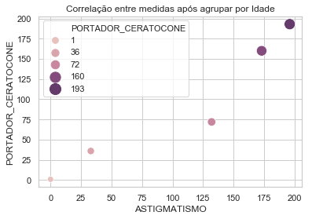
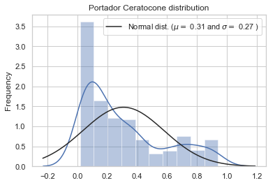

# Keratoconus-and-your-correlations
On this job, I'll analyze if exist correlation amoung kind of alergies, kind of eyes diseases and other features. The data was acquired by a research made from internet using Google Forms. Also, I generate a Random Forest Classifier to try predict carriers of keratoconus.


<span style="color:black"> 

# Análise da correlação de alergias e astigmatismo com a insidência do Ceratocone

### Este trabalho de cunho acadêmico, irá analisar dados obtidos por intermédio de uma pesquisa realizada via internet. Os resultados obtidos não poderão ser considerados como única fonte de identificação da portabilidade da doença, sendo necessária a análise médica por intermédio de exames específicos para detecção da doença.

### O objetivo será analisar a influência de alguns tipos de alergias e doenças básicas relacionadas a problemas de visão, bem como analisar fatores externos como tempo de exposição a óculos e lentes e faixa etária do portador, visando a classificação, com análise probabilistica quanto portabilidade ou não do ceratocone. </span>


```python
##Importando as Bibliotecas ##
import pandas as pd
import numpy as np
from scipy import stats
import matplotlib.pyplot as plt
import seaborn as sns

##Importando o dataset da pesquisa##
df = pd.read_csv('C:\\Users\\filipe.luz\\Desktop\\TCC -MBA\\CeratoconeCorrelacao.csv', sep=',')

###Analisando o dataset###
df.head()
```


<div>
<style scoped>
    .dataframe tbody tr th:only-of-type {
        vertical-align: middle;
    }

    .dataframe tbody tr th {
        vertical-align: top;
    }

    .dataframe thead th {
        text-align: right;
    }
</style>
<table border="1" class="dataframe">
  <thead>
    <tr style="text-align: right;">
      <th></th>
      <th>Carimbo de data/hora</th>
      <th>Você faz parte do grupo do Facebook Ceratocone e Tratamentos?</th>
      <th>Qual a sua idade?</th>
      <th>Qual seu sexo?</th>
      <th>Você possui alergia a poeria?</th>
      <th>Você possui alergia a algum medicamento?</th>
      <th>Você possui alergia a algum alimento?</th>
      <th>Você costuma coçar os olhos frequentemente?</th>
      <th>Você faz uso de colírio lubrificante constantemente?</th>
      <th>Você é ou já foi fumante ?</th>
      <th>Você já utiliza/utilizou óculos?</th>
      <th>Por quantos anos utiliza/utilizou óculos? (Inserir apenas número, caso use o campo outros)</th>
      <th>Você já usou lentes de contato?</th>
      <th>Por quantos anos utiliza/utilizou lentes de contato? (Inserir apenas número, caso use o campo outros)</th>
      <th>Você possui Miopia ?</th>
      <th>Você possui astigmatismo?</th>
      <th>Já realizou alguma cirurgia corretiva de grau?</th>
      <th>Você é portador de ceratocone?</th>
      <th>Possui algum parente de primeiro grau portador do ceratocone?</th>
    </tr>
  </thead>
  <tbody>
    <tr>
      <th>0</th>
      <td>27/09/2018 14:10:46</td>
      <td>Sim</td>
      <td>23</td>
      <td>Masculino</td>
      <td>Sim</td>
      <td>Sim</td>
      <td>Não</td>
      <td>Não</td>
      <td>Não</td>
      <td>Sim</td>
      <td>Não</td>
      <td>0</td>
      <td>Sim</td>
      <td>1</td>
      <td>Sim</td>
      <td>Sim</td>
      <td>Não</td>
      <td>Sim</td>
      <td>Não</td>
    </tr>
    <tr>
      <th>1</th>
      <td>27/09/2018 14:14:09</td>
      <td>Sim</td>
      <td>22</td>
      <td>Feminino</td>
      <td>Sim</td>
      <td>Não</td>
      <td>Sim</td>
      <td>Sim</td>
      <td>Sim</td>
      <td>Não</td>
      <td>Sim</td>
      <td>10</td>
      <td>Sim</td>
      <td>13</td>
      <td>Sim</td>
      <td>Sim</td>
      <td>Não</td>
      <td>Sim</td>
      <td>Sim</td>
    </tr>
    <tr>
      <th>2</th>
      <td>27/09/2018 14:15:03</td>
      <td>Sim</td>
      <td>34</td>
      <td>Feminino</td>
      <td>Sim</td>
      <td>Não</td>
      <td>Sim</td>
      <td>Sim</td>
      <td>Não</td>
      <td>Não</td>
      <td>Sim</td>
      <td>vários</td>
      <td>Sim</td>
      <td>5</td>
      <td>NaN</td>
      <td>Sim</td>
      <td>Não</td>
      <td>Sim</td>
      <td>Sim</td>
    </tr>
    <tr>
      <th>3</th>
      <td>27/09/2018 14:15:31</td>
      <td>Sim</td>
      <td>19</td>
      <td>Masculino</td>
      <td>Sim</td>
      <td>Não</td>
      <td>Não</td>
      <td>Não</td>
      <td>Sim</td>
      <td>Sim</td>
      <td>Sim</td>
      <td>2</td>
      <td>Não</td>
      <td>0</td>
      <td>Sim</td>
      <td>Sim</td>
      <td>Não</td>
      <td>Sim</td>
      <td>Não</td>
    </tr>
    <tr>
      <th>4</th>
      <td>27/09/2018 14:15:47</td>
      <td>Não</td>
      <td>34</td>
      <td>Masculino</td>
      <td>Sim</td>
      <td>Não</td>
      <td>Não</td>
      <td>Não</td>
      <td>Não</td>
      <td>Não</td>
      <td>Sim</td>
      <td>22</td>
      <td>Não</td>
      <td>0</td>
      <td>Sim</td>
      <td>Não</td>
      <td>Não</td>
      <td>Não</td>
      <td>Não</td>
    </tr>
  </tbody>
</table>
</div>


### Analisando tipo de dados e quantidades de registros ####


```python
df.info()
```

    <class 'pandas.core.frame.DataFrame'>
    RangeIndex: 672 entries, 0 to 671
    Data columns (total 19 columns):
    Carimbo de data/hora                                                                                     672 non-null object
    Você faz parte do grupo do Facebook Ceratocone e Tratamentos?                                            672 non-null object
    Qual a sua idade?                                                                                        672 non-null int64
    Qual seu sexo?                                                                                           672 non-null object
    Você possui alergia a poeria?                                                                            672 non-null object
    Você possui alergia a algum medicamento?                                                                 672 non-null object
    Você possui alergia a algum alimento?                                                                    672 non-null object
    Você costuma coçar os olhos frequentemente?                                                              672 non-null object
    Você faz uso de colírio lubrificante constantemente?                                                     672 non-null object
    Você é ou já foi fumante ?                                                                               672 non-null object
    Você já utiliza/utilizou óculos?                                                                         672 non-null object
    Por quantos anos utiliza/utilizou óculos? (Inserir apenas número, caso use o campo outros)               672 non-null object
    Você já usou lentes de contato?                                                                          672 non-null object
    Por quantos anos utiliza/utilizou lentes de contato? (Inserir apenas número, caso use o campo outros)    672 non-null object
    Você possui Miopia ?                                                                                     669 non-null object
    Você possui astigmatismo?                                                                                672 non-null object
    Já realizou alguma cirurgia corretiva de grau?                                                           672 non-null object
    Você é portador de ceratocone?                                                                           672 non-null object
    Possui algum parente de primeiro grau portador do ceratocone?                                            672 non-null object
    dtypes: int64(1), object(18)
    memory usage: 99.8+ KB
    

### Ajustando nome das colunas do dataset


```python

col_name = ['Data/hora','Integra_Grp_cerato','Idade','Sexo','Alrg_Poeira','Alrg_Medicamento','Alrg_Alimento','Coca_os_Olhos','Usa_Colirio','Exp_fumaca_cigarro','Exp_Oculos','Tmp_Uso_Oculos','Exp_Lentes','Tmp_Uso_Lentes','Miope','Astigmatismo','Fez_Cirurgia','Portador_Ceratocone','Parente_Portador']

for i in range(0,len(df.columns)):
      df.rename(columns = {df.columns[i] : col_name[i].upper()}, inplace = True)

```

### Verificando existência de registros NaN values, e inferindo valores nas colunas com esse tipo de registro.


```python
## Verificando existência de registros NaN ##
df.isnull().sum()

#Ajustando Coluna com registro NaN#
df = df.fillna('Não')

## Verificando existência de registros NaN, após ajuste de valores ##
df.isnull().sum()
```


    DATA/HORA              0
    INTEGRA_GRP_CERATO     0
    IDADE                  0
    SEXO                   0
    ALRG_POEIRA            0
    ALRG_MEDICAMENTO       0
    ALRG_ALIMENTO          0
    COCA_OS_OLHOS          0
    USA_COLIRIO            0
    EXP_FUMACA_CIGARRO     0
    EXP_OCULOS             0
    TMP_USO_OCULOS         0
    EXP_LENTES             0
    TMP_USO_LENTES         0
    MIOPE                  0
    ASTIGMATISMO           0
    FEZ_CIRURGIA           0
    PORTADOR_CERATOCONE    0
    PARENTE_PORTADOR       0
    dtype: int64


### Convertendo dados de respostas Sim = 1 Não = 0  e  Masculino = 1 Feminino = 0


```python
#Convertendo respostas SIM = 1 NÃO = 0#
col_ZeroUm = ['INTEGRA_GRP_CERATO','ALRG_POEIRA','ALRG_MEDICAMENTO','ALRG_ALIMENTO','COCA_OS_OLHOS','USA_COLIRIO','EXP_FUMACA_CIGARRO','EXP_OCULOS','EXP_LENTES','MIOPE','ASTIGMATISMO','FEZ_CIRURGIA','PORTADOR_CERATOCONE','PARENTE_PORTADOR']

for i in df[col_ZeroUm]:
    df[i] = df[i].apply(lambda row: '1' if row == 'Sim' else '0' ).astype('int64')

#Convertendo coluna sexo para Masculino = 1 Feminino = 0    
df['SEXO'] = df['SEXO'].apply(lambda row: '1' if row == 'Masculino' else '0' ).astype('int64')
```

### Analisando novamente o dataset, após ajustes realizados.


```python
df.info()
```

    <class 'pandas.core.frame.DataFrame'>
    RangeIndex: 672 entries, 0 to 671
    Data columns (total 19 columns):
    DATA/HORA              672 non-null object
    INTEGRA_GRP_CERATO     672 non-null int64
    IDADE                  672 non-null int64
    SEXO                   672 non-null int64
    ALRG_POEIRA            672 non-null int64
    ALRG_MEDICAMENTO       672 non-null int64
    ALRG_ALIMENTO          672 non-null int64
    COCA_OS_OLHOS          672 non-null int64
    USA_COLIRIO            672 non-null int64
    EXP_FUMACA_CIGARRO     672 non-null int64
    EXP_OCULOS             672 non-null int64
    TMP_USO_OCULOS         672 non-null object
    EXP_LENTES             672 non-null int64
    TMP_USO_LENTES         672 non-null object
    MIOPE                  672 non-null int64
    ASTIGMATISMO           672 non-null int64
    FEZ_CIRURGIA           672 non-null int64
    PORTADOR_CERATOCONE    672 non-null int64
    PARENTE_PORTADOR       672 non-null int64
    dtypes: int64(16), object(3)
    memory usage: 99.8+ KB
    

### Análise estatísitca do data set, verificando distribuição dos dados nas features utilizadas


```python
df.describe()
```


<div>
<style scoped>
    .dataframe tbody tr th:only-of-type {
        vertical-align: middle;
    }

    .dataframe tbody tr th {
        vertical-align: top;
    }

    .dataframe thead th {
        text-align: right;
    }
</style>
<table border="1" class="dataframe">
  <thead>
    <tr style="text-align: right;">
      <th></th>
      <th>INTEGRA_GRP_CERATO</th>
      <th>IDADE</th>
      <th>SEXO</th>
      <th>ALRG_POEIRA</th>
      <th>ALRG_MEDICAMENTO</th>
      <th>ALRG_ALIMENTO</th>
      <th>COCA_OS_OLHOS</th>
      <th>USA_COLIRIO</th>
      <th>EXP_FUMACA_CIGARRO</th>
      <th>EXP_OCULOS</th>
      <th>EXP_LENTES</th>
      <th>MIOPE</th>
      <th>ASTIGMATISMO</th>
      <th>FEZ_CIRURGIA</th>
      <th>PORTADOR_CERATOCONE</th>
      <th>PARENTE_PORTADOR</th>
    </tr>
  </thead>
  <tbody>
    <tr>
      <th>count</th>
      <td>672.000000</td>
      <td>6.720000e+02</td>
      <td>672.000000</td>
      <td>672.000000</td>
      <td>672.000000</td>
      <td>672.000000</td>
      <td>672.000000</td>
      <td>672.000000</td>
      <td>672.00000</td>
      <td>672.000000</td>
      <td>672.000000</td>
      <td>672.000000</td>
      <td>672.000000</td>
      <td>672.000000</td>
      <td>672.000000</td>
      <td>672.000000</td>
    </tr>
    <tr>
      <th>mean</th>
      <td>0.650298</td>
      <td>1.562570e+04</td>
      <td>0.276786</td>
      <td>0.699405</td>
      <td>0.200893</td>
      <td>0.187500</td>
      <td>0.668155</td>
      <td>0.459821</td>
      <td>0.19494</td>
      <td>0.830357</td>
      <td>0.571429</td>
      <td>0.586310</td>
      <td>0.793155</td>
      <td>0.174107</td>
      <td>0.686012</td>
      <td>0.230655</td>
    </tr>
    <tr>
      <th>std</th>
      <td>0.477231</td>
      <td>4.041672e+05</td>
      <td>0.447743</td>
      <td>0.458858</td>
      <td>0.400967</td>
      <td>0.390603</td>
      <td>0.471226</td>
      <td>0.498754</td>
      <td>0.39645</td>
      <td>0.375598</td>
      <td>0.495240</td>
      <td>0.492861</td>
      <td>0.405345</td>
      <td>0.379484</td>
      <td>0.464457</td>
      <td>0.421566</td>
    </tr>
    <tr>
      <th>min</th>
      <td>0.000000</td>
      <td>9.000000e+00</td>
      <td>0.000000</td>
      <td>0.000000</td>
      <td>0.000000</td>
      <td>0.000000</td>
      <td>0.000000</td>
      <td>0.000000</td>
      <td>0.00000</td>
      <td>0.000000</td>
      <td>0.000000</td>
      <td>0.000000</td>
      <td>0.000000</td>
      <td>0.000000</td>
      <td>0.000000</td>
      <td>0.000000</td>
    </tr>
    <tr>
      <th>25%</th>
      <td>0.000000</td>
      <td>2.600000e+01</td>
      <td>0.000000</td>
      <td>0.000000</td>
      <td>0.000000</td>
      <td>0.000000</td>
      <td>0.000000</td>
      <td>0.000000</td>
      <td>0.00000</td>
      <td>1.000000</td>
      <td>0.000000</td>
      <td>0.000000</td>
      <td>1.000000</td>
      <td>0.000000</td>
      <td>0.000000</td>
      <td>0.000000</td>
    </tr>
    <tr>
      <th>50%</th>
      <td>1.000000</td>
      <td>3.200000e+01</td>
      <td>0.000000</td>
      <td>1.000000</td>
      <td>0.000000</td>
      <td>0.000000</td>
      <td>1.000000</td>
      <td>0.000000</td>
      <td>0.00000</td>
      <td>1.000000</td>
      <td>1.000000</td>
      <td>1.000000</td>
      <td>1.000000</td>
      <td>0.000000</td>
      <td>1.000000</td>
      <td>0.000000</td>
    </tr>
    <tr>
      <th>75%</th>
      <td>1.000000</td>
      <td>4.000000e+01</td>
      <td>1.000000</td>
      <td>1.000000</td>
      <td>0.000000</td>
      <td>0.000000</td>
      <td>1.000000</td>
      <td>1.000000</td>
      <td>0.00000</td>
      <td>1.000000</td>
      <td>1.000000</td>
      <td>1.000000</td>
      <td>1.000000</td>
      <td>0.000000</td>
      <td>1.000000</td>
      <td>0.000000</td>
    </tr>
    <tr>
      <th>max</th>
      <td>1.000000</td>
      <td>1.047725e+07</td>
      <td>1.000000</td>
      <td>1.000000</td>
      <td>1.000000</td>
      <td>1.000000</td>
      <td>1.000000</td>
      <td>1.000000</td>
      <td>1.00000</td>
      <td>1.000000</td>
      <td>1.000000</td>
      <td>1.000000</td>
      <td>1.000000</td>
      <td>1.000000</td>
      <td>1.000000</td>
      <td>1.000000</td>
    </tr>
  </tbody>
</table>
</div>


### Realizando o tratamento de campos que permitiram texto aberto. Campo: Tmp_Uso_Oculos


```python
### Tratando campos que contem texto, foram retirados os textos e mantidos os números ###
df['TMP_USO_OCULOS'] = df['TMP_USO_OCULOS'].astype(str).map(lambda x: x.lstrip(', . ! /pra longe/ +- í ã vários óéhjusoaAbBcCdDeEfFgGhHiIjJkKlLmMnNoOpPqQrRsStTuUvVxXzZ').rstrip('aAbBcCdDeEfFgGhHiIjJkKlLmMnNoOpPqQrRsStTuUvVxXzZ tem anos  anos e hj tenho . í ã !'))

### Caso específico que não foi tratado pela funçao a cima, aonde se tem texto entre números, buscando index da resposta (Index = 62)###
df['TMP_USO_OCULOS'] = np.where(df['TMP_USO_OCULOS'] == '7 anos e hj tenho 34',27,df['TMP_USO_OCULOS'])


### Tratando resposta (index = 74), para colocar valor numérico correto, segundo informação posta no campo ###
if df.loc[74,'TMP_USO_OCULOS'] == '8':
    df.loc[74,'TMP_USO_OCULOS'] = df.loc[74,'TMP_USO_OCULOS'].replace('8','18')
else: 
    df.loc[74,'TMP_USO_OCULOS']

```

### Tratando registros vazios que continham apenas texto sem informação que pudessem gerar dados numéricos 


```python
df['TMP_USO_OCULOS'] = df['TMP_USO_OCULOS'].replace("", 0).astype('int64')
```

### Tratando campos que contem texto, excluirei os caracteres descritos na função a baixo. Serão excluídos da esquerda e da direita todos os caracteres (Strings)


```python
df['TMP_USO_LENTES'] = df['TMP_USO_LENTES'].astype(str).map(lambda x: x.lstrip(', . anos já í ã me vários óéhjusoaAbBcCdDeEfFgGhHiIjJkKlLmMnNoOpPqQrRsStTuUvVxXzZ').rstrip('aAbBcCdDeEfFgGhHiIjJkKlLmMnNoOpPqQrRsStTuUvVxXzZ tem anos já anos e hj tenho mê anos já .'))

```

### Alguns casos específicos serão tratados individualmente, para garantir a substituição do texto descrito por valores calculados, expostos de forma literária pelo proprio respondente.


```python
### Tratando resposta (index = 62), para colocar valor numérico correto, segundo informação posta no campo ###
df.loc[62,'TMP_USO_LENTES'] = df.loc[62,'TMP_USO_LENTES'].replace('1 ano a gelatinosa 1 ano a escleral 1','3')

### Tratando resposta (index = 354), para colocar valor numérico correto, segundo informação posta no campo ###
df.loc[354,'TMP_USO_LENTES'] = df.loc[354,'TMP_USO_LENTES'].replace('(ambos os olhos) em fase de adaptação ( sem sucesso ) foi uns 3 meses mais ou menos. Lente escleral em OD fase de adaptação ( sem sucesso) 2','0')

```

### Após tratamento, será aplicado valor 0 aos campos que continham texto sem informações úteis para atribuição de valores numéricos.


```python
###Tratando registros vazios que continham apenas texto sem informação que pudesse gerar dado numérico ##
df['TMP_USO_LENTES'] = df['TMP_USO_LENTES'].replace("", 0).astype('int64')
```

### Analisando data set após ajustes


```python
df.head()
```


<div>
<style scoped>
    .dataframe tbody tr th:only-of-type {
        vertical-align: middle;
    }

    .dataframe tbody tr th {
        vertical-align: top;
    }

    .dataframe thead th {
        text-align: right;
    }
</style>
<table border="1" class="dataframe">
  <thead>
    <tr style="text-align: right;">
      <th></th>
      <th>DATA/HORA</th>
      <th>INTEGRA_GRP_CERATO</th>
      <th>IDADE</th>
      <th>SEXO</th>
      <th>ALRG_POEIRA</th>
      <th>ALRG_MEDICAMENTO</th>
      <th>ALRG_ALIMENTO</th>
      <th>COCA_OS_OLHOS</th>
      <th>USA_COLIRIO</th>
      <th>EXP_FUMACA_CIGARRO</th>
      <th>EXP_OCULOS</th>
      <th>TMP_USO_OCULOS</th>
      <th>EXP_LENTES</th>
      <th>TMP_USO_LENTES</th>
      <th>MIOPE</th>
      <th>ASTIGMATISMO</th>
      <th>FEZ_CIRURGIA</th>
      <th>PORTADOR_CERATOCONE</th>
      <th>PARENTE_PORTADOR</th>
    </tr>
  </thead>
  <tbody>
    <tr>
      <th>0</th>
      <td>27/09/2018 14:10:46</td>
      <td>1</td>
      <td>23</td>
      <td>1</td>
      <td>1</td>
      <td>1</td>
      <td>0</td>
      <td>0</td>
      <td>0</td>
      <td>1</td>
      <td>0</td>
      <td>0</td>
      <td>1</td>
      <td>1</td>
      <td>1</td>
      <td>1</td>
      <td>0</td>
      <td>1</td>
      <td>0</td>
    </tr>
    <tr>
      <th>1</th>
      <td>27/09/2018 14:14:09</td>
      <td>1</td>
      <td>22</td>
      <td>0</td>
      <td>1</td>
      <td>0</td>
      <td>1</td>
      <td>1</td>
      <td>1</td>
      <td>0</td>
      <td>1</td>
      <td>10</td>
      <td>1</td>
      <td>13</td>
      <td>1</td>
      <td>1</td>
      <td>0</td>
      <td>1</td>
      <td>1</td>
    </tr>
    <tr>
      <th>2</th>
      <td>27/09/2018 14:15:03</td>
      <td>1</td>
      <td>34</td>
      <td>0</td>
      <td>1</td>
      <td>0</td>
      <td>1</td>
      <td>1</td>
      <td>0</td>
      <td>0</td>
      <td>1</td>
      <td>0</td>
      <td>1</td>
      <td>5</td>
      <td>0</td>
      <td>1</td>
      <td>0</td>
      <td>1</td>
      <td>1</td>
    </tr>
    <tr>
      <th>3</th>
      <td>27/09/2018 14:15:31</td>
      <td>1</td>
      <td>19</td>
      <td>1</td>
      <td>1</td>
      <td>0</td>
      <td>0</td>
      <td>0</td>
      <td>1</td>
      <td>1</td>
      <td>1</td>
      <td>2</td>
      <td>0</td>
      <td>0</td>
      <td>1</td>
      <td>1</td>
      <td>0</td>
      <td>1</td>
      <td>0</td>
    </tr>
    <tr>
      <th>4</th>
      <td>27/09/2018 14:15:47</td>
      <td>0</td>
      <td>34</td>
      <td>1</td>
      <td>1</td>
      <td>0</td>
      <td>0</td>
      <td>0</td>
      <td>0</td>
      <td>0</td>
      <td>1</td>
      <td>22</td>
      <td>0</td>
      <td>0</td>
      <td>1</td>
      <td>0</td>
      <td>0</td>
      <td>0</td>
      <td>0</td>
    </tr>
  </tbody>
</table>
</div>


```python
df.info()
```

    <class 'pandas.core.frame.DataFrame'>
    RangeIndex: 672 entries, 0 to 671
    Data columns (total 19 columns):
    DATA/HORA              672 non-null object
    INTEGRA_GRP_CERATO     672 non-null int64
    IDADE                  672 non-null int64
    SEXO                   672 non-null int64
    ALRG_POEIRA            672 non-null int64
    ALRG_MEDICAMENTO       672 non-null int64
    ALRG_ALIMENTO          672 non-null int64
    COCA_OS_OLHOS          672 non-null int64
    USA_COLIRIO            672 non-null int64
    EXP_FUMACA_CIGARRO     672 non-null int64
    EXP_OCULOS             672 non-null int64
    TMP_USO_OCULOS         672 non-null int64
    EXP_LENTES             672 non-null int64
    TMP_USO_LENTES         672 non-null int64
    MIOPE                  672 non-null int64
    ASTIGMATISMO           672 non-null int64
    FEZ_CIRURGIA           672 non-null int64
    PORTADOR_CERATOCONE    672 non-null int64
    PARENTE_PORTADOR       672 non-null int64
    dtypes: int64(18), object(1)
    memory usage: 99.8+ KB
    


```python
df.describe()
```


<div>
<style scoped>
    .dataframe tbody tr th:only-of-type {
        vertical-align: middle;
    }

    .dataframe tbody tr th {
        vertical-align: top;
    }

    .dataframe thead th {
        text-align: right;
    }
</style>
<table border="1" class="dataframe">
  <thead>
    <tr style="text-align: right;">
      <th></th>
      <th>INTEGRA_GRP_CERATO</th>
      <th>IDADE</th>
      <th>SEXO</th>
      <th>ALRG_POEIRA</th>
      <th>ALRG_MEDICAMENTO</th>
      <th>ALRG_ALIMENTO</th>
      <th>COCA_OS_OLHOS</th>
      <th>USA_COLIRIO</th>
      <th>EXP_FUMACA_CIGARRO</th>
      <th>EXP_OCULOS</th>
      <th>TMP_USO_OCULOS</th>
      <th>EXP_LENTES</th>
      <th>TMP_USO_LENTES</th>
      <th>MIOPE</th>
      <th>ASTIGMATISMO</th>
      <th>FEZ_CIRURGIA</th>
      <th>PORTADOR_CERATOCONE</th>
      <th>PARENTE_PORTADOR</th>
    </tr>
  </thead>
  <tbody>
    <tr>
      <th>count</th>
      <td>672.000000</td>
      <td>6.720000e+02</td>
      <td>672.000000</td>
      <td>672.000000</td>
      <td>672.000000</td>
      <td>672.000000</td>
      <td>672.000000</td>
      <td>672.000000</td>
      <td>672.00000</td>
      <td>672.000000</td>
      <td>672.000000</td>
      <td>672.000000</td>
      <td>672.000000</td>
      <td>672.000000</td>
      <td>672.000000</td>
      <td>672.000000</td>
      <td>672.000000</td>
      <td>672.000000</td>
    </tr>
    <tr>
      <th>mean</th>
      <td>0.650298</td>
      <td>1.562570e+04</td>
      <td>0.276786</td>
      <td>0.699405</td>
      <td>0.200893</td>
      <td>0.187500</td>
      <td>0.668155</td>
      <td>0.459821</td>
      <td>0.19494</td>
      <td>0.830357</td>
      <td>9.107143</td>
      <td>0.571429</td>
      <td>3.547619</td>
      <td>0.586310</td>
      <td>0.793155</td>
      <td>0.174107</td>
      <td>0.686012</td>
      <td>0.230655</td>
    </tr>
    <tr>
      <th>std</th>
      <td>0.477231</td>
      <td>4.041672e+05</td>
      <td>0.447743</td>
      <td>0.458858</td>
      <td>0.400967</td>
      <td>0.390603</td>
      <td>0.471226</td>
      <td>0.498754</td>
      <td>0.39645</td>
      <td>0.375598</td>
      <td>10.408661</td>
      <td>0.495240</td>
      <td>6.644079</td>
      <td>0.492861</td>
      <td>0.405345</td>
      <td>0.379484</td>
      <td>0.464457</td>
      <td>0.421566</td>
    </tr>
    <tr>
      <th>min</th>
      <td>0.000000</td>
      <td>9.000000e+00</td>
      <td>0.000000</td>
      <td>0.000000</td>
      <td>0.000000</td>
      <td>0.000000</td>
      <td>0.000000</td>
      <td>0.000000</td>
      <td>0.00000</td>
      <td>0.000000</td>
      <td>0.000000</td>
      <td>0.000000</td>
      <td>0.000000</td>
      <td>0.000000</td>
      <td>0.000000</td>
      <td>0.000000</td>
      <td>0.000000</td>
      <td>0.000000</td>
    </tr>
    <tr>
      <th>25%</th>
      <td>0.000000</td>
      <td>2.600000e+01</td>
      <td>0.000000</td>
      <td>0.000000</td>
      <td>0.000000</td>
      <td>0.000000</td>
      <td>0.000000</td>
      <td>0.000000</td>
      <td>0.00000</td>
      <td>1.000000</td>
      <td>1.000000</td>
      <td>0.000000</td>
      <td>0.000000</td>
      <td>0.000000</td>
      <td>1.000000</td>
      <td>0.000000</td>
      <td>0.000000</td>
      <td>0.000000</td>
    </tr>
    <tr>
      <th>50%</th>
      <td>1.000000</td>
      <td>3.200000e+01</td>
      <td>0.000000</td>
      <td>1.000000</td>
      <td>0.000000</td>
      <td>0.000000</td>
      <td>1.000000</td>
      <td>0.000000</td>
      <td>0.00000</td>
      <td>1.000000</td>
      <td>5.000000</td>
      <td>1.000000</td>
      <td>0.000000</td>
      <td>1.000000</td>
      <td>1.000000</td>
      <td>0.000000</td>
      <td>1.000000</td>
      <td>0.000000</td>
    </tr>
    <tr>
      <th>75%</th>
      <td>1.000000</td>
      <td>4.000000e+01</td>
      <td>1.000000</td>
      <td>1.000000</td>
      <td>0.000000</td>
      <td>0.000000</td>
      <td>1.000000</td>
      <td>1.000000</td>
      <td>0.00000</td>
      <td>1.000000</td>
      <td>13.250000</td>
      <td>1.000000</td>
      <td>4.000000</td>
      <td>1.000000</td>
      <td>1.000000</td>
      <td>0.000000</td>
      <td>1.000000</td>
      <td>0.000000</td>
    </tr>
    <tr>
      <th>max</th>
      <td>1.000000</td>
      <td>1.047725e+07</td>
      <td>1.000000</td>
      <td>1.000000</td>
      <td>1.000000</td>
      <td>1.000000</td>
      <td>1.000000</td>
      <td>1.000000</td>
      <td>1.00000</td>
      <td>1.000000</td>
      <td>59.000000</td>
      <td>1.000000</td>
      <td>44.000000</td>
      <td>1.000000</td>
      <td>1.000000</td>
      <td>1.000000</td>
      <td>1.000000</td>
      <td>1.000000</td>
    </tr>
  </tbody>
</table>
</div>


## Início do processo EDA - Exploratory Data Analise 

### O processo de EDA é extremamente importante para garantir a qualidade dos dados utilizados, para modelar o data set para futuras análises assim como para conseguir inferir algumas hipóteses bem como identificar o melhor modelo a ser aplicado no problema.

================================================================================================================================

### Criação de função para verificação da distribuição de dados únicos nas colunas do dataset, via visualização gráfica


```python
def distribuicao (data):
    '''
    Esta função exibirá a quantidade de registros únicos para cada coluna
    existente no dataset
    
    dataframe -> Histogram
    '''
    # Calculando valores unicos para cada label: num_unique_labels
    num_unique_labels = data.apply(pd.Series.nunique)

    # plotando valores
    num_unique_labels.plot( kind='bar')
    
    # Nomeando os eixos
    plt.xlabel('Campos')
    plt.ylabel('Número de Registros únicos')
    plt.title('Distribuição de dados únicos do DataSet')
    
    # Exibindo gráfico
    plt.show()

distribuicao(df.drop('DATA/HORA', axis=1))


```


### O processo de detecção de outliers visa identificar registros que não sejam condizentes com o padrão de distribuição da classe a qual o dado faz parte, identificando muitas vezes valores iverídicos, erros de preenchimento e até mesmo pontos que representem comportamentos estranhos reais como casos de excepcionalidade. 

### Valores excepcionais podem inferir no resultado impreciso gerado por modelos de classificação / regressão que utilizem como base medida Euclidiana.

#### Realizando a detecção de Outliers na coluna TMP_USO_OCULOS.


```python
#Detectando Outliers
sns.boxplot(x=df['TMP_USO_OCULOS'])
plt.show()
```


### Analisando outliers que estejam a mais de 3 pontos além da média, utilizando função Z-Score para obter esses registros.


```python
#Analisando Z-SCORE
z = np.abs(stats.zscore(df['TMP_USO_OCULOS'].values))
threshold = 3
p = np.where(z > threshold)
print(p)
```

    (array([111, 322, 461, 502, 538, 567, 586, 665], dtype=int64),)
    

#### Cirando um looping para analisar os registros dos ID's com Z-score maior que o threshold definido


```python
for i in p:
    print(df[['IDADE','TMP_USO_OCULOS']].iloc[i])
```

         IDADE  TMP_USO_OCULOS
    111     62              50
    322     55              45
    461     53              49
    502     58              53
    538     66              50
    567     61              54
    586     57              46
    665     70              59
    


```python
#Detectando Outliers
sns.boxplot(x=df['TMP_USO_LENTES'])
plt.show()
```


```python
#Analisando Z-SCORE

z = np.abs(stats.zscore(df['TMP_USO_LENTES'].values))
threshold = 3
p = np.where(z > threshold)
print(p)
```

    (array([ 18,  33,  80,  94, 104, 140, 247, 248, 258, 262, 292, 293, 299,
           337, 355, 543, 586, 588], dtype=int64),)
    


```python
#Verificando dados dos possíveis outliers
for i in p:
    print(df[['IDADE','TMP_USO_LENTES']].iloc[i])
```

         IDADE  TMP_USO_LENTES
    18      38              25
    33      62              30
    80      30              30
    94      58              30
    104     52              30
    140     47              30
    247     44              26
    248     39              24
    258     60              44
    262     69              35
    292     48              30
    293     40              25
    299     40              25
    337     47              32
    355     61              41
    543     40              27
    586     57              36
    588     49              25
    


```python
### O índice 80 é um erro que produziu um outlier, a pessoa possui 30 anos e colocou que utiliza lentes a 30 anos, algo improvável ###

# Ajuste do valor. Será atribuído a média ou mediana, para isso iremos analisar a distribuição do dado.

#Detectando Outliers
sns.boxplot(x=df['TMP_USO_LENTES'])
plt.show()

#Plotando no gráfico para analisar distribuição dos dados
sns.distplot(df['TMP_USO_LENTES'])

#Analisando média e mediana
print("Média: " + str(np.mean(df['TMP_USO_LENTES'])))
print("Mediana: " + str(np.median(df['TMP_USO_LENTES'])))

# justando campo irregular aonde pessoa com 30 anos usa lentes a 30 anos
df.loc[80,'TMP_USO_LENTES'] = np.mean(df['TMP_USO_LENTES'])
```


    Média: 3.5476190476190474
    Mediana: 0.0
    


```python
### verifica-se que a alteração foi mínima ###

#Plotando no gráfico para analisar distribuição dos dados
sns.distplot(df['TMP_USO_LENTES'])

#Analisando média e mediana
print("Média: " + str(np.mean(df['TMP_USO_LENTES'])))
print("Mediana: " + str(np.median(df['TMP_USO_LENTES'])))
```

    Média: 3.5082553854875287
    Mediana: 0.0
    


```python
#Criando Pair Plot de algumas colunas para facilitar a visualização e análise dos dados entre si.
sns.pairplot(df.drop(['INTEGRA_GRP_CERATO','IDADE','USA_COLIRIO','COCA_OS_OLHOS','EXP_FUMACA_CIGARRO','EXP_OCULOS','EXP_LENTES','MIOPE','FEZ_CIRURGIA','PARENTE_PORTADOR'],axis=1), hue="PORTADOR_CERATOCONE")
```

    D:\Continuum\anaconda3\lib\site-packages\statsmodels\nonparametric\kde.py:488: RuntimeWarning: invalid value encountered in true_divide
      binned = fast_linbin(X, a, b, gridsize) / (delta * nobs)
    D:\Continuum\anaconda3\lib\site-packages\statsmodels\nonparametric\kdetools.py:34: RuntimeWarning: invalid value encountered in double_scalars
      FAC1 = 2*(np.pi*bw/RANGE)**2
    


    <seaborn.axisgrid.PairGrid at 0x1c301080fd0>


```python
# Chamando exibição do PairPlot do restante das colunas
sns.pairplot(df.drop(['INTEGRA_GRP_CERATO','SEXO','IDADE','ALRG_POEIRA','ALRG_MEDICAMENTO','ALRG_ALIMENTO','TMP_USO_OCULOS','TMP_USO_LENTES'],axis=1), hue="PORTADOR_CERATOCONE")
```

    D:\Continuum\anaconda3\lib\site-packages\statsmodels\nonparametric\kde.py:488: RuntimeWarning: invalid value encountered in true_divide
      binned = fast_linbin(X, a, b, gridsize) / (delta * nobs)
    D:\Continuum\anaconda3\lib\site-packages\statsmodels\nonparametric\kdetools.py:34: RuntimeWarning: invalid value encountered in double_scalars
      FAC1 = 2*(np.pi*bw/RANGE)**2
    


    <seaborn.axisgrid.PairGrid at 0x1c301224b38>


```python
# Analisando coluna a Portadores de Ceratocone, e sua distribuição
from scipy import stats
y = df['PORTADOR_CERATOCONE']

sns.distplot(y, fit=stats.norm)

# Obtendo os parametros atribuidos e utilizados pela função
(mu, sigma) = stats.norm.fit(y)
print( '\n mu = {:.2f} and sigma = {:.2f}\n'.format(mu, sigma))

#Plotando gráfico de distribuição
plt.legend(['Normal dist. ($\mu=$ {:.2f} and $\sigma=$ {:.2f} )'.format(mu, sigma)],
            loc='best')
plt.ylabel('Frequency')
plt.title('Portador Ceratocone distribution')

#Gerando também QQ-plot
fig = plt.figure()
res = stats.probplot(df['PORTADOR_CERATOCONE'], plot=plt)
plt.show()
```

    
     mu = 0.69 and sigma = 0.46
    
    


```python
# Analisando coluna a Portadores de Ceratocone, e sua distribuição
from scipy import stats
y = df['ALRG_POEIRA']

sns.distplot(y, fit=stats.norm)

# Obtendo os parametros atribuidos e utilizados pela função
(mu, sigma) = stats.norm.fit(y)
print( '\n mu = {:.2f} and sigma = {:.2f}\n'.format(mu, sigma))

#Plotando gráfico de distribuição
plt.legend(['Normal dist. ($\mu=$ {:.2f} and $\sigma=$ {:.2f} )'.format(mu, sigma)],
            loc='best')
plt.ylabel('Frequency')
plt.title('Alergia a poeira distribution')

#Gerando também QQ-plot
fig = plt.figure()
res = stats.probplot(df['ALRG_POEIRA'], plot=plt)
plt.show()
```

    
     mu = 0.70 and sigma = 0.46
    
    


#### É possível analisar que o conjunto de dados está desbalanceado, a diferença é de 25% de uma classe para a outra#### Este fato pode enviesar o modelo de classificação gerando assim falsos positivos, o que é aceitável uma vez que é preferível que se investigue uma falsa suspeita do que o inverso podendo gerar problemas futuros a pessoa


```python
  
def heat_corr (data):
    '''Analisando a correlação entre as features
       do dataset
    '''    
    f, ax = plt.subplots(figsize=(12, 7))
    sns.heatmap(data.corr(), annot=True, linewidths=.5, ax=ax,cmap='RdYlGn')
    
    plt.title('Correlação entre as features')
    plt.show()
 

#Chamando função para analisar a correlação entre as features originais do dataset
heat_corr(df[['PORTADOR_CERATOCONE','ALRG_POEIRA','IDADE','ALRG_MEDICAMENTO','ALRG_ALIMENTO','TMP_USO_LENTES','EXP_LENTES','MIOPE','ASTIGMATISMO','COCA_OS_OLHOS','PARENTE_PORTADOR','SEXO']]) 

#Imprimindo valor da correlação
df[['PORTADOR_CERATOCONE','ALRG_POEIRA','IDADE','ALRG_MEDICAMENTO','ALRG_ALIMENTO','TMP_USO_LENTES','EXP_LENTES','MIOPE','ASTIGMATISMO','COCA_OS_OLHOS','PARENTE_PORTADOR','SEXO']].corr()

```


<div>
<style scoped>
    .dataframe tbody tr th:only-of-type {
        vertical-align: middle;
    }

    .dataframe tbody tr th {
        vertical-align: top;
    }

    .dataframe thead th {
        text-align: right;
    }
</style>
<table border="1" class="dataframe">
  <thead>
    <tr style="text-align: right;">
      <th></th>
      <th>PORTADOR_CERATOCONE</th>
      <th>ALRG_POEIRA</th>
      <th>IDADE</th>
      <th>ALRG_MEDICAMENTO</th>
      <th>ALRG_ALIMENTO</th>
      <th>TMP_USO_LENTES</th>
      <th>EXP_LENTES</th>
      <th>MIOPE</th>
      <th>ASTIGMATISMO</th>
      <th>COCA_OS_OLHOS</th>
      <th>PARENTE_PORTADOR</th>
      <th>SEXO</th>
    </tr>
  </thead>
  <tbody>
    <tr>
      <th>PORTADOR_CERATOCONE</th>
      <td>1.000000</td>
      <td>0.276737</td>
      <td>0.026107</td>
      <td>0.043120</td>
      <td>0.029265</td>
      <td>0.218105</td>
      <td>0.457240</td>
      <td>0.310619</td>
      <td>0.390700</td>
      <td>0.381189</td>
      <td>0.142091</td>
      <td>-0.219280</td>
    </tr>
    <tr>
      <th>ALRG_POEIRA</th>
      <td>0.276737</td>
      <td>1.000000</td>
      <td>0.025303</td>
      <td>0.174803</td>
      <td>0.156946</td>
      <td>-0.002909</td>
      <td>0.101183</td>
      <td>0.114891</td>
      <td>0.121930</td>
      <td>0.282362</td>
      <td>0.050789</td>
      <td>-0.160233</td>
    </tr>
    <tr>
      <th>IDADE</th>
      <td>0.026107</td>
      <td>0.025303</td>
      <td>1.000000</td>
      <td>-0.019355</td>
      <td>-0.018544</td>
      <td>0.038208</td>
      <td>0.033432</td>
      <td>0.032424</td>
      <td>0.019715</td>
      <td>0.027199</td>
      <td>-0.021136</td>
      <td>-0.023886</td>
    </tr>
    <tr>
      <th>ALRG_MEDICAMENTO</th>
      <td>0.043120</td>
      <td>0.174803</td>
      <td>-0.019355</td>
      <td>1.000000</td>
      <td>0.215884</td>
      <td>0.028526</td>
      <td>0.036453</td>
      <td>0.066727</td>
      <td>0.063490</td>
      <td>0.100953</td>
      <td>0.042863</td>
      <td>-0.119256</td>
    </tr>
    <tr>
      <th>ALRG_ALIMENTO</th>
      <td>0.029265</td>
      <td>0.156946</td>
      <td>-0.018544</td>
      <td>0.215884</td>
      <td>1.000000</td>
      <td>0.024386</td>
      <td>-0.023113</td>
      <td>0.016450</td>
      <td>0.028827</td>
      <td>0.063256</td>
      <td>0.044687</td>
      <td>-0.067106</td>
    </tr>
    <tr>
      <th>TMP_USO_LENTES</th>
      <td>0.218105</td>
      <td>-0.002909</td>
      <td>0.038208</td>
      <td>0.028526</td>
      <td>0.024386</td>
      <td>1.000000</td>
      <td>0.438385</td>
      <td>0.229511</td>
      <td>0.162213</td>
      <td>0.031959</td>
      <td>0.094893</td>
      <td>-0.079871</td>
    </tr>
    <tr>
      <th>EXP_LENTES</th>
      <td>0.457240</td>
      <td>0.101183</td>
      <td>0.033432</td>
      <td>0.036453</td>
      <td>-0.023113</td>
      <td>0.438385</td>
      <td>1.000000</td>
      <td>0.341048</td>
      <td>0.314989</td>
      <td>0.149616</td>
      <td>0.095858</td>
      <td>-0.149782</td>
    </tr>
    <tr>
      <th>MIOPE</th>
      <td>0.310619</td>
      <td>0.114891</td>
      <td>0.032424</td>
      <td>0.066727</td>
      <td>0.016450</td>
      <td>0.229511</td>
      <td>0.341048</td>
      <td>1.000000</td>
      <td>0.376698</td>
      <td>0.152382</td>
      <td>0.072603</td>
      <td>-0.067896</td>
    </tr>
    <tr>
      <th>ASTIGMATISMO</th>
      <td>0.390700</td>
      <td>0.121930</td>
      <td>0.019715</td>
      <td>0.063490</td>
      <td>0.028827</td>
      <td>0.162213</td>
      <td>0.314989</td>
      <td>0.376698</td>
      <td>1.000000</td>
      <td>0.155059</td>
      <td>0.079025</td>
      <td>-0.209614</td>
    </tr>
    <tr>
      <th>COCA_OS_OLHOS</th>
      <td>0.381189</td>
      <td>0.282362</td>
      <td>0.027199</td>
      <td>0.100953</td>
      <td>0.063256</td>
      <td>0.031959</td>
      <td>0.149616</td>
      <td>0.152382</td>
      <td>0.155059</td>
      <td>1.000000</td>
      <td>0.033279</td>
      <td>-0.122034</td>
    </tr>
    <tr>
      <th>PARENTE_PORTADOR</th>
      <td>0.142091</td>
      <td>0.050789</td>
      <td>-0.021136</td>
      <td>0.042863</td>
      <td>0.044687</td>
      <td>0.094893</td>
      <td>0.095858</td>
      <td>0.072603</td>
      <td>0.079025</td>
      <td>0.033279</td>
      <td>1.000000</td>
      <td>-0.101867</td>
    </tr>
    <tr>
      <th>SEXO</th>
      <td>-0.219280</td>
      <td>-0.160233</td>
      <td>-0.023886</td>
      <td>-0.119256</td>
      <td>-0.067106</td>
      <td>-0.079871</td>
      <td>-0.149782</td>
      <td>-0.067896</td>
      <td>-0.209614</td>
      <td>-0.122034</td>
      <td>-0.101867</td>
      <td>1.000000</td>
    </tr>
  </tbody>
</table>
</div>


#### A análise anterior nos apresenta informações importantes que consolidam a suspeita da correlação entre portadores de ceratocone com algum tipo de alergia. No caso desta pesquisa é possível perceber uma correlação positiva se analisarmos alergia a poeira. Também é possível identificar correlação forte com o Astigmatismo, coçar os olhos com frequência e a exposição a lentes de contato ####


```python
'''Será gerada a analise descritiva dos dados obtidos na pesquisa, para um melhor entendimento da amostragem adiquirida'''

#Agrupando os dados por idade de quem é portador da doença
portadores = pd.DataFrame(df.groupby(['IDADE'], as_index=False)['PORTADOR_CERATOCONE','ASTIGMATISMO','MIOPE','ALRG_POEIRA','COCA_OS_OLHOS','TMP_USO_LENTES','SEXO','EXP_LENTES'].sum())

#criando coluna nova
portadores['GRUPO_IDADE'] = '0'    


#Verificando condição para preencher nova coluna grupo de idade
for i in range(0,len(portadores)):
    if portadores.IDADE[i] <= 10:    
        portadores.loc[i,['GRUPO_IDADE']]='0-10'
        
    elif portadores.IDADE[i]>= 11 and portadores.IDADE[i] <= 20:
        portadores.loc[i,['GRUPO_IDADE']]='11 - 20'
    
    elif portadores.IDADE[i] >= 21 and portadores.IDADE[i] <= 30:
        portadores.loc[i,['GRUPO_IDADE']]= '21 - 30'

    elif portadores.IDADE[i] >= 31 and portadores.IDADE[i] <= 40:
        portadores.loc[i,['GRUPO_IDADE']]=  '31 - 40'   

    else:
        portadores.loc[i,['GRUPO_IDADE']]='Maior ou Igual a 50' 

        
#Realizando agrupamento pelo novo grupo de idade criado
portadores_idade = pd.DataFrame(portadores.groupby(['GRUPO_IDADE'], as_index=False)['PORTADOR_CERATOCONE','ALRG_POEIRA'].sum())


```


```python
## Doenças e fatores conhecidos, Fazendo Group By ##

#Realizando agrupamento por portadores com astigmatismo
port_astigm = pd.DataFrame(df.groupby(['ASTIGMATISMO'], as_index=False)['PORTADOR_CERATOCONE'].sum())

#Realizando agrupamento por portadores com astigmatismo
port_miopia = pd.DataFrame(df.groupby(['MIOPE'], as_index=False)['PORTADOR_CERATOCONE'].sum())

#Realizando agrupamento por portadores que costumam coças frequentemente os olhos
port_cocaOlho = pd.DataFrame(df.groupby(['COCA_OS_OLHOS'], as_index=False)['PORTADOR_CERATOCONE'].sum())

### Alergias ##

#Realizando agrupamento por portadores com alergia a poeira
port_alerg = pd.DataFrame(df.groupby(['ALRG_POEIRA'], as_index=False)['PORTADOR_CERATOCONE'].sum())

#Realizando agrupamento por portadores com alergia a alimentos
port_aler_alimento = pd.DataFrame(df.groupby(['ALRG_ALIMENTO'], as_index=False)['PORTADOR_CERATOCONE'].sum())

#Realizando agrupamento por portadores com alergia a medicamentos
port_aler_medic = pd.DataFrame(df.groupby(['ALRG_MEDICAMENTO'], as_index=False)['PORTADOR_CERATOCONE'].sum())

#Realizando agrupamento por portadores pelo sexo
sexo = pd.DataFrame(df.groupby(['SEXO'], as_index=False)['PORTADOR_CERATOCONE'].sum())

```


```python
# Gerando Gráfico de pizza
def pie_chart(data,col1,col2,title): 
    labels = {'Não':0,'Sim':1}
    sizes = data[col2]
    colors = ['lightcoral', 'lightskyblue','green', 'purple','skyblue']

    plt.pie(sizes, labels=labels, colors=colors,
                autopct='%1.1f%%', shadow=True, startangle=140, labeldistance =1.2)
    plt.title( title )
    
    plt.axis('equal')
    plt.show()

def pie_chart_1(data,col1,col2,title):      
    labels = {'Não':0,'Sim':1}
    sizes = data[col2]
    colors = ['gold', 'lightgreen','green', 'purple','skyblue']

    plt.pie(sizes, labels=labels, colors=colors,
                autopct='%1.1f%%', shadow=True, startangle=140, labeldistance =1.2)
    plt.title( title )
    
    plt.axis('equal')
    plt.show()
    
#Tratamento dos campos 0,1 para Não e Sim, para apresentar no gráfico descritivo
    
def sim_nao (data,col):
    '''data -->dataframe
       col --> string
       return (dataframe)       
    '''
    data[col] = np.where(np.logical_or(data[col] == 1, data[col].astype('str')=="Sim"), "Sim","Não")
    return(data)

#Tratamento dos campos 0,1 para Feminino e Masculino, para apresentar no gráfico descritivo
def h_m (data,col):
    '''data -->dataframe
       col --> string
       return (dataframe)       
    '''
    data[col] = np.where(np.logical_or(data[col] == 1, data[col].astype('str')=="Sim"), "Masculino","Feminino")
    return(data)
```


```python
''' Geração de Gráficos para análise descritiva'''
print('Quantidade total de registros analisados: ' + str(df.shape[0]))
print('Quantidade total de portadores analisados: ' + str(df[df['PORTADOR_CERATOCONE']==1].shape[0]))
print( "Percentual de Respondentes Portadores:" + str( '{:.2f}'.format(df[df['PORTADOR_CERATOCONE']==1].shape[0] / df.shape[0]) ))
print('Quantidade total de não portadores analisados: ' + str(df[df['PORTADOR_CERATOCONE']==0].shape[0]))
print( "Percentual de Respondentes Não Portadores:" + str( '{:.2f}'.format( (df[df['PORTADOR_CERATOCONE']==1].shape[0] - df[df['PORTADOR_CERATOCONE']==0].shape[0]) / df.shape[0]) ))


#Criando gráfico portadores com astigmatismo
pie_chart(port_astigm,'ASTIGMATISMO','PORTADOR_CERATOCONE','Portadores do Ceratocone com Astigmatismo')
sim_nao(port_astigm,'ASTIGMATISMO') 
print(port_astigm )

#Criando gráfico portadores com miopia
pie_chart(port_miopia,'MIOPE','PORTADOR_CERATOCONE','Portadores do Ceratocone com Miopia')
sim_nao(port_miopia,'MIOPE') 
print(port_miopia)

#Criando gráfico portadores que coçam os olhos frequentemente
pie_chart(port_cocaOlho,'COCA_OS_OLHOS','PORTADOR_CERATOCONE','Portadores do Ceratocone\n Que coçam os Olhos com Frequência ')
sim_nao(port_cocaOlho,'COCA_OS_OLHOS') 
print(port_cocaOlho)
```

    Quantidade total de registros analisados: 672
    Quantidade total de portadores analisados: 461
    Percentual de Respondentes Portadores:0.69
    Quantidade total de não portadores analisados: 211
    Percentual de Respondentes Não Portadores:0.37
    


      ASTIGMATISMO  PORTADOR_CERATOCONE
    0          Não                   46
    1          Sim                  415
    


      MIOPE  PORTADOR_CERATOCONE
    0   Não                  143
    1   Sim                  318
    


      COCA_OS_OLHOS  PORTADOR_CERATOCONE
    0           Não                   97
    1           Sim                  364
    


```python
print('Quantidade total de registros analisados: ' + str(df.shape[0]))
print('Quantidade total de portadores analisados: ' + str(df[df['PORTADOR_CERATOCONE']==1].shape[0]))
print( "Percentual de Respondentes Portadores:" + str( '{:.2f}'.format(df[df['PORTADOR_CERATOCONE']==1].shape[0] / df.shape[0]) ))
print('Quantidade total de não portadores analisados: ' + str(df[df['PORTADOR_CERATOCONE']==0].shape[0]))
print( "Percentual de Respondentes Não Portadores:" + str( '{:.2f}'.format( (df[df['PORTADOR_CERATOCONE']==1].shape[0] - df[df['PORTADOR_CERATOCONE']==0].shape[0]) / df.shape[0]) ))


#Criando gráfico portadores com alergia a poeira
pie_chart_1(port_alerg,'ALRG_POEIRA','PORTADOR_CERATOCONE','\nPortadores do Ceratocone com\n Alergia a Poeira')
sim_nao(port_alerg,'ALRG_POEIRA') 
print(port_alerg)

#Criando gráfico portadores com alergia a Alimentos
pie_chart_1(port_aler_alimento,'ALRG_ALIMENTO','PORTADOR_CERATOCONE','\nPortadores do Ceratocone com\n Alergia a algum alimento\n')
sim_nao(port_aler_alimento,'ALRG_ALIMENTO') 
print(port_aler_alimento)

#Criando gráfico portadores com alergia a medicamentos
pie_chart_1(port_aler_medic,'ALRG_MEDICAMENTO','PORTADOR_CERATOCONE','\nPortadores do Ceratocone com\n Alergia a algum medicamento\n')
sim_nao(port_aler_medic,'ALRG_MEDICAMENTO') 
print(port_aler_medic)


```

    Quantidade total de registros analisados: 672
    Quantidade total de portadores analisados: 461
    Percentual de Respondentes Portadores:0.69
    Quantidade total de não portadores analisados: 211
    Percentual de Respondentes Não Portadores:0.37
    


      ALRG_POEIRA  PORTADOR_CERATOCONE
    0         Não                   99
    1         Sim                  362
    


      ALRG_ALIMENTO  PORTADOR_CERATOCONE
    0           Não                  371
    1           Sim                   90
    


      ALRG_MEDICAMENTO  PORTADOR_CERATOCONE
    0              Não                  363
    1              Sim                   98
    


```python
#Criando gráfico portadores pelo sexo
pie_chart(sexo,'SEXO','PORTADOR_CERATOCONE','Portadores do Ceratocone por sexo\n')
h_m(sexo,'SEXO') 
print(sexo)

```


            SEXO  PORTADOR_CERATOCONE
    0   Feminino                  364
    1  Masculino                   97
    


```python
#Criando gráfico portadores por grupo de idade    
sns.set(style="whitegrid")
sns.barplot(x='GRUPO_IDADE',y='PORTADOR_CERATOCONE',hue='PORTADOR_CERATOCONE', data=portadores_idade)
plt.xlabel('Idade')
plt.ylabel('Quantidade de portadores')
plt.title('Análise da Quantidade de portadores por grupo de idade')
plt.show()
```


```python
cmap = sns.cubehelix_palette(dark=.3, light=.8, as_cmap=True)
ax = sns.scatterplot(x="ALRG_POEIRA", y="PORTADOR_CERATOCONE",hue='PORTADOR_CERATOCONE', size='PORTADOR_CERATOCONE',palette=cmap,
                     sizes=(60, 200),legend="full",data=portadores_idade)
plt.title("Correlação entre medidas após agrupar por Idade")
plt.show()
```


```python
"""Percebe-se que após agrupamento dos dados, é possível enxergar uma correlação entre as varáveis 
mostrando que quanto mais pessoas com alergia no grupo de idade, maior o quantitativo de portadores de ceratocone"""

print( "Pearson Correlation : " +  str('{:.2f}'.format(np.corrcoef(portadores_idade['ALRG_POEIRA'], portadores_idade['PORTADOR_CERATOCONE'])[0, 1])))
```

    Pearson Correlation : 0.99
    

#### Foi realizado um agrupamento das idades para melhor compreensão da faixa etária mais atingida pela doença, neste caso a análise pode ter sido extremamente influênciada a não apresentar informações do grupo  0-10 anos umas vez que nesta faixa etária existe um controle parental referente ao acesso a redes sociais


```python
'''Após o agrupamento das idades, foi gerada uma nova visualização quanto a 
correlação das features com o fato de ser portador da doença. O quão sensível são essas variáveis
em relação ao fato de se portar a doença'''

print("Análise da correlação após agrupar portadores por idade")
heat_corr(portadores.drop(['IDADE','SEXO'],axis=1))
#Imprimindo valor da correlação
portadores[['PORTADOR_CERATOCONE','ALRG_POEIRA','MIOPE','ASTIGMATISMO','COCA_OS_OLHOS','TMP_USO_LENTES','EXP_LENTES']].corr()

```

    Análise da correlação após agrupar portadores por idade
    


<div>
<style scoped>
    .dataframe tbody tr th:only-of-type {
        vertical-align: middle;
    }

    .dataframe tbody tr th {
        vertical-align: top;
    }

    .dataframe thead th {
        text-align: right;
    }
</style>
<table border="1" class="dataframe">
  <thead>
    <tr style="text-align: right;">
      <th></th>
      <th>PORTADOR_CERATOCONE</th>
      <th>ALRG_POEIRA</th>
      <th>MIOPE</th>
      <th>ASTIGMATISMO</th>
      <th>COCA_OS_OLHOS</th>
      <th>TMP_USO_LENTES</th>
      <th>EXP_LENTES</th>
    </tr>
  </thead>
  <tbody>
    <tr>
      <th>PORTADOR_CERATOCONE</th>
      <td>1.000000</td>
      <td>0.972584</td>
      <td>0.959486</td>
      <td>0.975596</td>
      <td>0.977222</td>
      <td>0.713811</td>
      <td>0.963284</td>
    </tr>
    <tr>
      <th>ALRG_POEIRA</th>
      <td>0.972584</td>
      <td>1.000000</td>
      <td>0.958875</td>
      <td>0.965643</td>
      <td>0.967592</td>
      <td>0.712359</td>
      <td>0.954421</td>
    </tr>
    <tr>
      <th>MIOPE</th>
      <td>0.959486</td>
      <td>0.958875</td>
      <td>1.000000</td>
      <td>0.971326</td>
      <td>0.960844</td>
      <td>0.721797</td>
      <td>0.963505</td>
    </tr>
    <tr>
      <th>ASTIGMATISMO</th>
      <td>0.975596</td>
      <td>0.965643</td>
      <td>0.971326</td>
      <td>1.000000</td>
      <td>0.971081</td>
      <td>0.765478</td>
      <td>0.977157</td>
    </tr>
    <tr>
      <th>COCA_OS_OLHOS</th>
      <td>0.977222</td>
      <td>0.967592</td>
      <td>0.960844</td>
      <td>0.971081</td>
      <td>1.000000</td>
      <td>0.700258</td>
      <td>0.955942</td>
    </tr>
    <tr>
      <th>TMP_USO_LENTES</th>
      <td>0.713811</td>
      <td>0.712359</td>
      <td>0.721797</td>
      <td>0.765478</td>
      <td>0.700258</td>
      <td>1.000000</td>
      <td>0.803404</td>
    </tr>
    <tr>
      <th>EXP_LENTES</th>
      <td>0.963284</td>
      <td>0.954421</td>
      <td>0.963505</td>
      <td>0.977157</td>
      <td>0.955942</td>
      <td>0.803404</td>
      <td>1.000000</td>
    </tr>
  </tbody>
</table>
</div>


```python
print('Pair Plot apresentando dados por Grupo de Idade')
sns.pairplot(portadores.drop('IDADE',axis=1), hue="GRUPO_IDADE")
```

    Pair Plot apresentando dados por Grupo de Idade
    

    D:\Continuum\anaconda3\lib\site-packages\numpy\core\_methods.py:135: RuntimeWarning: Degrees of freedom <= 0 for slice
      keepdims=keepdims)
    D:\Continuum\anaconda3\lib\site-packages\numpy\core\_methods.py:127: RuntimeWarning: invalid value encountered in double_scalars
      ret = ret.dtype.type(ret / rcount)
    


    <seaborn.axisgrid.PairGrid at 0x1c30c12a320>


### Inicio das atividades de Machine Learning\n Objetivo: Classificar possíveis portadores da doença


```python
from sklearn.ensemble import RandomForestClassifier
from sklearn.model_selection import train_test_split
from sklearn.metrics import  classification_report,confusion_matrix, roc_curve


def compute_log_loss(predicted, actual, eps=1e-14):
    '''
    Computa a medida de avaliação sobre perda (log loss)
    Utilizada para avaliação do modelo
    '''
    
    predicted = np.clip( predicted , eps , 1- eps)  
    loss = -1 * np.mean(  actual * np.log(predicted) + (1 - actual) * np.log(1 - predicted))

    return loss


def ac_desemp (cm):
    ac = 0
    ac = (cm[0,0] + cm[1,1]) / (cm[0,0] + cm[1,1] + cm[1,0] + cm[0,1])
    
    print("Acuracia do modelo é : " + str(ac))


```


```python
#Separando coluna previsora das demais colunas de informação

X = (df.drop(['PORTADOR_CERATOCONE','IDADE','SEXO','DATA/HORA','INTEGRA_GRP_CERATO'], axis=1))
y = (df.PORTADOR_CERATOCONE)

'''Apesar do dataset estar coeso e sem features descritivas, a aplicação do metodo de encoding
gerou uma melhora percentual aceitável, por este motivo resolvi manter esse passo no processo'''

#One Hot Encoding fuel rail column
from sklearn.preprocessing import LabelEncoder, OneHotEncoder
labelEncoder= LabelEncoder()
for i in range(0,len(X.columns)):
    X.iloc[:,i] = labelEncoder.fit_transform(X.iloc[:,i].astype('int'))


hotEncoder = OneHotEncoder()
for i in range(0,len(X.columns)):
    X.iloc[:,i] = labelEncoder.fit_transform(X.iloc[:,i])

```


```python
'''Desenvolvimento do modelo de Machine Learning, aplicando técnicas the split do dataset e 
GridSearch para procurar a melhor optimização dos resultados do modelo(tunning) '''


#Realiando o split do modelo
from sklearn.model_selection import GridSearchCV
from sklearn.metrics import make_scorer, accuracy_score

X_train, X_test, y_train, y_test = train_test_split(X, y , test_size=0.45, random_state = 0)

#classifier = RandomForestClassifier(n_estimators=35, criterion='entropy', random_state=0)
'''Criando o modelo'''
classifier = RandomForestClassifier()

#Criando parametros para verificação de performance dos parametros (Técnicas de Tunning)
parameters_rf = {"n_estimators": [20,35,45], 
                 "criterion":["gini","entropy"], "max_features":['auto','sqrt','log2'],
                 "max_depth":[2,5,10],"min_samples_split":[2,5,10]}

'''Atribuindo parametros de ao modelo de classificacao'''
grid_rf = GridSearchCV(classifier,parameters_rf,scoring=make_scorer(accuracy_score))

grid_rf.fit(X_train, y_train)

classifier = grid_rf.best_estimator_

print("Best Parameter founded: " + str(classifier))
```

    Best Parameter founded: RandomForestClassifier(bootstrap=True, class_weight=None, criterion='entropy',
                max_depth=10, max_features='log2', max_leaf_nodes=None,
                min_impurity_decrease=0.0, min_impurity_split=None,
                min_samples_leaf=1, min_samples_split=10,
                min_weight_fraction_leaf=0.0, n_estimators=45, n_jobs=1,
                oob_score=False, random_state=None, verbose=0,
                warm_start=False)
    


```python

'''Atribuindo os dados de treinamento ao melhor modelo encontrado pelo método de GridSearch'''
classifier.fit(X_train, y_train)

### Criando a o modelo te treinamento ###
y_pred_train = classifier.predict_proba(X_train)

### Gerando teste do modelo ###
y_pred = classifier.predict_proba(X_test)

# Compute predicted probabilities: y_pred_prob
y_pred_prob = (y_pred[:,1])

# Generate ROC curve values: fpr, tpr, thresholds
fpr, tpr,threshold = roc_curve(y_test,y_pred_prob.round())


"""Curva ROC e AUC para analizar o corte de falsos positivos"""
# Plot ROC curve
plt.plot([0, 1], [0, 1], 'k--')
plt.plot(fpr,tpr)
plt.xlabel('False Positive Rate')
plt.ylabel('True Positive Rate')
plt.title('ROC Curve')
plt.show()

```





```python
# Making the Confusion Matrix
cm = confusion_matrix(y_test, y_pred[:,1].round())
ac_desemp(cm)
# Compute metrics
print(classification_report(y_test, y_pred[:,1].round()))

print("Log Loss Result: \n" + str( compute_log_loss(np.array(pd.Series(y_pred[:,1])),y_test)))
print('\nConfusion Matrix:')
print(cm)
```

    Acuracia do modelo é : 0.8184818481848185
                 precision    recall  f1-score   support
    
              0       0.82      0.55      0.66        96
              1       0.82      0.94      0.88       207
    
    avg / total       0.82      0.82      0.81       303
    
    Log Loss Result: 
    0.3978929798459688
    
    Confusion Matrix:
    [[ 53  43]
     [ 12 195]]
    

### Gerando Gráfico para Melhor analisar a matriz confusa


```python
labels = ['Não Portador', 'Portador']
fig = plt.figure()
ax = fig.add_subplot(111)
cax = ax.matshow(cm, cmap=plt.cm.Blues)
fig.colorbar(cax)
ax.set_xticklabels([''] + labels)
ax.set_yticklabels([''] + labels)
plt.xlabel('Predição')
plt.ylabel('Expectativa')
plt.title("Confuion Matrix Analise\n")
plt.show()
```


```python
"""Análise de importância das features do dadaset para classificação"""
feature_imp = pd.Series(classifier.feature_importances_,index=X.columns).sort_values(ascending=False)
feature_imp
```


    TMP_USO_LENTES        0.151353
    TMP_USO_OCULOS        0.149480
    EXP_LENTES            0.136401
    COCA_OS_OLHOS         0.107749
    ASTIGMATISMO          0.102673
    USA_COLIRIO           0.068094
    MIOPE                 0.059226
    ALRG_POEIRA           0.050273
    EXP_FUMACA_CIGARRO    0.045352
    PARENTE_PORTADOR      0.036030
    FEZ_CIRURGIA          0.027605
    ALRG_ALIMENTO         0.027121
    ALRG_MEDICAMENTO      0.019692
    EXP_OCULOS            0.018949
    dtype: float64


```python
'''Gráfico para melhor idenfiticação de importância das features'''
# Creating a bar plot
sns.barplot(x=feature_imp, y=feature_imp.index)
# Add labels to your graph
plt.xlabel('Pontuação de Importancia das Features')
plt.ylabel('Features')
plt.title("Visualizando Features Importantes")
plt.show()
```


```python
def chart_stat(df):    

    # Analisando a predição do modelo, e sua distribuição
    from scipy import stats
    y_teste = df

    sns.distplot(y_teste, fit=stats.norm)

    # Obtendo os parametros atribuidos e utilizados pela função
    (mu, sigma) = stats.norm.fit(y_teste)
    print( '\n mu = {:.2f} and sigma = {:.2f}\n'.format(mu, sigma))

    #Plotando gráfico de distribuição
    plt.legend(['Normal dist. ($\mu=$ {:.2f} and $\sigma=$ {:.2f} )'.format(mu, sigma)],
                loc='best')
    plt.ylabel('Frequency')
    plt.title('Portador Ceratocone distribution')

    #Gerando também QQ-plot
    fig = plt.figure()
    res = stats.probplot(y_teste, plot=plt)
    plt.show()
```


```python
###Analisando distribuição do modelo de treinamento, dados de Portadores###
chart_stat(y_pred_train[:,1])
```

    
     mu = 0.69 and sigma = 0.28
    
    


```python
###Analisando distribuição do modelo de treinamento, dados de Não Portadores###
chart_stat(y_pred_train[:,0])
```

    
     mu = 0.31 and sigma = 0.28
    
    


```python
###Analisando distribuição do modelo de Teste, dados de Portadores###
chart_stat(y_pred[:,1])
```

    
     mu = 0.68 and sigma = 0.28
    
    


```python
###Analisando distribuição do modelo de Teste, dados de Não Portadores###
chart_stat(y_pred[:,0])
```

    
     mu = 0.32 and sigma = 0.28
    
    


```python
''' Realizando Teste de classificação, me utilizei como 
cobaia uma vez que sou portador da doença e não respondi o questionário'''


filipe = [[1,1,0,1,0,1,1,8,1,10,1,1,1,0]]

drik = [[0,0,0,0,0,0,1,2,0,0,0,1,0,0]]

y_pred_eu = classifier.predict_proba(filipe)
y_predict_eu = classifier.predict(filipe)

print('Resultado da analise de um portador da doença\n que respondeu o questionário:')
print(y_pred_eu, y_predict_eu)


y_pred_drik = classifier.predict_proba(drik)
y_predict_drik = classifier.predict(drik)

print('Resultado da analise de um não portador da doença\n que não respondeu o questionário:')
print(y_pred_drik, y_predict_drik)

```

    Resultado da analise de um portador da doença
     que respondeu o questionário:
    [[0.07791864 0.92208136]] [1]
    Resultado da analise de um não portador da doença
     que não respondeu o questionário:
    [[0.71503916 0.28496084]] [0]
    

### Processo de geração de dados aleatórios Oversampling

##### Conforme análise anterior verificamos que o data set está desequilibrado entre os grupos de Não Portadores e Portadores, iremos utilizar uma técnica estatística para ampliar os dados de um dos grupos.


```python
# Analisando coluna a Portadores de Ceratocone, e sua distribuição
from scipy import stats
y = df['PORTADOR_CERATOCONE']

sns.distplot(y, fit=stats.norm)

# Obtendo os parametros atribuidos e utilizados pela função
(mu, sigma) = stats.norm.fit(y)
print( '\n mu = {:.2f} and sigma = {:.2f}\n'.format(mu, sigma))

#Plotando gráfico de distribuição
plt.legend(['Normal dist. ($\mu=$ {:.2f} and $\sigma=$ {:.2f} )'.format(mu, sigma)],
            loc='best')
plt.ylabel('Frequency')
plt.title('Portador Ceratocone distribution')

#Gerando também QQ-plot
fig = plt.figure()
res = stats.probplot(df['PORTADOR_CERATOCONE'], plot=plt)
plt.show()
```

    
     mu = 0.69 and sigma = 0.46
    
    


#### Primeiro irei efetuar o processo de Under-Sampling. Este processo consiste em excluir dados existentes de um dos grupo par aigualar o quantitativo existente, e assim poder tentar equiparar os grupos de informaçõe para tentar um modelode machine learning mais equilibrado


```python
# Classe countagem
count_class_0, count_class_1 = df.PORTADOR_CERATOCONE.value_counts()

# Divide by class
df_class_0 = df[df['PORTADOR_CERATOCONE'] == 0]
df_class_1 = df[df['PORTADOR_CERATOCONE'] == 1]
```


```python
# Efetuando under-sampling
df_class_1_under = df_class_1.sample(count_class_1)
df_test_under = pd.concat([df_class_1_under, df_class_0], axis=0)

print('Random under-sampling:')
print(df_test_under.PORTADOR_CERATOCONE.value_counts())

df_test_under.PORTADOR_CERATOCONE.value_counts().plot(kind='bar', title='Count (target)');
```

    Random under-sampling:
    1    211
    0    211
    Name: PORTADOR_CERATOCONE, dtype: int64
    


```python
# Analisando coluna a Portadores de Ceratocone, e sua distribuição
from scipy import stats
y = df_test_under['PORTADOR_CERATOCONE']

sns.distplot(y, fit=stats.norm)

# Obtendo os parametros atribuidos e utilizados pela função
(mu, sigma) = stats.norm.fit(y)
print( '\n mu = {:.2f} and sigma = {:.2f}\n'.format(mu, sigma))

#Plotando gráfico de distribuição
plt.legend(['Normal dist. ($\mu=$ {:.2f} and $\sigma=$ {:.2f} )'.format(mu, sigma)],
            loc='best')
plt.ylabel('Frequency')
plt.title('Portador Ceratocone distribution')

#Gerando também QQ-plot
fig = plt.figure()
res = stats.probplot(df['PORTADOR_CERATOCONE'], plot=plt)
plt.show()
```

    
     mu = 0.50 and sigma = 0.50
    
    





```python
#Analisando dataset apos under-sampling
df_test_under.describe()
```


<div>
<style scoped>
    .dataframe tbody tr th:only-of-type {
        vertical-align: middle;
    }

    .dataframe tbody tr th {
        vertical-align: top;
    }

    .dataframe thead th {
        text-align: right;
    }
</style>
<table border="1" class="dataframe">
  <thead>
    <tr style="text-align: right;">
      <th></th>
      <th>INTEGRA_GRP_CERATO</th>
      <th>IDADE</th>
      <th>SEXO</th>
      <th>ALRG_POEIRA</th>
      <th>ALRG_MEDICAMENTO</th>
      <th>ALRG_ALIMENTO</th>
      <th>COCA_OS_OLHOS</th>
      <th>USA_COLIRIO</th>
      <th>EXP_FUMACA_CIGARRO</th>
      <th>EXP_OCULOS</th>
      <th>TMP_USO_OCULOS</th>
      <th>EXP_LENTES</th>
      <th>TMP_USO_LENTES</th>
      <th>MIOPE</th>
      <th>ASTIGMATISMO</th>
      <th>FEZ_CIRURGIA</th>
      <th>PORTADOR_CERATOCONE</th>
      <th>PARENTE_PORTADOR</th>
    </tr>
  </thead>
  <tbody>
    <tr>
      <th>count</th>
      <td>422.000000</td>
      <td>422.000000</td>
      <td>422.000000</td>
      <td>422.000000</td>
      <td>422.000000</td>
      <td>422.000000</td>
      <td>422.000000</td>
      <td>422.000000</td>
      <td>422.000000</td>
      <td>422.000000</td>
      <td>422.000000</td>
      <td>422.000000</td>
      <td>422.000000</td>
      <td>422.000000</td>
      <td>422.000000</td>
      <td>422.000000</td>
      <td>422.000000</td>
      <td>422.000000</td>
    </tr>
    <tr>
      <th>mean</th>
      <td>0.488152</td>
      <td>35.962085</td>
      <td>0.308057</td>
      <td>0.651659</td>
      <td>0.194313</td>
      <td>0.168246</td>
      <td>0.594787</td>
      <td>0.388626</td>
      <td>0.222749</td>
      <td>0.796209</td>
      <td>9.345972</td>
      <td>0.473934</td>
      <td>2.686132</td>
      <td>0.516588</td>
      <td>0.725118</td>
      <td>0.146919</td>
      <td>0.500000</td>
      <td>0.199052</td>
    </tr>
    <tr>
      <th>std</th>
      <td>0.500453</td>
      <td>12.733090</td>
      <td>0.462238</td>
      <td>0.477010</td>
      <td>0.396140</td>
      <td>0.374529</td>
      <td>0.491516</td>
      <td>0.488016</td>
      <td>0.416585</td>
      <td>0.403294</td>
      <td>11.111344</td>
      <td>0.499913</td>
      <td>5.677335</td>
      <td>0.500318</td>
      <td>0.446984</td>
      <td>0.354446</td>
      <td>0.500593</td>
      <td>0.399761</td>
    </tr>
    <tr>
      <th>min</th>
      <td>0.000000</td>
      <td>9.000000</td>
      <td>0.000000</td>
      <td>0.000000</td>
      <td>0.000000</td>
      <td>0.000000</td>
      <td>0.000000</td>
      <td>0.000000</td>
      <td>0.000000</td>
      <td>0.000000</td>
      <td>0.000000</td>
      <td>0.000000</td>
      <td>0.000000</td>
      <td>0.000000</td>
      <td>0.000000</td>
      <td>0.000000</td>
      <td>0.000000</td>
      <td>0.000000</td>
    </tr>
    <tr>
      <th>25%</th>
      <td>0.000000</td>
      <td>26.000000</td>
      <td>0.000000</td>
      <td>0.000000</td>
      <td>0.000000</td>
      <td>0.000000</td>
      <td>0.000000</td>
      <td>0.000000</td>
      <td>0.000000</td>
      <td>1.000000</td>
      <td>1.000000</td>
      <td>0.000000</td>
      <td>0.000000</td>
      <td>0.000000</td>
      <td>0.000000</td>
      <td>0.000000</td>
      <td>0.000000</td>
      <td>0.000000</td>
    </tr>
    <tr>
      <th>50%</th>
      <td>0.000000</td>
      <td>33.000000</td>
      <td>0.000000</td>
      <td>1.000000</td>
      <td>0.000000</td>
      <td>0.000000</td>
      <td>1.000000</td>
      <td>0.000000</td>
      <td>0.000000</td>
      <td>1.000000</td>
      <td>5.000000</td>
      <td>0.000000</td>
      <td>0.000000</td>
      <td>1.000000</td>
      <td>1.000000</td>
      <td>0.000000</td>
      <td>0.500000</td>
      <td>0.000000</td>
    </tr>
    <tr>
      <th>75%</th>
      <td>1.000000</td>
      <td>43.000000</td>
      <td>1.000000</td>
      <td>1.000000</td>
      <td>0.000000</td>
      <td>0.000000</td>
      <td>1.000000</td>
      <td>1.000000</td>
      <td>0.000000</td>
      <td>1.000000</td>
      <td>13.750000</td>
      <td>1.000000</td>
      <td>2.000000</td>
      <td>1.000000</td>
      <td>1.000000</td>
      <td>0.000000</td>
      <td>1.000000</td>
      <td>0.000000</td>
    </tr>
    <tr>
      <th>max</th>
      <td>1.000000</td>
      <td>75.000000</td>
      <td>1.000000</td>
      <td>1.000000</td>
      <td>1.000000</td>
      <td>1.000000</td>
      <td>1.000000</td>
      <td>1.000000</td>
      <td>1.000000</td>
      <td>1.000000</td>
      <td>59.000000</td>
      <td>1.000000</td>
      <td>36.000000</td>
      <td>1.000000</td>
      <td>1.000000</td>
      <td>1.000000</td>
      <td>1.000000</td>
      <td>1.000000</td>
    </tr>
  </tbody>
</table>
</div>


```python
#Separando coluna previsora das demais colunas de informação

X = (df_test_under.drop(['PORTADOR_CERATOCONE','IDADE','SEXO','DATA/HORA','INTEGRA_GRP_CERATO'], axis=1))
y = (df_test_under.PORTADOR_CERATOCONE)

'''Apesar do dataset estar coeso e sem features descritivas, a aplicação do metodo de encoding
gerou uma melhora percentual aceitável, por este motivo resolvi manter esse passo no processo'''

#One Hot Encoding fuel rail column
from sklearn.preprocessing import LabelEncoder, OneHotEncoder
labelEncoder= LabelEncoder()
for i in range(0,len(X.columns)):
    X.iloc[:,i] = labelEncoder.fit_transform(X.iloc[:,i].astype('int'))


hotEncoder = OneHotEncoder()
for i in range(0,len(X.columns)):
    X.iloc[:,i] = labelEncoder.fit_transform(X.iloc[:,i])

```


```python

X_train, X_test, y_train, y_test = train_test_split(X, y , test_size=0.45, random_state = 0)

#classifier = RandomForestClassifier(n_estimators=35, criterion='entropy', random_state=0)
'''Criando o modelo'''
classifier = RandomForestClassifier()

#Criando parametros para verificação de performance dos parametros (Técnicas de Tunning)
parameters_rf = {"n_estimators": [20,35,45], 
                 "criterion":["gini","entropy"], "max_features":['auto','sqrt','log2'],
                 "max_depth":[2,5,10],"min_samples_split":[2,5,10]}

'''Atribuindo parametros de ao modelo de classificacao'''
grid_rf = GridSearchCV(classifier,parameters_rf,scoring=make_scorer(accuracy_score))

grid_rf.fit(X_train, y_train)

classifier = grid_rf.best_estimator_

print("Best Parameter founded: " + str(classifier))
```

    Best Parameter founded: RandomForestClassifier(bootstrap=True, class_weight=None, criterion='gini',
                max_depth=5, max_features='sqrt', max_leaf_nodes=None,
                min_impurity_decrease=0.0, min_impurity_split=None,
                min_samples_leaf=1, min_samples_split=5,
                min_weight_fraction_leaf=0.0, n_estimators=35, n_jobs=1,
                oob_score=False, random_state=None, verbose=0,
                warm_start=False)
    


```python

'''Atribuindo os dados de treinamento ao melhor modelo encontrado pelo método de GridSearch'''
classifier.fit(X_train, y_train)

### Criando a o modelo te treinamento ###
y_pred_train = classifier.predict_proba(X_train)

### Gerando teste do modelo ###
y_pred = classifier.predict_proba(X_test)

# Compute predicted probabilities: y_pred_prob
y_pred_prob = (y_pred[:,1])

# Generate ROC curve values: fpr, tpr, thresholds
fpr, tpr,threshold = roc_curve(y_test,y_pred_prob.round())


"""Curva ROC e AUC para analizar o corte de falsos positivos"""
# Plot ROC curve
plt.plot([0, 1], [0, 1], 'k--')
plt.plot(fpr,tpr)
plt.xlabel('False Positive Rate')
plt.ylabel('True Positive Rate')
plt.title('ROC Curve')
plt.show()

```


```python
# Making the Confusion Matrix
cm = confusion_matrix(y_test, y_pred[:,1].round())
ac_desemp(cm)
# Compute metrics
print(classification_report(y_test, y_pred[:,1].round()))

print("Log Loss Result: \n" + str( compute_log_loss(np.array(pd.Series(y_pred[:,1])),y_test)))
print('\nConfusion Matrix:')
print(cm)
```

    Acuracia do modelo é : 0.7789473684210526
                 precision    recall  f1-score   support
    
              0       0.75      0.81      0.78        91
              1       0.81      0.75      0.78        99
    
    avg / total       0.78      0.78      0.78       190
    
    Log Loss Result: 
    0.42794486400756404
    
    Confusion Matrix:
    [[74 17]
     [25 74]]
    


```python
labels = ['Não Portador', 'Portador']
fig = plt.figure()
ax = fig.add_subplot(111)
cax = ax.matshow(cm, cmap=plt.cm.Blues)
fig.colorbar(cax)
ax.set_xticklabels([''] + labels)
ax.set_yticklabels([''] + labels)
plt.xlabel('Predição')
plt.ylabel('Expectativa')
plt.title("Confuion Matrix Analise\n")
plt.show()
```


```python
"""Análise de importância das features do dadaset para classificação"""
feature_imp = pd.Series(classifier.feature_importances_,index=X.columns).sort_values(ascending=False)
feature_imp

```


    EXP_LENTES            0.191845
    TMP_USO_OCULOS        0.137264
    COCA_OS_OLHOS         0.136312
    USA_COLIRIO           0.127653
    TMP_USO_LENTES        0.097105
    ASTIGMATISMO          0.078348
    ALRG_POEIRA           0.055725
    EXP_FUMACA_CIGARRO    0.051058
    MIOPE                 0.041728
    PARENTE_PORTADOR      0.033618
    EXP_OCULOS            0.017653
    ALRG_MEDICAMENTO      0.011758
    FEZ_CIRURGIA          0.010986
    ALRG_ALIMENTO         0.008947
    dtype: float64


```python
'''Gráfico para melhor idenfiticação de importância das features'''
# Creating a bar plot
sns.barplot(x=feature_imp, y=feature_imp.index)
# Add labels to your graph
plt.xlabel('Pontuação de Importancia das Features')
plt.ylabel('Features')
plt.title("Visualizando Features Importantes")
plt.show()
```


#### Realizando o processo inverso, chamado de oversampling. Neste processo iremos ampliar a classe com menor quantidade de registros. Processo iverso ao realizado no passo anterior. Este passo tem o risco de gerar um overfitting.


```python
# Efetuando under-sampling
df_class_0_over = df_class_0.sample(count_class_0,replace=True)
df_test_over = pd.concat([df_class_0_over, df_class_1], axis=0)

print('Random under-sampling:')
print(df_test_over.PORTADOR_CERATOCONE.value_counts())

df_test_over.PORTADOR_CERATOCONE.value_counts().plot(kind='bar', title='Count (target)');
```

    Random under-sampling:
    1    461
    0    461
    Name: PORTADOR_CERATOCONE, dtype: int64
    


```python
#Analisando dataset apos oversampling
df_test_over.describe()
```


<div>
<style scoped>
    .dataframe tbody tr th:only-of-type {
        vertical-align: middle;
    }

    .dataframe tbody tr th {
        vertical-align: top;
    }

    .dataframe thead th {
        text-align: right;
    }
</style>
<table border="1" class="dataframe">
  <thead>
    <tr style="text-align: right;">
      <th></th>
      <th>INTEGRA_GRP_CERATO</th>
      <th>IDADE</th>
      <th>SEXO</th>
      <th>ALRG_POEIRA</th>
      <th>ALRG_MEDICAMENTO</th>
      <th>ALRG_ALIMENTO</th>
      <th>COCA_OS_OLHOS</th>
      <th>USA_COLIRIO</th>
      <th>EXP_FUMACA_CIGARRO</th>
      <th>EXP_OCULOS</th>
      <th>TMP_USO_OCULOS</th>
      <th>EXP_LENTES</th>
      <th>TMP_USO_LENTES</th>
      <th>MIOPE</th>
      <th>ASTIGMATISMO</th>
      <th>FEZ_CIRURGIA</th>
      <th>PORTADOR_CERATOCONE</th>
      <th>PARENTE_PORTADOR</th>
    </tr>
  </thead>
  <tbody>
    <tr>
      <th>count</th>
      <td>922.000000</td>
      <td>9.220000e+02</td>
      <td>922.000000</td>
      <td>922.000000</td>
      <td>922.000000</td>
      <td>922.000000</td>
      <td>922.000000</td>
      <td>922.000000</td>
      <td>922.000000</td>
      <td>922.000000</td>
      <td>922.000000</td>
      <td>922.000000</td>
      <td>922.000000</td>
      <td>922.000000</td>
      <td>922.000000</td>
      <td>922.000000</td>
      <td>922.000000</td>
      <td>922.000000</td>
    </tr>
    <tr>
      <th>mean</th>
      <td>0.481562</td>
      <td>1.139959e+04</td>
      <td>0.305857</td>
      <td>0.669197</td>
      <td>0.201735</td>
      <td>0.177874</td>
      <td>0.600868</td>
      <td>0.407809</td>
      <td>0.225597</td>
      <td>0.827549</td>
      <td>9.585683</td>
      <td>0.496746</td>
      <td>3.066754</td>
      <td>0.529284</td>
      <td>0.736443</td>
      <td>0.147505</td>
      <td>0.500000</td>
      <td>0.212581</td>
    </tr>
    <tr>
      <th>std</th>
      <td>0.499931</td>
      <td>3.450486e+05</td>
      <td>0.461019</td>
      <td>0.470757</td>
      <td>0.401513</td>
      <td>0.382614</td>
      <td>0.489986</td>
      <td>0.491694</td>
      <td>0.418201</td>
      <td>0.377977</td>
      <td>10.998457</td>
      <td>0.500261</td>
      <td>6.189128</td>
      <td>0.499413</td>
      <td>0.440801</td>
      <td>0.354802</td>
      <td>0.500271</td>
      <td>0.409356</td>
    </tr>
    <tr>
      <th>min</th>
      <td>0.000000</td>
      <td>9.000000e+00</td>
      <td>0.000000</td>
      <td>0.000000</td>
      <td>0.000000</td>
      <td>0.000000</td>
      <td>0.000000</td>
      <td>0.000000</td>
      <td>0.000000</td>
      <td>0.000000</td>
      <td>0.000000</td>
      <td>0.000000</td>
      <td>0.000000</td>
      <td>0.000000</td>
      <td>0.000000</td>
      <td>0.000000</td>
      <td>0.000000</td>
      <td>0.000000</td>
    </tr>
    <tr>
      <th>25%</th>
      <td>0.000000</td>
      <td>2.600000e+01</td>
      <td>0.000000</td>
      <td>0.000000</td>
      <td>0.000000</td>
      <td>0.000000</td>
      <td>0.000000</td>
      <td>0.000000</td>
      <td>0.000000</td>
      <td>1.000000</td>
      <td>1.000000</td>
      <td>0.000000</td>
      <td>0.000000</td>
      <td>0.000000</td>
      <td>0.000000</td>
      <td>0.000000</td>
      <td>0.000000</td>
      <td>0.000000</td>
    </tr>
    <tr>
      <th>50%</th>
      <td>0.000000</td>
      <td>3.300000e+01</td>
      <td>0.000000</td>
      <td>1.000000</td>
      <td>0.000000</td>
      <td>0.000000</td>
      <td>1.000000</td>
      <td>0.000000</td>
      <td>0.000000</td>
      <td>1.000000</td>
      <td>5.000000</td>
      <td>0.000000</td>
      <td>0.000000</td>
      <td>1.000000</td>
      <td>1.000000</td>
      <td>0.000000</td>
      <td>0.500000</td>
      <td>0.000000</td>
    </tr>
    <tr>
      <th>75%</th>
      <td>1.000000</td>
      <td>4.300000e+01</td>
      <td>1.000000</td>
      <td>1.000000</td>
      <td>0.000000</td>
      <td>0.000000</td>
      <td>1.000000</td>
      <td>1.000000</td>
      <td>0.000000</td>
      <td>1.000000</td>
      <td>15.000000</td>
      <td>1.000000</td>
      <td>3.000000</td>
      <td>1.000000</td>
      <td>1.000000</td>
      <td>0.000000</td>
      <td>1.000000</td>
      <td>0.000000</td>
    </tr>
    <tr>
      <th>max</th>
      <td>1.000000</td>
      <td>1.047725e+07</td>
      <td>1.000000</td>
      <td>1.000000</td>
      <td>1.000000</td>
      <td>1.000000</td>
      <td>1.000000</td>
      <td>1.000000</td>
      <td>1.000000</td>
      <td>1.000000</td>
      <td>59.000000</td>
      <td>1.000000</td>
      <td>44.000000</td>
      <td>1.000000</td>
      <td>1.000000</td>
      <td>1.000000</td>
      <td>1.000000</td>
      <td>1.000000</td>
    </tr>
  </tbody>
</table>
</div>


##### Executaremos o modelo de machine learning sobre os dataset com over-sampling


```python
#Separando coluna previsora das demais colunas de informação

X = (df_test_over.drop(['PORTADOR_CERATOCONE','IDADE','SEXO','DATA/HORA','INTEGRA_GRP_CERATO'], axis=1))
y = (df_test_over.PORTADOR_CERATOCONE)

'''Apesar do dataset estar coeso e sem features descritivas, a aplicação do metodo de encoding
gerou uma melhora percentual aceitável, por este motivo resolvi manter esse passo no processo'''

#One Hot Encoding fuel rail column
from sklearn.preprocessing import LabelEncoder, OneHotEncoder
labelEncoder= LabelEncoder()
for i in range(0,len(X.columns)):
    X.iloc[:,i] = labelEncoder.fit_transform(X.iloc[:,i].astype('int'))


hotEncoder = OneHotEncoder()
for i in range(0,len(X.columns)):
    X.iloc[:,i] = labelEncoder.fit_transform(X.iloc[:,i])

```


```python

X_train, X_test, y_train, y_test = train_test_split(X, y , test_size=0.45, random_state = 0)

#classifier = RandomForestClassifier(n_estimators=35, criterion='entropy', random_state=0)
'''Criando o modelo'''
classifier = RandomForestClassifier()

#Criando parametros para verificação de performance dos parametros (Técnicas de Tunning)
parameters_rf = {"n_estimators": [20,35,45], 
                 "criterion":["gini","entropy"], "max_features":['auto','sqrt','log2'],
                 "max_depth":[2,5,10],"min_samples_split":[2,5,10]}

'''Atribuindo parametros de ao modelo de classificacao'''
grid_rf = GridSearchCV(classifier,parameters_rf,scoring=make_scorer(accuracy_score))

grid_rf.fit(X_train, y_train)

classifier = grid_rf.best_estimator_

print("Best Parameter founded: " + str(classifier))
```

    Best Parameter founded: RandomForestClassifier(bootstrap=True, class_weight=None, criterion='gini',
                max_depth=10, max_features='sqrt', max_leaf_nodes=None,
                min_impurity_decrease=0.0, min_impurity_split=None,
                min_samples_leaf=1, min_samples_split=2,
                min_weight_fraction_leaf=0.0, n_estimators=45, n_jobs=1,
                oob_score=False, random_state=None, verbose=0,
                warm_start=False)
    


```python

'''Atribuindo os dados de treinamento ao melhor modelo encontrado pelo método de GridSearch'''
classifier.fit(X_train, y_train)

### Criando a o modelo te treinamento ###
y_pred_train = classifier.predict_proba(X_train)

### Gerando teste do modelo ###
y_pred = classifier.predict_proba(X_test)

# Compute predicted probabilities: y_pred_prob
y_pred_prob = (y_pred[:,1])

# Generate ROC curve values: fpr, tpr, thresholds
fpr, tpr,threshold = roc_curve(y_test,y_pred_prob.round())


"""Curva ROC e AUC para analizar o corte de falsos positivos"""
# Plot ROC curve
plt.plot([0, 1], [0, 1], 'k--')
plt.plot(fpr,tpr)
plt.xlabel('False Positive Rate')
plt.ylabel('True Positive Rate')
plt.title('ROC Curve')
plt.show()

```


```python
# Making the Confusion Matrix
cm = confusion_matrix(y_test, y_pred[:,1].round())
ac_desemp(cm)
# Compute metrics
print(classification_report(y_test, y_pred[:,1].round()))

print("Log Loss Result: \n" + str( compute_log_loss(np.array(pd.Series(y_pred[:,1])),y_test)))
print('\nConfusion Matrix:')
print(cm)
```

    Acuracia do modelo é : 0.8602409638554217
                 precision    recall  f1-score   support
    
              0       0.82      0.92      0.87       211
              1       0.91      0.79      0.85       204
    
    avg / total       0.87      0.86      0.86       415
    
    Log Loss Result: 
    0.3316970481055039
    
    Confusion Matrix:
    [[195  16]
     [ 42 162]]
    


```python
labels = ['Não Portador', 'Portador']
fig = plt.figure()
ax = fig.add_subplot(111)
cax = ax.matshow(cm, cmap=plt.cm.Blues)
fig.colorbar(cax)
ax.set_xticklabels([''] + labels)
ax.set_yticklabels([''] + labels)
plt.xlabel('Predição')
plt.ylabel('Expectativa')
plt.title("Confuion Matrix Analise\n")
plt.show()
```


```python
"""Análise de importância das features do dadaset para classificação"""
feature_imp = pd.Series(classifier.feature_importances_,index=X.columns).sort_values(ascending=False)
feature_imp

```


    TMP_USO_OCULOS        0.173156
    TMP_USO_LENTES        0.129707
    EXP_LENTES            0.125742
    COCA_OS_OLHOS         0.109561
    USA_COLIRIO           0.085106
    ASTIGMATISMO          0.070926
    EXP_FUMACA_CIGARRO    0.059429
    MIOPE                 0.049834
    FEZ_CIRURGIA          0.039149
    ALRG_POEIRA           0.038698
    ALRG_ALIMENTO         0.037943
    ALRG_MEDICAMENTO      0.031587
    PARENTE_PORTADOR      0.029074
    EXP_OCULOS            0.020086
    dtype: float64


```python
'''Gráfico para melhor idenfiticação de importância das features'''
# Creating a bar plot
sns.barplot(x=feature_imp, y=feature_imp.index)
# Add labels to your graph
plt.xlabel('Pontuação de Importancia das Features')
plt.ylabel('Features')
plt.title("Visualizando Features Importantes")
plt.show()
```


#### Depois de todos os testes podemos verificar que o under-sampling equiparou o quantitativo de acertos bem como os erros. Já o processo de oversampling gerou um aumento considerável de falsos negativos, o que não é interesante uma vez que é preferível que haja excesso de exames do que a não realização do mesmo podendo causar maiores lesões aos pacientes. 

### Processo de bootstraping


#### Neste passo tentarei replicar de forma aleatória a amostragem para conseguir simular a população definida no início da pesquisa. Desta forma poderei analisar e inferir qual a real influência da portabilidade da alergia em relação a população, tomando como base a amostragem levantada.


```python
# scikit-learn bootstrap
from sklearn.utils import resample

# prepare bootstrap sample
boot = resample(df, replace=True, n_samples=18000, random_state=1)
print('Bootstrap Sample: %s' % boot)
# out of bag observations
oob = [x for x in data if x not in boot]
print('OOB Sample: %s' % oob)

```

    Bootstrap Sample:                DATA/HORA  INTEGRA_GRP_CERATO  IDADE  SEXO  ALRG_POEIRA  \
    37   27/09/2018 14:42:47                   1     47     1            0   
    235  27/09/2018 22:29:32                   0     28     1            1   
    72   27/09/2018 15:11:05                   1     30     0            1   
    645  02/10/2018 13:41:44                   0     28     1            1   
    144  27/09/2018 18:02:33                   1     28     0            1   
    129  27/09/2018 17:36:16                   1     31     0            1   
    583  30/09/2018 11:11:53                   0     64     0            1   
    508  29/09/2018 19:37:49                   1     31     1            1   
    390  28/09/2018 14:16:03                   1     31     0            0   
    281  28/09/2018 00:18:37                   1     36     0            1   
    178  27/09/2018 19:45:14                   0     29     1            0   
    276  28/09/2018 00:03:08                   1     36     0            1   
    254  27/09/2018 23:02:50                   1     25     1            1   
    357  28/09/2018 11:12:28                   1     49     0            0   
    468  29/09/2018 16:25:18                   1     43     0            1   
    252  27/09/2018 22:57:45                   1     20     0            1   
    490  29/09/2018 18:33:42                   0     38     0            0   
    668  05/10/2018 21:33:48                   0     29     1            0   
    398  28/09/2018 15:33:52                   1     30     0            1   
    562  30/09/2018 00:00:16                   0     21     0            1   
    580  30/09/2018 10:05:52                   1     35     1            1   
    215  27/09/2018 21:10:50                   1     24     0            1   
    503  29/09/2018 19:10:12                   1     26     0            1   
    478  29/09/2018 17:15:07                   1     30     0            1   
    86   27/09/2018 15:27:53                   1     30     0            1   
    141  27/09/2018 17:53:05                   1     30     0            1   
    393  28/09/2018 14:26:39                   0     45     0            1   
    7    27/09/2018 14:20:20                   1     32     0            1   
    319  28/09/2018 08:02:52                   0     30     1            1   
    534  29/09/2018 20:35:28                   1     35     0            1   
    ..                   ...                 ...    ...   ...          ...   
    467  29/09/2018 16:23:12                   0     30     0            0   
    17   27/09/2018 14:27:48                   1     19     0            1   
    43   27/09/2018 14:46:06                   1     26     0            0   
    597  30/09/2018 15:19:15                   1     23     1            1   
    126  27/09/2018 17:31:07                   1     40     0            0   
    188  27/09/2018 19:56:27                   1     46     0            1   
    378  28/09/2018 12:06:53                   1     38     1            1   
    525  29/09/2018 20:15:02                   1     33     0            1   
    560  29/09/2018 23:47:52                   0     60     0            1   
    393  28/09/2018 14:26:39                   0     45     0            1   
    523  29/09/2018 20:12:48                   1     42     1            1   
    188  27/09/2018 19:56:27                   1     46     0            1   
    294  28/09/2018 01:00:57                   0     38     0            0   
    44   27/09/2018 14:47:32                   1     33     0            1   
    263  27/09/2018 23:17:44                   0     26     1            1   
    311  28/09/2018 07:49:32                   1     42     0            1   
    587  30/09/2018 12:29:05                   1     17     0            1   
    455  29/09/2018 14:32:09                   1     23     0            1   
    246  27/09/2018 22:49:59                   1     29     0            1   
    430  29/09/2018 12:53:09                   1     41     0            0   
    583  30/09/2018 11:11:53                   0     64     0            1   
    119  27/09/2018 17:07:12                   0     41     0            1   
    145  27/09/2018 18:10:43                   1     23     1            0   
    30   27/09/2018 14:36:48                   1     36     0            1   
    653  02/10/2018 22:18:12                   0     23     0            1   
    253  27/09/2018 23:00:25                   1     20     0            1   
    140  27/09/2018 17:51:37                   1     47     0            0   
    615  01/10/2018 09:46:40                   0     42     1            0   
    357  28/09/2018 11:12:28                   1     49     0            0   
    660  05/10/2018 17:44:52                   0     40     0            1   
    
         ALRG_MEDICAMENTO  ALRG_ALIMENTO  COCA_OS_OLHOS  USA_COLIRIO  \
    37                  0              1              1            0   
    235                 1              0              0            0   
    72                  1              0              1            1   
    645                 0              0              0            0   
    144                 0              0              1            1   
    129                 1              0              1            1   
    583                 1              0              1            0   
    508                 0              0              1            0   
    390                 0              0              1            1   
    281                 1              1              1            1   
    178                 0              0              1            0   
    276                 0              1              1            0   
    254                 0              0              1            1   
    357                 0              0              1            0   
    468                 0              0              1            0   
    252                 0              0              1            0   
    490                 0              0              0            0   
    668                 0              0              0            0   
    398                 0              0              1            1   
    562                 0              0              1            1   
    580                 0              0              1            0   
    215                 0              0              1            1   
    503                 0              1              1            1   
    478                 0              0              0            0   
    86                  0              0              1            0   
    141                 0              0              1            1   
    393                 0              0              0            0   
    7                   0              1              0            0   
    319                 0              0              0            1   
    534                 1              1              1            0   
    ..                ...            ...            ...          ...   
    467                 0              0              1            0   
    17                  0              0              1            0   
    43                  0              0              0            1   
    597                 0              0              1            1   
    126                 0              0              1            1   
    188                 0              1              1            1   
    378                 0              0              1            0   
    525                 0              0              1            1   
    560                 0              1              1            0   
    393                 0              0              0            0   
    523                 0              0              1            0   
    188                 0              1              1            1   
    294                 0              0              0            0   
    44                  0              0              0            1   
    263                 0              0              1            1   
    311                 0              0              1            1   
    587                 0              0              1            0   
    455                 0              0              1            0   
    246                 0              0              1            0   
    430                 0              0              1            1   
    583                 1              0              1            0   
    119                 1              1              1            0   
    145                 0              0              0            1   
    30                  0              1              1            1   
    653                 0              0              0            0   
    253                 0              0              1            0   
    140                 0              0              1            1   
    615                 0              0              0            0   
    357                 0              0              1            0   
    660                 1              0              1            0   
    
         EXP_FUMACA_CIGARRO  EXP_OCULOS  TMP_USO_OCULOS  EXP_LENTES  \
    37                    1           1              36           1   
    235                   0           1               1           0   
    72                    0           0               0           1   
    645                   0           1               1           0   
    144                   0           1              21           1   
    129                   0           1               6           1   
    583                   1           1              25           0   
    508                   0           1               5           1   
    390                   0           1               8           1   
    281                   0           1              10           1   
    178                   0           1              15           1   
    276                   1           1              20           1   
    254                   0           0               0           1   
    357                   0           1               5           1   
    468                   0           1               7           0   
    252                   0           1              13           1   
    490                   0           0               0           0   
    668                   0           1              20           1   
    398                   1           1               4           1   
    562                   0           1               7           1   
    580                   1           1              25           1   
    215                   0           1               4           0   
    503                   1           1               5           1   
    478                   0           1               4           0   
    86                    0           1              20           1   
    141                   0           0               0           0   
    393                   0           1              30           1   
    7                     0           1              20           1   
    319                   0           1               5           1   
    534                   1           1               6           1   
    ..                  ...         ...             ...         ...   
    467                   0           0               0           0   
    17                    0           1               3           0   
    43                    0           1               1           1   
    597                   0           1               5           0   
    126                   0           1              10           1   
    188                   0           1              32           1   
    378                   1           1              12           1   
    525                   0           1               3           0   
    560                   0           1              30           0   
    393                   0           1              30           1   
    523                   0           1              10           0   
    188                   0           1              32           1   
    294                   0           1              27           1   
    44                    0           1              10           1   
    263                   0           1               4           0   
    311                   0           1              20           1   
    587                   0           1               1           1   
    455                   0           1               2           0   
    246                   0           1               9           1   
    430                   0           1               8           0   
    583                   1           1              25           0   
    119                   0           1              10           1   
    145                   0           0               0           1   
    30                    0           1               4           1   
    653                   0           0               0           0   
    253                   0           1              14           1   
    140                   0           1               1           1   
    615                   0           0               0           0   
    357                   0           1               5           1   
    660                   0           0               0           0   
    
         TMP_USO_LENTES  MIOPE  ASTIGMATISMO  FEZ_CIRURGIA  PORTADOR_CERATOCONE  \
    37             23.0      1             1             0                    1   
    235             0.0      0             0             0                    0   
    72              1.0      0             1             0                    1   
    645             0.0      0             1             0                    0   
    144             5.0      1             1             0                    1   
    129             0.0      0             1             1                    1   
    583             0.0      0             1             0                    0   
    508             4.0      0             1             0                    1   
    390             2.0      0             1             0                    1   
    281             1.0      0             1             0                    1   
    178            15.0      1             1             0                    0   
    276             1.0      1             1             0                    1   
    254             3.0      1             1             0                    1   
    357            16.0      1             1             0                    1   
    468             0.0      0             0             0                    1   
    252             1.0      1             1             0                    1   
    490             0.0      0             0             0                    0   
    668             2.0      1             1             0                    0   
    398             5.0      1             1             0                    1   
    562             0.0      1             1             0                    1   
    580            20.0      1             1             0                    1   
    215             0.0      1             1             1                    1   
    503             3.0      1             1             1                    1   
    478             0.0      1             1             0                    1   
    86             10.0      1             1             1                    1   
    141             0.0      0             1             0                    1   
    393             3.0      1             1             0                    0   
    7               1.0      1             1             0                    1   
    319             1.0      1             1             1                    1   
    534            10.0      1             1             1                    1   
    ..              ...    ...           ...           ...                  ...   
    467             0.0      0             0             0                    0   
    17              0.0      1             1             0                    0   
    43             10.0      1             1             1                    1   
    597             0.0      1             1             1                    1   
    126            10.0      0             1             0                    1   
    188             1.0      0             1             1                    1   
    378             4.0      1             1             0                    1   
    525             0.0      1             1             0                    1   
    560             0.0      0             1             0                    0   
    393             3.0      1             1             0                    0   
    523             0.0      0             1             0                    1   
    188             1.0      0             1             1                    1   
    294             2.0      1             1             0                    1   
    44              3.0      1             1             0                    1   
    263             0.0      0             0             0                    0   
    311            15.0      0             1             0                    1   
    587             9.0      1             1             0                    1   
    455             0.0      0             1             0                    1   
    246             0.0      0             1             0                    1   
    430             0.0      0             1             0                    1   
    583             0.0      0             1             0                    0   
    119             4.0      1             1             0                    1   
    145             0.0      1             1             1                    1   
    30              1.0      1             1             1                    1   
    653             1.0      0             0             0                    0   
    253             1.0      1             1             0                    1   
    140            30.0      1             1             0                    1   
    615             0.0      0             0             0                    0   
    357            16.0      1             1             0                    1   
    660             0.0      0             0             0                    0   
    
         PARENTE_PORTADOR  
    37                  0  
    235                 0  
    72                  0  
    645                 0  
    144                 0  
    129                 0  
    583                 0  
    508                 1  
    390                 0  
    281                 0  
    178                 0  
    276                 0  
    254                 0  
    357                 1  
    468                 0  
    252                 0  
    490                 0  
    668                 0  
    398                 0  
    562                 0  
    580                 0  
    215                 1  
    503                 0  
    478                 0  
    86                  0  
    141                 1  
    393                 0  
    7                   0  
    319                 0  
    534                 0  
    ..                ...  
    467                 0  
    17                  0  
    43                  0  
    597                 1  
    126                 1  
    188                 0  
    378                 1  
    525                 0  
    560                 0  
    393                 0  
    523                 0  
    188                 0  
    294                 1  
    44                  0  
    263                 0  
    311                 0  
    587                 1  
    455                 0  
    246                 0  
    430                 0  
    583                 0  
    119                 0  
    145                 0  
    30                  1  
    653                 0  
    253                 0  
    140                 1  
    615                 0  
    357                 1  
    660                 0  
    
    [18000 rows x 19 columns]
    OOB Sample: [0.1, 0.2, 0.3, 0.4, 0.5, 0.6]
    

#### Analisando os dados após Gerar Massa de dados com Bootstraping


```python
heat_corr(boot.drop(['DATA/HORA','INTEGRA_GRP_CERATO','SEXO','IDADE'],axis=1))
```


```python
# Analisando coluna a Portadores de Ceratocone, e sua distribuição
from scipy import stats
y = boot['PORTADOR_CERATOCONE']

sns.distplot(y, fit=stats.norm)

# Obtendo os parametros atribuidos e utilizados pela função
(mu, sigma) = stats.norm.fit(y)
print( '\n mu = {:.2f} and sigma = {:.2f}\n'.format(mu, sigma))

#Plotando gráfico de distribuição
plt.legend(['Normal dist. ($\mu=$ {:.2f} and $\sigma=$ {:.2f} )'.format(mu, sigma)],
            loc='best')
plt.ylabel('Frequency')
plt.title('Portador Ceratocone distribution')

#Gerando também QQ-plot
fig = plt.figure()
res = stats.probplot(df['PORTADOR_CERATOCONE'], plot=plt)
plt.show()
```

    
     mu = 0.68 and sigma = 0.47
    
    


### Executando modelo de Machine Learning sobre Massa gerada com Bootstraping 


```python
#Separando coluna previsora das demais colunas de informação

X = (df_test_over.drop(['PORTADOR_CERATOCONE','IDADE','SEXO','DATA/HORA','INTEGRA_GRP_CERATO'], axis=1))
y = (df_test_over.PORTADOR_CERATOCONE)

'''Apesar do dataset estar coeso e sem features descritivas, a aplicação do metodo de encoding
gerou uma melhora percentual aceitável, por este motivo resolvi manter esse passo no processo'''

#One Hot Encoding fuel rail column
from sklearn.preprocessing import LabelEncoder, OneHotEncoder
labelEncoder= LabelEncoder()
for i in range(0,len(X.columns)):
    X.iloc[:,i] = labelEncoder.fit_transform(X.iloc[:,i].astype('int'))


hotEncoder = OneHotEncoder()
for i in range(0,len(X.columns)):
    X.iloc[:,i] = labelEncoder.fit_transform(X.iloc[:,i])

```


```python

X_train, X_test, y_train, y_test = train_test_split(X, y , test_size=0.45, random_state = 0)

#classifier = RandomForestClassifier(n_estimators=35, criterion='entropy', random_state=0)
'''Criando o modelo'''
classifier = RandomForestClassifier()

#Criando parametros para verificação de performance dos parametros (Técnicas de Tunning)
parameters_rf = {"n_estimators": [20,35,45], 
                 "criterion":["gini","entropy"], "max_features":['auto','sqrt','log2'],
                 "max_depth":[2,5,10],"min_samples_split":[2,5,10]}

'''Atribuindo parametros de ao modelo de classificacao'''
grid_rf = GridSearchCV(classifier,parameters_rf,scoring=make_scorer(accuracy_score))

grid_rf.fit(X_train, y_train)

classifier = grid_rf.best_estimator_

print("Best Parameter founded: " + str(classifier))
```

    Best Parameter founded: RandomForestClassifier(bootstrap=True, class_weight=None, criterion='entropy',
                max_depth=10, max_features='sqrt', max_leaf_nodes=None,
                min_impurity_decrease=0.0, min_impurity_split=None,
                min_samples_leaf=1, min_samples_split=2,
                min_weight_fraction_leaf=0.0, n_estimators=35, n_jobs=1,
                oob_score=False, random_state=None, verbose=0,
                warm_start=False)
    


```python

'''Atribuindo os dados de treinamento ao melhor modelo encontrado pelo método de GridSearch'''
classifier.fit(X_train, y_train)

### Criando a o modelo te treinamento ###
y_pred_train = classifier.predict_proba(X_train)

### Gerando teste do modelo ###
y_pred = classifier.predict_proba(X_test)

# Compute predicted probabilities: y_pred_prob
y_pred_prob = (y_pred[:,1])

# Generate ROC curve values: fpr, tpr, thresholds
fpr, tpr,threshold = roc_curve(y_test,y_pred_prob.round())


"""Curva ROC e AUC para analizar o corte de falsos positivos"""
# Plot ROC curve
plt.plot([0, 1], [0, 1], 'k--')
plt.plot(fpr,tpr)
plt.xlabel('False Positive Rate')
plt.ylabel('True Positive Rate')
plt.title('ROC Curve')
plt.show()

```


```python
# Making the Confusion Matrix
cm = confusion_matrix(y_test, y_pred[:,1].round())
ac_desemp(cm)
# Compute metrics
print(classification_report(y_test, y_pred[:,1].round()))

print("Log Loss Result: \n" + str( compute_log_loss(np.array(pd.Series(y_pred[:,1])),y_test)))
print('\nConfusion Matrix:')
print(cm)
```

    Acuracia do modelo é : 0.8771084337349397
                 precision    recall  f1-score   support
    
              0       0.84      0.93      0.89       211
              1       0.92      0.82      0.87       204
    
    avg / total       0.88      0.88      0.88       415
    
    Log Loss Result: 
    0.32502797557700674
    
    Confusion Matrix:
    [[197  14]
     [ 37 167]]
    


```python
labels = ['Não Portador', 'Portador']
fig = plt.figure()
ax = fig.add_subplot(111)
cax = ax.matshow(cm, cmap=plt.cm.Blues)
fig.colorbar(cax)
ax.set_xticklabels([''] + labels)
ax.set_yticklabels([''] + labels)
plt.xlabel('Predição')
plt.ylabel('Expectativa')
plt.title("Confuion Matrix Analise\n")
plt.show()
```


```python
"""Análise de importância das features do dadaset para classificação"""
feature_imp = pd.Series(classifier.feature_importances_,index=X.columns).sort_values(ascending=False)
feature_imp

```


    TMP_USO_OCULOS        0.185860
    EXP_LENTES            0.136889
    TMP_USO_LENTES        0.112442
    COCA_OS_OLHOS         0.104365
    USA_COLIRIO           0.081936
    ASTIGMATISMO          0.068574
    EXP_FUMACA_CIGARRO    0.052469
    MIOPE                 0.048761
    ALRG_POEIRA           0.043315
    ALRG_ALIMENTO         0.039423
    PARENTE_PORTADOR      0.037960
    ALRG_MEDICAMENTO      0.035291
    FEZ_CIRURGIA          0.029151
    EXP_OCULOS            0.023563
    dtype: float64


```python
'''Gráfico para melhor idenfiticação de importância das features'''
# Creating a bar plot
sns.barplot(x=feature_imp, y=feature_imp.index)
# Add labels to your graph
plt.xlabel('Pontuação de Importancia das Features')
plt.ylabel('Features')
plt.title("Visualizando Features Importantes")
plt.show()
```


## Conclusão

### É notório que a influência do uso contínuo de lentes e o período de utilização prolongado influência na probabilidade de se desenvolver Ceratocone. Podemos concluir que a alergia a poeira tem uma correlação com a portabilidade da doença, porém fatores como exposição a fumaça e o uso contínuo de colírio lubrificante também influenciam para se definir um portador do ceratocone, podendo estes fatores estarem correlacionas a algum tipo de sindrome do olho seco ou a algum tipo de fungo/bactéria que existe tanto na poeira quanto na fumaça proveniente do cigarro. 

### Estudos mais aprofundados serão necessários para que se possa concluir uma correlação mais a fundo de alergias, podendo inclusive realizar um novo levantamento especificando alguns tipos de alergias e problemas respitarorios gerados por ácaros e fungos.
